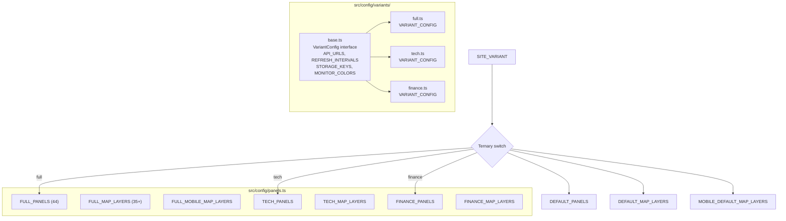
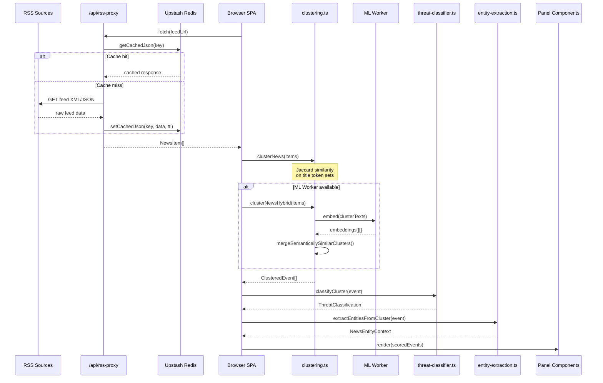
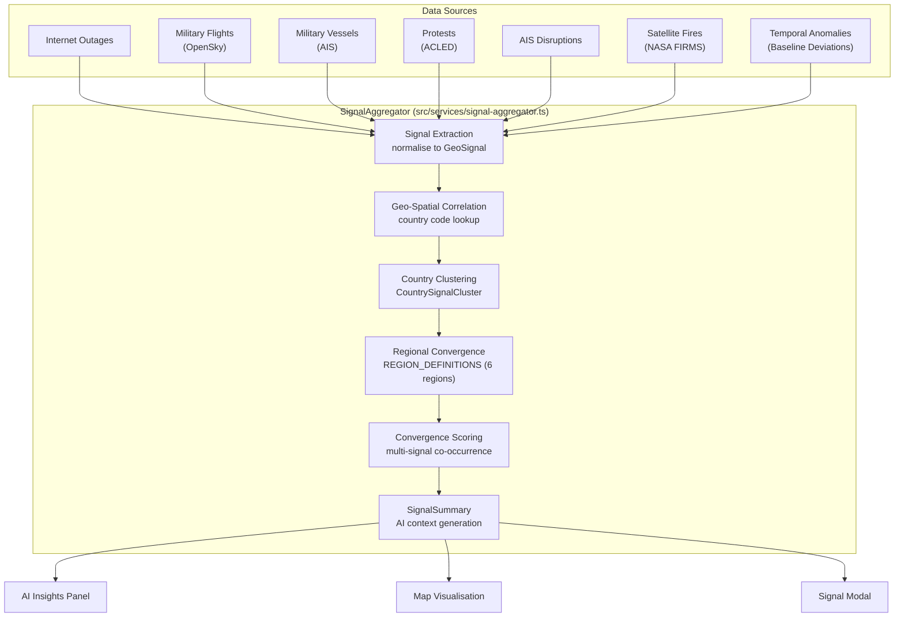
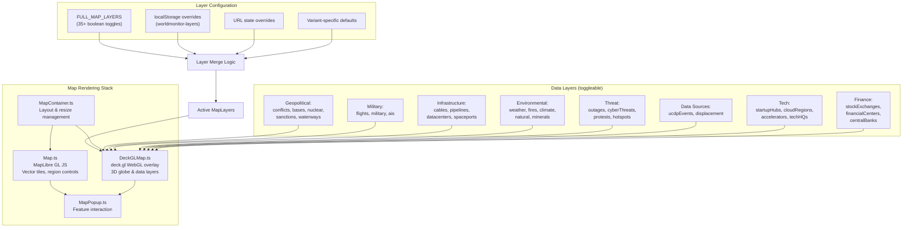
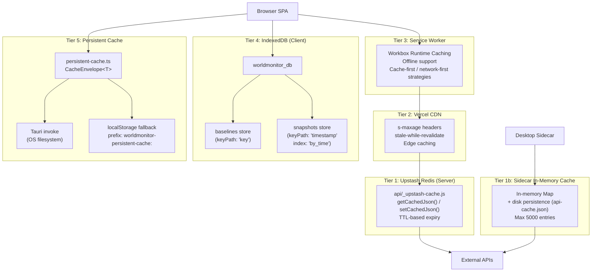
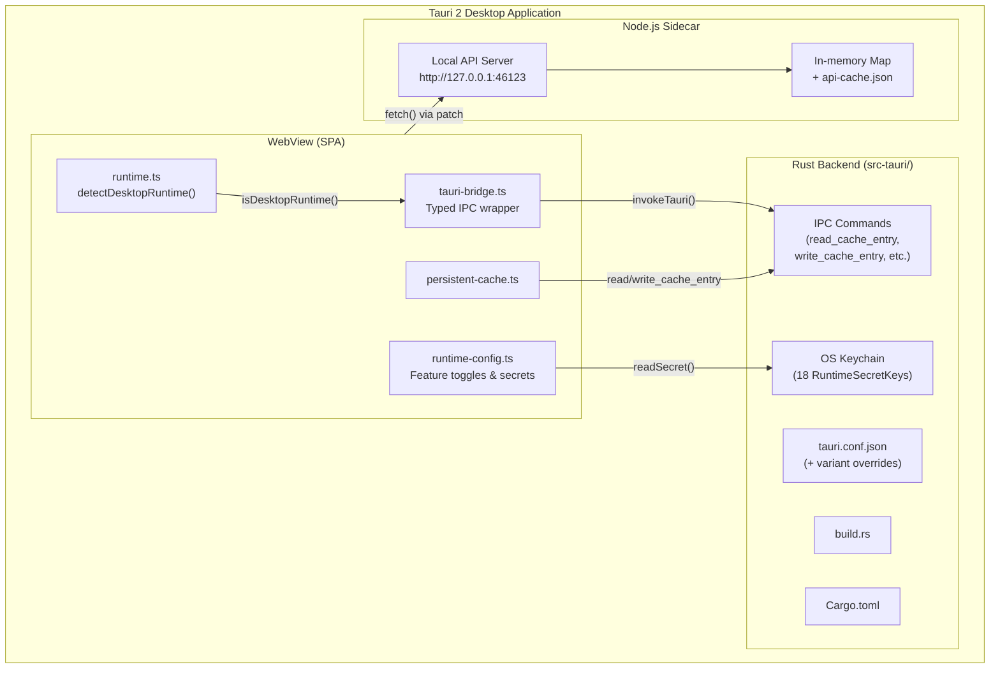
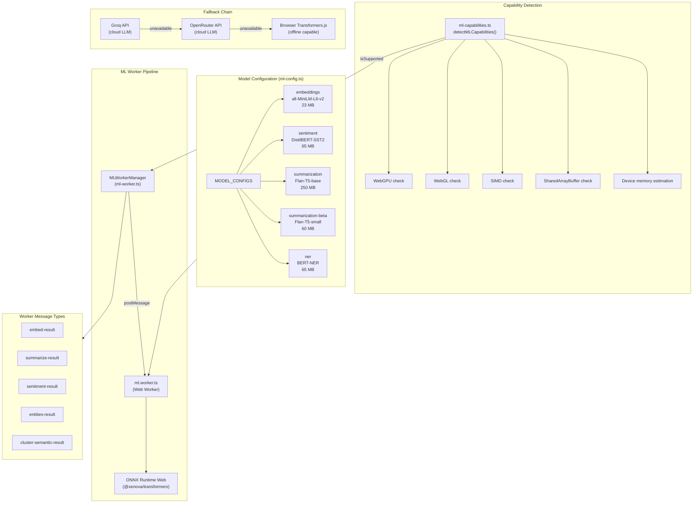
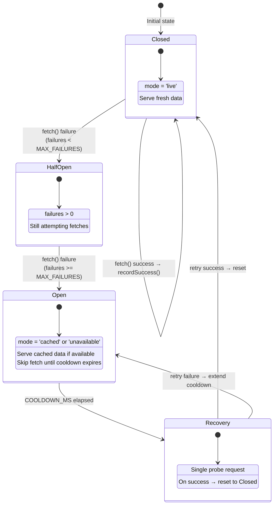

# Architecture

World Monitor is an AI-powered real-time global intelligence dashboard built as a TypeScript single-page application. It aggregates 30+ external data sources — covering geopolitics, military activity, financial markets, cyber threats, climate events, and more — into a unified operational picture rendered through an interactive 3D globe and a grid of specialised panels.

This document covers the full system architecture: deployment topology, variant configuration, data pipelines, signal intelligence, map rendering, caching, desktop packaging, machine-learning inference, and error handling.

---

## Table of Contents

1. [High-Level System Diagram](#1-high-level-system-diagram)
2. [Variant Architecture](#2-variant-architecture)
3. [Data Flow: RSS Ingestion to Display](#3-data-flow-rss-ingestion-to-display)
4. [Signal Intelligence Pipeline](#4-signal-intelligence-pipeline)
5. [Map Rendering Pipeline](#5-map-rendering-pipeline)
6. [Caching Architecture](#6-caching-architecture)
7. [Desktop Architecture](#7-desktop-architecture)
8. [ML Pipeline](#8-ml-pipeline)
9. [Error Handling Hierarchy](#9-error-handling-hierarchy)

---

## 1. High-Level System Diagram

The system follows a classic edge-compute pattern: a static SPA served from a CDN communicates with serverless API endpoints that proxy, normalise, and cache upstream data.

```mermaid
graph TD
    subgraph Browser
        SPA["TypeScript SPA<br/>(Vite 6, class-based)"]
        SW["Service Worker<br/>(Workbox)"]
        IDB["IndexedDB<br/>(snapshots & baselines)"]
        MLW["ML Web Worker<br/>(ONNX / Transformers.js)"]
        SPA --> SW
        SPA --> IDB
        SPA --> MLW
    end

    subgraph Vercel["Vercel Edge Functions"]
        API["60+ API Endpoints<br/>(api/ directory, plain JS)"]
    end

    subgraph External["External APIs (30+)"]
        RSS["RSS Feeds"]
        ACLED["ACLED"]
        UCDP["UCDP"]
        GDELT["GDELT"]
        OpenSky["OpenSky"]
        Finnhub["Finnhub"]
        Yahoo["Yahoo Finance"]
        FRED["FRED"]
        CoinGecko["CoinGecko"]
        Polymarket["Polymarket"]
        FIRMS["NASA FIRMS"]
        GROQ["Groq / OpenRouter"]
        Others["+ 20 more"]
    end

    subgraph Cache["Upstash Redis"]
        Redis["Server-side<br/>API Response Cache"]
    end

    subgraph Desktop["Tauri Desktop Shell"]
        Tauri["Tauri 2 (Rust)"]
        Sidecar["Node.js Sidecar<br/>127.0.0.1:46123"]
        Tauri --> Sidecar
    end

    SPA <-->|"fetch()"| API
    SPA <-->|"Tauri IPC"| Tauri
    SPA <-->|"fetch()"| Sidecar
    API <--> Redis
    API <--> RSS
    API <--> ACLED
    API <--> UCDP
    API <--> GDELT
    API <--> OpenSky
    API <--> Finnhub
    API <--> Yahoo
    API <--> FRED
    API <--> CoinGecko
    API <--> Polymarket
    API <--> FIRMS
    API <--> GROQ
    API <--> Others
```



### Component Summary

| Layer | Technology | Role |
|---|---|---|
| **SPA** | TypeScript, Vite 6, no framework | UI rendering via class-based components extending a `Panel` base class. 44 panels in the full variant. |
| **Vercel Edge Functions** | Plain JS (60+ files in api/) | Proxy, normalise, and cache upstream API calls. Each file exports a default Vercel handler. |
| **External APIs** | 30+ heterogeneous sources | RSS feeds, conflict databases (ACLED, UCDP), geospatial (GDELT, NASA FIRMS, OpenSky), markets (Finnhub, Yahoo Finance, CoinGecko), LLMs (Groq, OpenRouter), and more. |
| **Upstash Redis** | Redis REST API | Server-side response cache with TTL-based expiry. Falls back to in-memory Map in sidecar mode. |
| **Service Worker** | Workbox | Offline support, runtime caching strategies, background sync. |
| **IndexedDB** | `worldmonitor_db` | Client-side storage for playback snapshots and temporal baseline data. |
| **Tauri Shell** | Tauri 2 (Rust) + Node.js sidecar | Desktop packaging. Sidecar runs a local API server; Rust layer provides OS keychain, window management, and IPC. |
| **ML Worker** | Web Worker + ONNX Runtime / Transformers.js | In-browser inference for embeddings, sentiment, summarisation, and NER. |

---

## 2. Variant Architecture

World Monitor ships as three product variants from a single codebase. Each variant surfaces a different subset of panels, map layers, and data sources.

| Variant | Domain | Focus |
|---|---|---|
| `full` | worldmonitor.app | Geopolitics, military, OSINT, conflicts, markets |
| `tech` | tech.worldmonitor.app | AI/ML, startups, cybersecurity, developer tools |
| `finance` | finance.worldmonitor.app | Markets, trading, central banks, macro indicators |

### Variant Resolution

The active variant is resolved at startup in src/config/variant.ts via a strict priority chain:

```
localStorage('worldmonitor-variant')  →  import.meta.env.VITE_VARIANT  →  default 'full'
```

The exported constant `SITE_VARIANT` is computed once as an IIFE:

```typescript
export const SITE_VARIANT: string = (() => {
  if (typeof window !== 'undefined') {
    const stored = localStorage.getItem('worldmonitor-variant');
    if (stored === 'tech' || stored === 'full' || stored === 'finance') return stored;
  }
  return import.meta.env.VITE_VARIANT || 'full';
})();
```

The `localStorage` override enables runtime variant switching on the settings page without a rebuild. The `VITE_VARIANT` env var is set at deploy time (one Vercel project per subdomain).

### Configuration Tree-Shaking



The `VariantConfig` interface in src/config/variants/base.ts defines the shape:

```typescript
interface VariantConfig {
  name: string;
  description: string;
  panels: Record<string, PanelConfig>;
  mapLayers: MapLayers;
  mobileMapLayers: MapLayers;
}
```

Each variant file (full.ts, tech.ts, finance.ts) exports a `VARIANT_CONFIG` conforming to this interface. The shared base re-exports common constants: `API_URLS`, `REFRESH_INTERVALS`, `STORAGE_KEYS`, `MONITOR_COLORS`, `SECTORS`, `COMMODITIES`, `MARKET_SYMBOLS`, `UNDERSEA_CABLES`, and `AI_DATA_CENTERS`.

At build time, Vite's tree-shaking eliminates the unused variant configs. If `VITE_VARIANT=tech`, the full and finance panel definitions are dead-code-eliminated from the production bundle.

At runtime, src/config/panels.ts selects the active config via ternary expressions:

```typescript
export const DEFAULT_PANELS = SITE_VARIANT === 'tech'
  ? TECH_PANELS
  : SITE_VARIANT === 'finance'
    ? FINANCE_PANELS
    : FULL_PANELS;
```

The same pattern applies to `DEFAULT_MAP_LAYERS` and `MOBILE_DEFAULT_MAP_LAYERS`.

### Panel and Layer Counts

| Variant | Panels | Desktop Map Layers | Mobile Map Layers |
|---|---|---|---|
| `full` | 44 | 35+ | Reduced subset |
| `tech` | ~20 | Tech-focused layers (cloud regions, startup hubs, accelerators) | Minimal |
| `finance` | ~18 | Finance-focused layers (stock exchanges, financial centres, central banks) | Minimal |

The `MapLayers` interface contains 35+ boolean toggle keys including: `conflicts`, `bases`, `cables`, `pipelines`, `hotspots`, `ais`, `nuclear`, `irradiators`, `sanctions`, `weather`, `economic`, `waterways`, `outages`, `cyberThreats`, `datacenters`, `protests`, `flights`, `military`, `natural`, `spaceports`, `minerals`, `fires`, `ucdpEvents`, `displacement`, `climate`, `startupHubs`, `cloudRegions`, `accelerators`, `techHQs`, `techEvents`, `stockExchanges`, `financialCenters`, `centralBanks`, `commodityHubs`, and `gulfInvestments`.

---

## 3. Data Flow: RSS Ingestion to Display

The core intelligence pipeline transforms raw RSS feeds into clustered, classified, and scored events displayed across panels. This pipeline runs entirely in the browser.



### Pipeline Stages

**Stage 1 — RSS Fetch** (src/services/rss.ts)

The `fetchFeed()` function calls the `/api/rss-proxy` endpoint, which fetches and parses upstream RSS/Atom feeds on the server side. Responses are cached in Upstash Redis (or the sidecar in-memory cache). On the client, a per-feed in-memory cache (`feedCache` Map) prevents redundant network requests within the refresh interval, and a persistent cache layer (via src/services/persistent-cache.ts) provides resilience across page reloads and desktop restarts.

The `fetchAllFeeds()` function orchestrates concurrent fetching across all enabled feeds with configurable `onBatch` callbacks for progressive rendering.

**Stage 2 — Clustering** (src/services/clustering.ts)

Two clustering strategies are available:

- `clusterNews(items)` — fast Jaccard similarity over title token sets via `clusterNewsCore()`. Groups headlines with high textual overlap into `ClusteredEvent[]`. This is the default path when ML is unavailable.
- `clusterNewsHybrid(items)` — first runs Jaccard clustering, then refines results using semantic embeddings from the ML Worker. `mergeSemanticallySimilarClusters()` reduces fragmentation by joining clusters whose embedding centroids exceed the `semanticClusterThreshold` (default 0.75). Requires at least `minClustersForML` (5) initial clusters to activate.

**Stage 3 — Classification** (src/services/threat-classifier.ts)

Each clustered event receives a `ThreatClassification` with a `ThreatLevel` (`critical | high | medium | low | info`). The classifier uses keyword pattern matching and source-tier weighting. Threat levels map to CSS variables (`--threat-critical`, `--threat-high`, etc.) for consistent colour coding across panels.

**Stage 4 — Entity Extraction** (src/services/entity-extraction.ts + src/services/entity-index.ts)

The `extractEntitiesFromTitle()` function matches text against a pre-built entity index. The `extractEntitiesFromCluster()` function aggregates entities across all items in a cluster to produce a `NewsEntityContext` containing primary and related entities.

The entity index (src/services/entity-index.ts) is a multi-index structure with five `Map` lookups:

| Index | Type | Purpose |
|---|---|---|
| `byId` | `Map<string, EntityEntry>` | Canonical lookup by entity ID |
| `byAlias` | `Map<string, string>` | Alias-to-ID resolution (case-insensitive) |
| `byKeyword` | `Map<string, Set<string>>` | Keyword-to-entity-IDs for text matching |
| `bySector` | `Map<string, Set<string>>` | Sector-based grouping |
| `byType` | `Map<string, Set<string>>` | Entity type grouping (person, org, country, etc.) |

**Stage 5 — Display**

Classified and entity-enriched events are distributed to panels. The `Panel` base class provides a consistent rendering contract. Each panel subclass (LiveNewsPanel, IntelligencePanel, etc.) decides how to filter, sort, and present events relevant to its domain.

---

## 4. Signal Intelligence Pipeline

The signal aggregator fuses heterogeneous geospatial data sources into a unified intelligence picture with country-level clustering and regional convergence detection.



### Type Hierarchy

The pipeline defined in src/services/signal-aggregator.ts operates on a layered type system:

```
SignalType (enum-like union)
  ├── internet_outage
  ├── military_flight
  ├── military_vessel
  ├── protest
  ├── ais_disruption
  ├── satellite_fire
  └── temporal_anomaly

GeoSignal (individual signal)
  ├── type: SignalType
  ├── country: string (ISO 3166-1 alpha-2)
  ├── countryName: string
  ├── lat / lon: number
  ├── severity: 'low' | 'medium' | 'high'
  ├── title: string
  └── timestamp: Date

CountrySignalCluster (per-country aggregation)
  ├── country / countryName
  ├── signals: GeoSignal[]
  ├── signalTypes: Set<SignalType>
  ├── totalCount / highSeverityCount
  └── convergenceScore: number

RegionalConvergence (cross-country pattern)
  ├── region: string
  ├── countries: string[]
  ├── signalTypes: SignalType[]
  ├── totalSignals: number
  └── description: string

SignalSummary (final output)
  ├── timestamp: Date
  ├── totalSignals: number
  ├── byType: Record<SignalType, number>
  ├── convergenceZones: RegionalConvergence[]
  ├── topCountries: CountrySignalCluster[]
  └── aiContext: string
```

### Region Definitions

The `REGION_DEFINITIONS` constant maps six monitored regions to their constituent country codes:

| Region | Name | Countries |
|---|---|---|
| `middle_east` | Middle East | IR, IL, SA, AE, IQ, SY, YE, JO, LB, KW, QA, OM, BH |
| `east_asia` | East Asia | CN, TW, JP, KR, KP, HK, MN |
| `south_asia` | South Asia | IN, PK, BD, AF, NP, LK, MM |
| `europe_east` | Eastern Europe | UA, RU, BY, PL, RO, MD, HU, CZ, SK, BG |
| `africa_north` | North Africa | EG, LY, DZ, TN, MA, SD, SS |
| `africa_sahel` | Sahel Region | ML, NE, BF, TD, NG, CM, CF |

### Convergence Scoring

The `convergenceScore` on each `CountrySignalCluster` quantifies multi-signal co-occurrence. A high score indicates that multiple independent signal types are present in the same country within the 24-hour analysis window (`WINDOW_MS`). This score drives the AI Insights panel prioritisation and the signal modal display.

The `SignalAggregator` class maintains a rolling window of signals and a `WeakMap`-based source tracking for temporal anomaly provenance. Individual `ingest*()` methods (e.g., `ingestInternetOutages()`, `ingestMilitaryFlights()`) clear stale signals by type before inserting fresh data, ensuring the aggregation always reflects the latest state.

---

## 5. Map Rendering Pipeline

The map system combines a 2D vector tile base map (MapLibre GL JS) with a 3D WebGL overlay (deck.gl) for globe rendering, supporting 35+ toggleable data layers.



### Layer Toggle Resolution

Map layers follow a three-tier override system:

1. **Variant defaults** — `FULL_MAP_LAYERS`, `TECH_MAP_LAYERS`, or `FINANCE_MAP_LAYERS` define the base layer state for each variant. The full variant enables `conflicts`, `bases`, `hotspots`, `nuclear`, `sanctions`, `weather`, `economic`, `waterways`, `outages`, and `military` by default.

2. **User localStorage** — Stored under the key `worldmonitor-layers`. Users toggle layers in the map controls UI, and their preferences persist across sessions.

3. **URL state** — Query parameters can override individual layers for shareable links and embeds.

The merge logic applies overrides in this order, meaning URL state has the highest priority.

### Mobile Adaptation

Mobile devices receive a reduced layer set via `MOBILE_DEFAULT_MAP_LAYERS` (variant-specific). This disables heavier layers (bases, nuclear, cables, pipelines, spaceports, minerals) that would degrade performance on constrained devices while retaining the most operationally relevant overlays (conflicts, hotspots, sanctions, weather).

### Rendering Pipeline

The rendering stack works in two layers:

- **MapLibre GL JS** (src/components/Map.ts) provides the base map with vector tiles, region-specific map controls, and the 2D rendering context. It handles camera management, style loading, and base interaction events.

- **deck.gl** (src/components/DeckGLMap.ts) overlays a WebGL context for 3D globe rendering and data-driven layers. Each toggleable layer maps to a deck.gl layer instance (ScatterplotLayer, IconLayer, ArcLayer, etc.) that is conditionally created based on the active `MapLayers` state.

The **MapPopup** component (src/components/MapPopup.ts) provides a unified popup system for feature interaction across both rendering layers, displaying contextual information when users click or hover over map features.

---

## 6. Caching Architecture

World Monitor employs a five-tier caching strategy to minimise API costs, reduce latency, and enable offline operation.



### Tier 1: Upstash Redis (Server-Side)

The api/_upstash-cache.js module wraps all API fetch operations with Redis GET/SET. Every API endpoint calls `getCachedJson(key)` before hitting upstream. On cache miss, the upstream response is stored with `setCachedJson(key, value, ttlSeconds)`. The module lazily initialises the Redis client from `UPSTASH_REDIS_REST_URL` and `UPSTASH_REDIS_REST_TOKEN` environment variables.

A `hashString()` utility produces compact cache keys from request parameters using a DJB2 hash.

### Tier 1b: Sidecar In-Memory Cache

When running in desktop/sidecar mode (`LOCAL_API_MODE=sidecar`), Redis is bypassed entirely. An in-memory `Map` stores cache entries with expiry timestamps. Entries persist to disk as `api-cache.json` via debounced writes (2-second delay). A periodic cleanup interval (60 seconds) evicts expired entries. The maximum persisted entry count is capped at `MAX_PERSIST_ENTRIES` (default 5000).

The disk persistence uses atomic writes: data is written to a `.tmp` file first, then renamed to the final path. A `persistInFlight` flag with `persistQueued` prevents concurrent writes.

### Tier 2: Vercel CDN

API responses include `Cache-Control` headers with `s-maxage` and `stale-while-revalidate` directives. This enables Vercel's CDN edge nodes to serve cached responses without invoking the serverless function, reducing cold starts and upstream API calls.

### Tier 3: Service Worker (Workbox)

The Service Worker (configured via Workbox) provides runtime caching with strategy selection per route:

- **Cache-first** for static assets and infrequently changing data
- **Network-first** for real-time feeds and market data
- **Stale-while-revalidate** for semi-static resources

The offline fallback page (public/offline.html) is served when the network is unavailable and no cached response exists.

### Tier 4: IndexedDB

The `worldmonitor_db` IndexedDB database contains two object stores:

| Store | keyPath | Index | Purpose |
|---|---|---|---|
| `baselines` | `key` | — | Stores baseline values for temporal deviation tracking. The signal aggregator compares current values against baselines to detect anomalies. |
| `snapshots` | `timestamp` | `by_time` | Stores periodic system state snapshots for the playback control feature, enabling users to replay historical states. |

### Tier 5: Persistent Cache

The src/services/persistent-cache.ts module provides a cross-platform persistent storage abstraction. Data is wrapped in a `CacheEnvelope<T>`:

```typescript
type CacheEnvelope<T> = {
  key: string;
  updatedAt: number;
  data: T;
};
```

On desktop, `getPersistentCache()` and `setPersistentCache()` attempt Tauri IPC invocations (`read_cache_entry` / `write_cache_entry`) first, which store data on the OS filesystem via the Rust backend. If the Tauri call fails (or in web mode), the module falls back to `localStorage` with the prefix `worldmonitor-persistent-cache:`.

---

## 7. Desktop Architecture

The desktop application uses Tauri 2 (Rust) as a native shell around the web SPA, with a Node.js sidecar process providing a local API server.



### Runtime Detection

The src/services/runtime.ts module detects the desktop environment through multiple signals:

```typescript
function detectDesktopRuntime(probe: RuntimeProbe): boolean {
  // Checks: window.__TAURI__, user agent, location host (127.0.0.1)
}
```

When desktop mode is detected, `getApiBaseUrl()` returns `http://127.0.0.1:46123` instead of relative paths, routing all API calls through the local sidecar. A global `fetch()` monkey-patch (applied once via `__wmFetchPatched` guard) rewrites API URLs to point at the sidecar.

### Tauri Configuration

The src-tauri/ directory contains:

| File | Purpose |
|---|---|
| tauri.conf.json | Base Tauri configuration (window size, CSP, bundle settings) |
| tauri.tech.conf.json | Tech variant overrides (app name, window title, icons) |
| tauri.finance.conf.json | Finance variant overrides |
| build.rs | Rust build script for Tauri codegen |
| Cargo.toml | Rust dependencies |
| sidecar/ | Node.js sidecar source (local API server) |
| capabilities/ | Tauri capability definitions (permissions) |
| icons/ | Application icons for each platform |

### Tauri Bridge

The src/services/tauri-bridge.ts module provides a typed TypeScript wrapper around Tauri's IPC invoke mechanism. It exposes functions like `invokeTauri<T>(command, args)` that handle serialisation and error mapping.

### Runtime Configuration

The src/services/runtime-config.ts module manages two concerns:

**1. Runtime Secrets** — 18 `RuntimeSecretKey` values representing API keys and credentials:

`GROQ_API_KEY`, `OPENROUTER_API_KEY`, `FRED_API_KEY`, `EIA_API_KEY`, `CLOUDFLARE_API_TOKEN`, `ACLED_ACCESS_TOKEN`, `URLHAUS_AUTH_KEY`, `OTX_API_KEY`, `ABUSEIPDB_API_KEY`, `WINGBITS_API_KEY`, `WS_RELAY_URL`, `VITE_OPENSKY_RELAY_URL`, `OPENSKY_CLIENT_ID`, `OPENSKY_CLIENT_SECRET`, `AISSTREAM_API_KEY`, `FINNHUB_API_KEY`, `NASA_FIRMS_API_KEY`, `UC_DP_KEY`.

On desktop, secrets are read from the OS keychain via Tauri IPC. In web mode, they fall back to environment variables. A `validateSecret()` function provides format validation with user-facing hints.

**2. Feature Toggles** — 14 `RuntimeFeatureId` values stored in localStorage under the key `worldmonitor-runtime-feature-toggles`:

`aiGroq`, `aiOpenRouter`, `economicFred`, `energyEia`, `internetOutages`, `acledConflicts`, `abuseChThreatIntel`, `alienvaultOtxThreatIntel`, `abuseIpdbThreatIntel`, `wingbitsEnrichment`, `aisRelay`, `openskyRelay`, `finnhubMarkets`, `nasaFirms`.

Each `RuntimeFeatureDefinition` declares its required secrets (and optionally desktop-specific overrides via `desktopRequiredSecrets`), along with a `fallback` description explaining behaviour when the feature is unavailable. The `isFeatureAvailable()` function checks both the toggle state and secret availability.

The settings page listens for `storage` events on the toggles key, enabling cross-tab synchronisation.

---

## 8. ML Pipeline

World Monitor runs machine-learning inference directly in the browser using ONNX Runtime Web via Transformers.js, with API-based fallbacks for constrained devices.



### Capability Detection

The src/services/ml-capabilities.ts module probes the browser environment before loading any models:

```typescript
interface MLCapabilities {
  isSupported: boolean;
  isDesktop: boolean;
  hasWebGL: boolean;
  hasWebGPU: boolean;
  hasSIMD: boolean;
  hasThreads: boolean;
  estimatedMemoryMB: number;
  recommendedExecutionProvider: 'webgpu' | 'webgl' | 'wasm';
  recommendedThreads: number;
}
```

ML is only enabled on desktop-class devices (`!isMobileDevice()`) with at least WebGL support and an estimated 100+ MB of available memory. The `recommendedExecutionProvider` selects the optimal ONNX backend: WebGPU (fastest, if available), WebGL, or WASM fallback.

### Model Configuration

The src/config/ml-config.ts module defines five model configurations:

| Model ID | HuggingFace Model | Size | Task | Required |
|---|---|---|---|---|
| `embeddings` | Xenova/all-MiniLM-L6-v2 | 23 MB | feature-extraction | Yes |
| `sentiment` | Xenova/distilbert-base-uncased-finetuned-sst-2-english | 65 MB | text-classification | No |
| `summarization` | Xenova/flan-t5-base | 250 MB | text2text-generation | No |
| `summarization-beta` | Xenova/flan-t5-small | 60 MB | text2text-generation | No |
| `ner` | Xenova/bert-base-NER | 65 MB | token-classification | No |

Only the embeddings model is marked as `required` — it powers semantic clustering. Other models are loaded on-demand based on feature flags (`ML_FEATURE_FLAGS`) and available memory budget (`ML_THRESHOLDS.memoryBudgetMB`, default 200 MB).

### ML Thresholds

```typescript
const ML_THRESHOLDS = {
  semanticClusterThreshold: 0.75,  // cosine similarity for merging clusters
  minClustersForML: 5,             // minimum clusters before ML refinement
  maxTextsPerBatch: 20,            // batch size for embedding requests
  modelLoadTimeoutMs: 600_000,     // 10 min model download/compile timeout
  inferenceTimeoutMs: 120_000,     // 2 min per inference call
  memoryBudgetMB: 200,             // max memory for all loaded models
};
```

### Worker Architecture

The `MLWorkerManager` class (src/services/ml-worker.ts) manages the lifecycle of a dedicated Web Worker (src/workers/ml.worker.ts). Communication uses a request-response pattern over `postMessage`:

1. **Initialisation** — `init()` calls `detectMLCapabilities()`, creates the worker if supported, and waits for a `worker-ready` message (10-second timeout).

2. **Request dispatch** — Each method (`embed()`, `summarize()`, `sentiment()`, `entities()`, `clusterSemantic()`) generates a unique request ID, posts a message to the worker, and returns a `Promise` that resolves when the worker posts back a matching result message.

3. **Timeout handling** — Each pending request has an independent timeout. If the worker fails to respond within `inferenceTimeoutMs`, the promise rejects and the request is cleaned up.

4. **Model lifecycle** — Models are loaded lazily on first use. The worker emits `model-progress` events during download, enabling progress UI. `model-loaded` and `model-unloaded` events track the loaded model set.

### Worker Result Message Types

| Message Type | Payload | Used By |
|---|---|---|
| `embed-result` | `embeddings: number[][]` | Semantic clustering |
| `summarize-result` | `summaries: string[]` | AI Insights panel |
| `sentiment-result` | `results: SentimentResult[]` | Threat classification augmentation |
| `entities-result` | `entities: NEREntity[][]` | Entity extraction (ML-backed) |
| `cluster-semantic-result` | `clusters: number[][]` | Cluster merging |

### Fallback Chain

When browser-based ML is not available (mobile devices, constrained hardware, or feature disabled), the system falls back to cloud-based LLM APIs:

1. **Groq API** — Primary cloud fallback. Used for summarisation and classification via /api/groq-summarize.
2. **OpenRouter API** — Secondary cloud fallback via /api/openrouter-summarize.
3. **Browser Transformers.js** — Tertiary fallback for offline operation. Even without API access, the embeddings model enables basic semantic clustering.

The fallback is not automatic at the ML worker level; each consumer service chooses its preferred provider and handles degradation independently.

---

## 9. Error Handling Hierarchy

World Monitor uses a circuit-breaker pattern to manage transient failures across its many data sources, preventing cascade failures and providing graceful degradation.



### Circuit Breaker Implementation

The `CircuitBreaker<T>` class in src/utils/circuit-breaker.ts implements per-feed failure tracking with automatic cooldowns:

```typescript
interface CircuitState {
  failures: number;
  cooldownUntil: number;
  lastError?: string;
}

type BreakerDataMode = 'live' | 'cached' | 'unavailable';
```

**Constants:**

| Constant | Default | Purpose |
|---|---|---|
| `DEFAULT_MAX_FAILURES` | 2 | Consecutive failures before opening the circuit |
| `DEFAULT_COOLDOWN_MS` | 5 min (300,000 ms) | How long to wait before retrying |
| `DEFAULT_CACHE_TTL_MS` | 10 min (600,000 ms) | How long cached data remains valid |

### Lifecycle

1. **Closed (Live)** — Normal operation. Each successful `fetch()` calls `recordSuccess()`, resetting the failure counter.

2. **Failure Tracking** — On fetch failure, the failure counter increments. The `lastError` is recorded for diagnostics.

3. **Open (Circuit Tripped)** — When `failures >= maxFailures`, the circuit opens. `cooldownUntil` is set to `Date.now() + cooldownMs`. While open:
   - `isOnCooldown()` returns `true`
   - No fetch attempts are made
   - `getCached()` serves the last successful response if within `cacheTtlMs`
   - If no cached data exists, the data mode is `'unavailable'`

4. **Recovery (Cooldown Expired)** — After the cooldown period, `isOnCooldown()` returns `false` and resets the state. The next fetch attempt acts as a probe:
   - On success → circuit fully resets to closed
   - On failure → circuit re-opens with a fresh cooldown

### Data State Reporting

Each breaker tracks a `BreakerDataState` for UI display:

```typescript
interface BreakerDataState {
  mode: BreakerDataMode;  // 'live' | 'cached' | 'unavailable'
  timestamp: number | null;
  offline: boolean;
}
```

Panels use this state to display freshness indicators — e.g., showing a "cached" badge with the last successful timestamp, or an "unavailable" state with the `lastError` message.

### Desktop Offline Mode

The `isDesktopOfflineMode()` helper detects when the Tauri desktop app loses network connectivity (`navigator.onLine === false`). In this mode, all circuit breakers immediately fall back to cached data without attempting network requests, preserving the user experience during temporary disconnections.

### Global Breaker Registry

A module-level `Map<string, CircuitBreaker<unknown>>` maintains all active breakers. Utility functions provide system-wide observability:

| Function | Purpose |
|---|---|
| `createCircuitBreaker<T>(options)` | Create and register a new breaker |
| `getCircuitBreakerStatus()` | Returns status of all breakers (for diagnostics) |
| `isCircuitBreakerOnCooldown(name)` | Check if a specific breaker is in cooldown |
| `getCircuitBreakerCooldownInfo(name)` | Get cooldown state and remaining seconds |
| `removeCircuitBreaker(name)` | Deregister a breaker |

### Degradation Hierarchy

The overall error handling follows a predictable degradation path:

```
Live data (fresh fetch)
  └── on failure →  Stale cache (within cacheTtlMs)
        └── expired cache →  'unavailable' state in UI
              └── desktop offline →  immediate cache fallback
```

Each panel independently manages its breaker, so a failure in one data source (e.g., OpenSky API downtime) does not affect other panels. The AI Insights panel aggregates breaker states to provide a system-wide health summary.
