# Component Documentation — World Monitor

> Auto-generated reference for all UI components in `src/components/`.
> Last updated: 2026-02-19

---

## Table of Contents

1. [Overview](#overview)
2. [Panel Base Class](#panel-base-class)
3. [Map System](#map-system)
   - [DeckGLMap (WebGL / 3D)](#deckglmap)
   - [MapComponent (D3 / SVG)](#mapcomponent)
   - [MapContainer (Adapter)](#mapcontainer)
   - [MapPopup (Popup Builder)](#mappopup)
4. [Virtual Scrolling](#virtual-scrolling)
   - [VirtualList](#virtuallist)
   - [WindowedList\<T\>](#windowedlistt)
5. [Search](#search)
   - [SearchModal](#searchmodal)
6. [Domain Panels](#domain-panels)
   - [Intelligence & Analysis](#intelligence--analysis-panels)
   - [News & Content](#news--content-panels)
   - [Markets & Finance](#markets--finance-panels)
   - [Military & Security](#military--security-panels)
   - [Natural Events & Humanitarian](#natural-events--humanitarian-panels)
   - [Infrastructure & Tech](#infrastructure--tech-panels)
   - [Platform](#platform-panels)
7. [Modals & Widgets](#modals--widgets)
8. [Variant Visibility Matrix](#variant-visibility-matrix)
9. [Component Interaction Diagram](#component-interaction-diagram)

---

## Overview

World Monitor's UI is built entirely with **vanilla TypeScript** — no React, Vue, or
Angular. Every component is a plain ES class that owns its own DOM subtree and
communicates through method calls, callbacks, and a handful of
`document`/`window`-level custom events.

### Design principles

| Principle | Detail |
|---|---|
| **No framework** | Components create and manage DOM imperatively. |
| **Class-based** | Each component is a standalone class (or, rarely, a set of exported functions). |
| **Panel inheritance** | Most dashboard tiles extend the shared `Panel` base class. |
| **Variant-aware** | Components check `SITE_VARIANT` (`world` / `tech` / `finance`) to show/hide themselves or swap data sources. |
| **Theme-aware** | Components listen for `theme-changed` events and adapt colours accordingly. |
| **Desktop-aware** | Tauri bridge detection via `isDesktopRuntime()` unlocks native features. |

### Component count

| Category | Count |
|---|---|
| Panel subclasses | ~35 |
| Map components | 4 (DeckGLMap, MapComponent, MapContainer, MapPopup) |
| Virtual scrolling | 2 (VirtualList, WindowedList) |
| Search | 1 (SearchModal) |
| Modals & widgets | ~9 |
| **Total** | **~51** |

All public exports are re-exported from `src/components/index.ts` (barrel file,
40+ symbols).

---

## Panel Base Class

**File:** `src/components/Panel.ts` (420 lines)

`Panel` is the shared superclass for every dashboard tile. It owns the chrome —
header, collapse/expand, resize handle, loading/error states, count badge,
"NEW" badge, data-quality badge, and tooltip — so that subclasses only need to
fill in `panel-content`.

### Constructor

```ts
interface PanelOptions {
  id: string;           // unique DOM id, also used as localStorage key
  title: string;        // human-readable header text
  showCount?: boolean;  // if true, renders a count badge in the header
  className?: string;   // extra CSS class on the root element
  trackActivity?: boolean; // enable activity tracking
  infoTooltip?: string; // markdown/HTML shown on hover of the ℹ icon
}

const panel = new Panel(options);
```

### Lifecycle & Methods

#### Public

| Method | Signature | Description |
|---|---|---|
| `getElement()` | `(): HTMLElement` | Returns the root `div.panel`. |
| `showLoading()` | `(): void` | Replaces content with a spinner. |
| `showError()` | `(msg: string): void` | Shows a red error banner inside content. |
| `showConfigError()` | `(): void` | Shows a config-missing message (desktop). |
| `setCount()` | `(n: number): void` | Updates the header count badge. |
| `setErrorState()` | `(isError: boolean): void` | Toggles `.panel-error` class. |
| `setContent()` | `(html: string \| HTMLElement): void` | Replaces panel-content innerHTML or child. |
| `show()` | `(): void` | Removes `display:none`. |
| `hide()` | `(): void` | Sets `display:none`. |
| `toggle()` | `(): void` | Toggles between show/hide. |
| `setNewBadge()` | `(): void` | Adds the "NEW" pill next to the title. |
| `clearNewBadge()` | `(): void` | Removes the "NEW" pill. |
| `getId()` | `(): string` | Returns the panel id. |
| `resetHeight()` | `(): void` | Clears any user-set height override. |
| `destroy()` | `(): void` | Removes element, cleans up listeners. |

#### Protected

| Method | Signature | Description |
|---|---|---|
| `setDataBadge(state, detail?)` | `(state: 'live'\|'cached'\|'unavailable', detail?: string): void` | Shows a coloured dot in the header indicating data freshness. |
| `clearDataBadge()` | `(): void` | Hides the data badge. |

### DOM Structure

```
div.panel#${id}                       ← root
 ├─ div.panel-header
 │   ├─ div.panel-header-left
 │   │   ├─ span.panel-title          ← title text
 │   │   ├─ span.panel-info-wrapper   ← ℹ icon + tooltip
 │   │   └─ span.panel-new-badge      ← "NEW" pill (conditional)
 │   ├─ span.panel-data-badge         ← live/cached/unavailable dot
 │   └─ span.panel-count              ← count number (conditional)
 ├─ div.panel-content                 ← subclass fills this
 └─ div.panel-resize-handle           ← drag handle for vertical resize
```

### CSS Classes

| Class | Applied to | Meaning |
|---|---|---|
| `.panel` | root | Base panel styling. |
| `.panel-collapsed` | root | Content hidden, header only. |
| `.panel-error` | root | Red border / error state. |
| `.panel-resizing` | root | While user drags resize handle. |
| `.panel-header` | header wrapper | Flex row. |
| `.panel-content` | content area | Overflow auto, flex-grow 1. |
| `.panel-resize-handle` | resize bar | Cursor `ns-resize`. |

### Events

| Event / Listener | Target | Direction |
|---|---|---|
| `click` (document) | tooltip close | Consumed |
| `mousemove` / `mouseup` | resize drag | Consumed |
| `touchstart` / `touchmove` / `touchend` | mobile resize | Consumed |
| `dragstart` | blocked during resize | Consumed |

### Persistence

Panel **span sizes** (user-resized heights) are stored in
`localStorage['worldmonitor-panel-spans']` as a JSON map of `{ [id]: height }`.

### Services

- `escapeHtml` from `sanitize` — XSS-safe title rendering.
- `isDesktopRuntime()` / `invokeTauri()` — Tauri bridge for settings sync.
- `t()` — i18n translation of UI strings.

### Variant Logic

None — `Panel` is a pure base class and renders identically in all variants.

---

## Map System

World Monitor ships two independent map renderers and an adapter that picks the
right one at runtime.

### DeckGLMap

**File:** `src/components/DeckGLMap.ts` (3 853 lines)

The primary, high-performance map used on desktop and WebGL-capable browsers.

#### Constructor

```ts
interface DeckMapState {
  zoom: number;
  pan: [number, number];
  view: DeckMapView;
  layers: MapLayers;
  timeRange: TimeRange;
}

type DeckMapView =
  | 'global' | 'america' | 'mena' | 'eu'
  | 'asia'   | 'latam'   | 'africa' | 'oceania';

const map = new DeckGLMap(container, initialState);
```

#### Exported Types

| Type | Description |
|---|---|
| `TimeRange` | `{ start: number; end: number }` epoch-ms window. |
| `DeckMapView` | 8 named camera presets. |
| `CountryClickPayload` | `{ iso: string; name: string; lngLat: [number, number] }` |
| `MapInteractionMode` | `'flat' \| '3d'` — controlled by `MAP_INTERACTION_MODE` env. |

#### Rendering Stack

Built on **MapLibre GL JS** (`maplibregl.Map`) with a **deck.gl** overlay
(`MapboxOverlay` from `@deck.gl/mapbox`). The following deck.gl layer types
are used:

- `GeoJsonLayer` — country polygons, cables, pipelines, waterways
- `ScatterplotLayer` — point events (earthquakes, fires, outages, bases)
- `PathLayer` — flight tracks, vessel tracks
- `IconLayer` — infrastructure icons, cluster markers
- `TextLayer` — labels
- `ArcLayer` — origin/destination arcs (trade, displacement)
- `HeatmapLayer` — density surfaces (protests, fires)
- `Supercluster` — client-side clustering of dense point data

#### Static Infrastructure Data

The map embeds or lazily loads over 20 static datasets:

| Dataset | Constant / Source |
|---|---|
| Intelligence hotspots | `INTEL_HOTSPOTS` |
| Conflict zones | `CONFLICT_ZONES` |
| Military bases | `MILITARY_BASES` |
| Undersea cables | `UNDERSEA_CABLES` |
| Nuclear facilities | `NUCLEAR_FACILITIES` |
| Gamma irradiators | `GAMMA_IRRADIATORS` |
| Pipelines | `PIPELINES` |
| Strategic waterways | `STRATEGIC_WATERWAYS` |
| Economic centers | `ECONOMIC_CENTERS` |
| AI data centers | `AI_DATA_CENTERS` |
| Startup hubs | `STARTUP_HUBS` |
| Accelerators | `ACCELERATORS` |
| Tech HQs | `TECH_HQS` |
| Cloud regions | `CLOUD_REGIONS` |
| Ports | `PORTS` |
| Spaceports | `SPACEPORTS` |
| APT groups | `APT_GROUPS` |
| Critical minerals | `CRITICAL_MINERALS` |
| Stock exchanges | `STOCK_EXCHANGES` |
| Financial centers | `FINANCIAL_CENTERS` |
| Central banks | `CENTRAL_BANKS` |
| Commodity hubs | `COMMODITY_HUBS` |
| Gulf investments | `GULF_INVESTMENTS` |

#### Services

| Service | Purpose |
|---|---|
| `hotspot-escalation` | Escalation scoring for hotspot markers. |
| `country-instability` | CII heat overlay. |
| `geo-convergence` | Convergence ring rendering. |
| `country-geometry` | GeoJSON boundaries. |
| `MapPopup` | Generates popup HTML for clicked features. |

#### Variant & Theme Logic

- **`SITE_VARIANT`** determines which static infrastructure layers are
  loaded (e.g. `tech` loads `AI_DATA_CENTERS`, `STARTUP_HUBS`,
  `CLOUD_REGIONS`; `finance` loads `STOCK_EXCHANGES`, `FINANCIAL_CENTERS`).
- **`MAP_INTERACTION_MODE`** env var toggles flat (2-D pitch-locked) vs 3-D
  (free pitch/bearing).
- **Theme**: basemap switches between CARTO Dark Matter and CARTO Positron
  via `getOverlayColors()` which provides a colour palette per theme.

---

### MapComponent

**File:** `src/components/Map.ts` (3 500 lines)

Fallback **D3 + SVG** map used on mobile and devices without WebGL.

#### Constructor

```ts
interface MapState {
  zoom: number;
  pan: [number, number];
  view: MapView;
  layers: MapLayers;
  timeRange: TimeRange;
}

const map = new MapComponent(container, initialState);
```

#### DOM Structure

```
div.map-wrapper#mapWrapper
 ├─ svg.map-svg#mapSvg            ← D3 projected countries & overlays
 ├─ canvas.map-cluster-canvas#mapClusterCanvas  ← Canvas 2-D for clusters
 └─ div#mapOverlays                ← Popup container
```

#### Key Data Overlays

| Overlay | Source |
|---|---|
| Hotspots | `hotspot-escalation` |
| Earthquakes | USGS feed |
| Weather alerts | `weather` service |
| Outages | Cloudflare / service-status |
| AIS disruptions | AIS feed |
| Cable advisories | Undersea cable advisories |
| Protests | ACLED |
| Military flights | OpenSky |
| Military vessels | AIS snapshot |
| Natural events | EONET |
| FIRMS fires | NASA FIRMS |
| Tech events | Tech events API |
| Tech activities | GitHub trending, HackerNews |
| Geo activities | Geo-convergence |
| News | Geolocated news clusters |

#### Events Consumed

| Event | Source | Effect |
|---|---|---|
| `theme-changed` | `window` | Re-renders all layers with new colour palette. |

#### Variant Logic

Imports `SITE_VARIANT` and adjusts loaded data layers accordingly. Runs a
health-check interval every **30 seconds**.

---

### MapContainer

**File:** `src/components/MapContainer.ts` (553 lines)

Adapter / façade that selects the appropriate map renderer at startup.

#### Constructor

```ts
const mapContainer = new MapContainer(container, initialState);
```

#### Selection Logic

```
if (isMobileDevice() || !hasWebGLSupport())
  → MapComponent (D3/SVG)
else
  → DeckGLMap (WebGL/deck.gl)
```

The container element receives the CSS class `deckgl-mode` or `svg-mode`
accordingly.

#### Delegated API

All calls are forwarded transparently to the underlying renderer:

| Method | Description |
|---|---|
| `render()` | Full re-render. |
| `setView(view)` | Switch named camera preset. |
| `setZoom(z)` | Set zoom level. |
| `setCenter(lng, lat)` | Pan to coordinates. |
| `setTimeRange(range)` | Filter displayed events by time. |
| `setLayers(layers)` | Toggle layer visibility. |
| `getState()` | Return current map state. |
| `setEarthquakes(data)` | Push earthquake data. |
| `setWeatherAlerts(data)` | Push weather alerts. |
| `setOutages(data)` | Push outage data. |
| … | (and many more domain-specific setters) |

---

### MapPopup

**File:** `src/components/MapPopup.ts` (2 400+ lines)

**Not a class** — a collection of builder functions that generate popup HTML
for every feature type the map can display.

#### PopupType Union

Over 40 discriminated popup types grouped into categories:

| Category | Types (examples) |
|---|---|
| Conflict | `conflict-event`, `protest`, `acled-event`, `hotspot`, `conflict-zone` |
| Military | `military-base`, `military-flight`, `military-vessel`, `spaceport` |
| Natural | `earthquake`, `weather-alert`, `natural-event`, `firms-fire` |
| Infrastructure | `cable`, `pipeline`, `nuclear`, `port`, `waterway`, `gamma-irradiator` |
| Tech | `datacenter`, `tech-hq`, `cloud-region`, `startup-hub`, `accelerator`, `tech-event` |
| Finance | `stock-exchange`, `financial-center`, `central-bank`, `commodity-hub`, `gulf-investment` |
| Intelligence | `apt-group`, `critical-mineral`, `news-cluster`, `convergence` |

Each popup type has a dedicated data interface and a builder function that
returns sanitized HTML.

---

## Virtual Scrolling

**File:** `src/components/VirtualList.ts`

Two complementary strategies for rendering large lists without creating
thousands of DOM nodes.

### VirtualList

Fixed-height, DOM-recycling virtual scroller.

#### Constructor

```ts
interface VirtualListOptions {
  itemHeight: number;          // px height per row
  overscan?: number;           // extra rows above/below viewport (default 3)
  container: HTMLElement;      // parent element
  renderItem: (index: number, el: HTMLElement) => void;
  onRecycle?: (el: HTMLElement) => void;
}

const vl = new VirtualList(options);
```

#### Methods

| Method | Signature | Description |
|---|---|---|
| `setItemCount()` | `(n: number): void` | Total number of items. |
| `refresh()` | `(): void` | Re-render visible items from current scroll position. |
| `scrollToIndex()` | `(i: number): void` | Programmatic scroll. |
| `getViewport()` | `(): { start: number; end: number }` | Currently visible range. |
| `destroy()` | `(): void` | Cleanup. |

#### DOM Structure

```
div.virtual-viewport
 └─ div.virtual-content           ← total height = itemHeight × itemCount
     ├─ (spacer top)
     ├─ div.virtual-item          ← pooled, reused via renderItem()
     ├─ div.virtual-item
     ├─ ...
     └─ (spacer bottom)
```

---

### WindowedList\<T\>

Variable-height, chunk-based windowed scroller. Used by `NewsPanel`.

#### Constructor

```ts
interface WindowedListOptions {
  container: HTMLElement;
  chunkSize?: number;       // items per chunk (default 10)
  bufferChunks?: number;    // chunks to keep rendered above/below viewport
}

const wl = new WindowedList<MyItem>(options, renderItem, onRendered?);
```

#### Methods

| Method | Description |
|---|---|
| `setItems(items: T[])` | Replace item array, re-chunk, re-render. |
| `refresh()` | Force re-render of visible chunks. |
| `destroy()` | Cleanup, remove intersection observers. |

#### DOM Structure

```
div.windowed-list
 ├─ div.windowed-chunk             ← IntersectionObserver placeholder
 ├─ div.windowed-chunk
 └─ ...
```

---

## Search

### SearchModal

**File:** `src/components/SearchModal.ts` (377 lines)

Global search overlay accessible via `Ctrl+K` / `Cmd+K`.

#### Constructor

```ts
const search = new SearchModal(container, {
  placeholder?: string,   // input placeholder text
  hint?: string,          // footer hint text
});
```

#### Methods

| Method | Signature | Description |
|---|---|---|
| `registerSource(type, items)` | `(type: SearchResultType, items: SearchItem[]): void` | Add or replace a searchable dataset. |
| `setOnSelect(callback)` | `(cb: (result: SearchResult) => void): void` | Selection handler. |
| `open()` | `(): void` | Show modal, focus input. |
| `close()` | `(): void` | Hide modal. |
| `isOpen()` | `(): boolean` | Visibility check. |

#### Search Result Types

20+ discriminated types:

```
country | news | hotspot | market | prediction | conflict | base |
pipeline | cable | datacenter | earthquake | outage | nuclear |
techhq | exchange | financial-center | central-bank | commodity-hub |
gulf-investment | apt-group | critical-mineral | ...
```

#### Scoring

| Match kind | Score |
|---|---|
| Prefix match | 2 |
| Substring match | 1 |

Results are further sorted by a **priority tier**:

```
news > prediction > market > earthquake > outage >
conflict > hotspot > country > infrastructure > tech
```

#### Persistence

Recent selections stored in `localStorage['worldmonitor_recent_searches']`
(most recent 10).

#### DOM Structure

```
div.search-overlay
 └─ div.search-modal
     ├─ div.search-header
     │   ├─ svg (search icon)
     │   ├─ input[type=text]
     │   └─ kbd (Esc)
     ├─ div.search-results           ← rendered matches
     └─ div.search-footer            ← hint text
```

---

## Domain Panels

All domain panels extend `Panel` (§2) and fill `.panel-content` with
domain-specific markup.

### Intelligence & Analysis Panels

#### InsightsPanel

| Field | Detail |
|---|---|
| **File** | `src/components/InsightsPanel.ts` |
| **Panel ID** | `insights` |
| **Purpose** | AI-generated analytical insights aggregated from multiple ML pipelines. |
| **Constructor** | `new InsightsPanel()` — no extra args. |
| **Key methods** | `setMilitaryFlights(flights)` |
| **Services** | `mlWorker`, `generateSummary`, `parallelAnalysis`, `signalAggregator`, `focalPointDetector`, `ingestNewsForCII`, `getTheaterPostureSummaries` |
| **Variant** | All |
| **Notes** | Hidden on mobile via CSS media query. |

#### CIIPanel (Country Instability Index)

| Field | Detail |
|---|---|
| **File** | `src/components/CIIPanel.ts` (150 lines) |
| **Panel ID** | `cii` |
| **Purpose** | Ranks countries by a composite instability score (U/C/S/I sub-scores). |
| **Key methods** | `setShareStoryHandler()`, `refresh(forceLocal?)`, `getScores()` |
| **DOM** | `.cii-list` → `.cii-country` each with header (emoji flag, name, score, trend arrow, share button), colour bar, sub-score row (U/C/S/I). |
| **Services** | `calculateCII()`, `getCSSColor` |
| **Variant** | `full` only |

#### GdeltIntelPanel

| Field | Detail |
|---|---|
| **File** | `src/components/GdeltIntelPanel.ts` |
| **Panel ID** | `gdelt-intel` |
| **Purpose** | Multi-topic intelligence digest from GDELT data. |
| **Key methods** | `refresh()`, `refreshAll()` |
| **Services** | `getIntelTopics`, `fetchTopicIntelligence` |
| **Variant** | `full` only |
| **Notes** | Tab-based UI, per-topic 5-minute cache. |

#### StrategicRiskPanel

| Field | Detail |
|---|---|
| **File** | `src/components/StrategicRiskPanel.ts` |
| **Panel ID** | `strategic-risk` |
| **Purpose** | Composite strategic risk overview with convergence detection. |
| **Key methods** | `refresh()` |
| **Services** | `calculateStrategicRiskOverview`, `getRecentAlerts`, `detectConvergence`, `dataFreshness`, `getLearningProgress`, `fetchCachedRiskScores` |
| **Data badge** | `live` / `cached` / `unavailable` |
| **Variant** | `full` only |

#### StrategicPosturePanel

| Field | Detail |
|---|---|
| **File** | `src/components/StrategicPosturePanel.ts` |
| **Panel ID** | `strategic-posture` |
| **Purpose** | Theater-level military posture assessment. |
| **Services** | `fetchCachedTheaterPosture`, `fetchMilitaryVessels`, `recalcPostureWithVessels` |
| **Variant** | `full` only |
| **Notes** | Multi-stage loading, 5-minute refresh interval. |

#### CascadePanel

| Field | Detail |
|---|---|
| **File** | `src/components/CascadePanel.ts` |
| **Panel ID** | `cascade` |
| **Purpose** | Infrastructure cascade / dependency-graph analysis. |
| **Services** | `buildDependencyGraph`, `calculateCascade`, `getGraphStats`, `clearGraphCache` (from `infrastructure-cascade` service) |
| **Variant** | `full` only |

#### MonitorPanel

| Field | Detail |
|---|---|
| **File** | `src/components/MonitorPanel.ts` (172 lines) |
| **Panel ID** | `monitors` |
| **Purpose** | User-defined keyword monitors that match against news. |
| **Key methods** | `removeMonitor(id)`, `renderResults(news)` |
| **DOM** | Input + add button, `#monitorsList` (`.monitor-tag` pills), `#monitorsResults` |
| **Matching** | Word-boundary regex, max 10 results per keyword. |
| **Variant** | All |

---

### News & Content Panels

#### NewsPanel

| Field | Detail |
|---|---|
| **File** | `src/components/NewsPanel.ts` (593 lines) |
| **Constructor** | `new NewsPanel(id: string, title: string)` |
| **Purpose** | Clustered news feed with velocity scoring and AI summaries. |
| **Scrolling** | `WindowedList<PreparedCluster>` with `chunkSize: 8`. |
| **Services** | `analysisWorker`, `enrichWithVelocityML`, `getClusterAssetContext`, `activityTracker`, `generateSummary`, `translateText`, `getSourcePropagandaRisk` / `getSourceTier` / `getSourceType` |
| **DOM extras** | Deviation indicator, summary container, summarize button. |
| **Variant** | `SITE_VARIANT` used in summary cache key. |

#### LiveNewsPanel

| Field | Detail |
|---|---|
| **File** | `src/components/LiveNewsPanel.ts` (703 lines) |
| **Panel ID** | `live-news` |
| **Purpose** | Embedded YouTube live-stream player with channel switching. |
| **DOM** | YouTube IFrame player, channel switcher bar, mute/live buttons. |
| **Services** | `fetchLiveVideoId`, `isDesktopRuntime`, `getRemoteApiBaseUrl` |
| **Variant channels** | `tech` → `TECH_LIVE_CHANNELS` (Bloomberg, Yahoo Finance, CNBC, NASA TV). `world` / `full` → `FULL_LIVE_CHANNELS` (Bloomberg, Sky, Euronews, DW, CNBC, France24, Al Arabiya, Al Jazeera). |
| **Notes** | Idle pause after 5 minutes of inactivity. |

#### PredictionPanel

| Field | Detail |
|---|---|
| **File** | `src/components/PredictionPanel.ts` (62 lines) |
| **Panel ID** | `polymarket` |
| **Purpose** | Polymarket prediction market odds display. |
| **Key methods** | `renderPredictions(data)` |
| **DOM** | `.prediction-item` with question text, volume, yes/no percentage bars. |
| **Variant** | All |

#### LiveWebcamsPanel

| Field | Detail |
|---|---|
| **File** | `src/components/LiveWebcamsPanel.ts` |
| **Panel ID** | `live-webcams` |
| **Purpose** | Grid of live YouTube webcam feeds from global locations. |
| **Data** | Hardcoded `WEBCAM_FEEDS` (YouTube channels). |
| **Variant** | All |
| **Notes** | Region filters, grid/single view toggle, idle pause. |

---

### Markets & Finance Panels

#### MarketPanel

| Field | Detail |
|---|---|
| **File** | `src/components/MarketPanel.ts` (152 lines, shared file) |
| **Panel ID** | `markets` |
| **Purpose** | Stock index overview with sparkline charts. |
| **DOM** | `.market-item` with inline sparkline `<svg>`. |
| **Helper** | `miniSparkline()` — generates a tiny inline SVG polyline. |

#### HeatmapPanel

| Field | Detail |
|---|---|
| **File** | `src/components/MarketPanel.ts` (shared file) |
| **Panel ID** | `heatmap` |
| **Purpose** | Market heatmap grid (sector / index performance). |
| **DOM** | `.heatmap` grid of colour-coded cells. |

#### CommoditiesPanel

| Field | Detail |
|---|---|
| **File** | `src/components/MarketPanel.ts` (shared file) |
| **Panel ID** | `commodities` |
| **Purpose** | Commodity price overview. |
| **DOM** | `.commodities-grid` of price cells. |

#### CryptoPanel

| Field | Detail |
|---|---|
| **File** | `src/components/MarketPanel.ts` (shared file) |
| **Panel ID** | `crypto` |
| **Purpose** | Top crypto assets with sparklines. |
| **DOM** | `.market-item` with inline sparkline `<svg>`. |

#### ETFFlowsPanel

| Field | Detail |
|---|---|
| **File** | `src/components/ETFFlowsPanel.ts` |
| **Panel ID** | `etf-flows` |
| **Purpose** | ETF fund flow data. |
| **Services** | `fetch('/api/etf-flows')` |
| **Refresh** | Auto, every 3 minutes. |
| **Variant** | `finance` / `full` / `tech` |

#### MacroSignalsPanel

| Field | Detail |
|---|---|
| **File** | `src/components/MacroSignalsPanel.ts` |
| **Panel ID** | `macro-signals` |
| **Purpose** | Macro economic signal aggregator with BUY/CASH verdict. |
| **Services** | `fetch('/api/macro-signals')` |
| **DOM** | Sparklines, donut gauge, verdict label. |
| **Refresh** | Auto, every 3 minutes. |
| **Variant** | `finance` / `full` / `tech` |

#### StablecoinPanel

| Field | Detail |
|---|---|
| **File** | `src/components/StablecoinPanel.ts` |
| **Panel ID** | `stablecoins` |
| **Purpose** | Stablecoin peg deviation monitor. |
| **Services** | `fetch('/api/stablecoin-markets')` |
| **DOM** | Peg status badges (pegged / depegging / depegged). |
| **Refresh** | Auto, every 3 minutes. |
| **Variant** | `finance` / `full` / `tech` |

#### InvestmentsPanel

| Field | Detail |
|---|---|
| **File** | `src/components/InvestmentsPanel.ts` |
| **Panel ID** | `gcc-investments` |
| **Constructor** | `new InvestmentsPanel(onInvestmentClick?)` |
| **Purpose** | GCC / Gulf sovereign investment tracker. |
| **Services** | `GULF_INVESTMENTS` config data. |
| **Variant** | `finance` |
| **Notes** | Multi-filter, sortable columns. |

#### EconomicPanel

| Field | Detail |
|---|---|
| **File** | `src/components/EconomicPanel.ts` |
| **Panel ID** | `economic` |
| **Purpose** | Three-tab economic dashboard: indicators (FRED), oil (EIA), spending (USASpending). |
| **Key methods** | `update(data)`, `updateOil(data)`, `updateSpending(data)` |
| **Variant** | All |

---

### Military & Security Panels

#### UcdpEventsPanel

| Field | Detail |
|---|---|
| **File** | `src/components/UcdpEventsPanel.ts` |
| **Panel ID** | `ucdp-events` |
| **Purpose** | Uppsala Conflict Data Program — armed conflict event log. |
| **Key methods** | `setEventClickHandler()`, `setEvents()`, `getEvents()` |
| **DOM** | Three tabs: state-based / non-state / one-sided. Max 50 rows per tab. |
| **Variant** | `full` only |

#### PlaybackControl

| Field | Detail |
|---|---|
| **File** | `src/components/PlaybackControl.ts` (178 lines) |
| **Purpose** | Time-travel slider for historical snapshot playback. |
| **DOM** | `div.playback-control` with toggle, range slider, action buttons (⏮ ◀ LIVE ▶ ⏭). |
| **Key methods** | `getElement()`, `onSnapshotChange` callback. |
| **Services** | `getSnapshotTimestamps()`, `getSnapshotAt()` |
| **Notes** | Adds `.playback-mode` class to `<body>` when active. |

---

### Natural Events & Humanitarian Panels

#### ClimateAnomalyPanel

| Field | Detail |
|---|---|
| **File** | `src/components/ClimateAnomalyPanel.ts` |
| **Panel ID** | `climate` |
| **Purpose** | Climate anomaly zones with severity indicators. |
| **Key methods** | `setZoneClickHandler(handler)`, `setAnomalies(anomalies)` |
| **Services** | `getSeverityIcon`, `formatDelta` from climate service. |

#### SatelliteFiresPanel

| Field | Detail |
|---|---|
| **File** | `src/components/SatelliteFiresPanel.ts` |
| **Panel ID** | `satellite-fires` |
| **Purpose** | NASA FIRMS satellite fire detection statistics. |
| **Key methods** | `update(stats, totalCount)` |
| **Variant** | `full` only |

#### PopulationExposurePanel

| Field | Detail |
|---|---|
| **File** | `src/components/PopulationExposurePanel.ts` |
| **Panel ID** | `population-exposure` |
| **Purpose** | Population within impact radius of active events. |
| **Key methods** | `setExposures()` |
| **DOM** | Event type icons (conflict / earthquake / flood / fire). Highlighted row at 1 M+. |

#### DisplacementPanel

| Field | Detail |
|---|---|
| **File** | `src/components/DisplacementPanel.ts` |
| **Panel ID** | `displacement` |
| **Purpose** | UNHCR displacement data — refugee origin / hosting. |
| **Key methods** | `setCountryClickHandler()`, `setData(data)` |
| **Services** | `formatPopulation` from UNHCR service. |
| **DOM** | Two tabs: origins / hosts. |

---

### Infrastructure & Tech Panels

#### TechEventsPanel

| Field | Detail |
|---|---|
| **File** | `src/components/TechEventsPanel.ts` |
| **Constructor** | `new TechEventsPanel(id)` |
| **Purpose** | Tech conferences, earnings calls, product launches. |
| **Services** | `fetch('/api/tech-events')` |
| **DOM** | View mode switcher: upcoming / conferences / earnings / all. |
| **Variant** | `tech` |

#### TechHubsPanel

| Field | Detail |
|---|---|
| **File** | `src/components/TechHubsPanel.ts` |
| **Panel ID** | `tech-hubs` |
| **Purpose** | Top-10 tech hub activity ranking. |
| **Key methods** | `setOnHubClick()`, `setActivities()` |
| **Variant** | `tech` |

#### TechReadinessPanel

| Field | Detail |
|---|---|
| **File** | `src/components/TechReadinessPanel.ts` |
| **Panel ID** | `tech-readiness` |
| **Purpose** | Country technology readiness rankings (World Bank data). |
| **Key methods** | `refresh()` |
| **Services** | `getTechReadinessRankings` from `worldbank` service. |
| **Refresh** | Every 6 hours. Top 25 countries. |
| **Variant** | `tech` |

#### GeoHubsPanel

| Field | Detail |
|---|---|
| **File** | `src/components/GeoHubsPanel.ts` |
| **Panel ID** | `geo-hubs` |
| **Purpose** | Geopolitical hub activity monitor. |
| **Key methods** | `setOnHubClick()`, `setActivities()` |
| **Services** | `GeoHubActivity` type. |
| **Variant** | `full` only |

#### RegulationPanel

| Field | Detail |
|---|---|
| **File** | `src/components/RegulationPanel.ts` |
| **Panel ID** | `regulation` |
| **Purpose** | AI / tech regulation tracker by country and timeline. |
| **DOM** | Four view modes: timeline / deadlines / regulations / countries. |
| **Services** | `AI_REGULATIONS`, `COUNTRY_REGULATION_PROFILES` |
| **Variant** | `tech` |

#### ServiceStatusPanel

| Field | Detail |
|---|---|
| **File** | `src/components/ServiceStatusPanel.ts` |
| **Panel ID** | `service-status` |
| **Purpose** | External service health / availability monitor. |
| **Refresh** | Auto, every 60 seconds. |
| **DOM** | Category filter chips, status rows. |
| **Variant** | `tech` primarily |
| **Notes** | Desktop readiness checks via Tauri bridge. |

---

### Platform Panels

#### StatusPanel

| Field | Detail |
|---|---|
| **File** | `src/components/StatusPanel.ts` (251 lines) |
| **Panel ID** | `status` |
| **Purpose** | Internal feed & API health status dashboard. |
| **Key methods** | `updateFeed(name, status)`, `updateApi(name, status)`, `setFeedDisabled(name)` |
| **DOM** | `div.status-panel-container` with toggle button, sections: `feeds-list`, `apis-list`, `storage-info`. |
| **Variant data** | `tech` → `TECH_FEEDS` / `TECH_APIS`. `world` / `full` → `WORLD_FEEDS` / `WORLD_APIS`. |

#### RuntimeConfigPanel

| Field | Detail |
|---|---|
| **File** | `src/components/RuntimeConfigPanel.ts` |
| **Panel ID** | `runtime-config` |
| **Purpose** | Runtime configuration / API-key management panel. |
| **Key methods** | `commitPendingSecrets()`, `hasPendingChanges()`, `verifyPendingSecrets()` |
| **Variant** | All |
| **Notes** | Desktop vs web mode adapts form fields. Tauri bridge for secure secrets storage. |

#### LanguageSelector

| Field | Detail |
|---|---|
| **File** | `src/components/LanguageSelector.ts` |
| **Purpose** | UI language switcher dropdown. |
| **Constructor** | `new LanguageSelector()` |
| **Key methods** | `getElement()` |
| **Services** | `ENABLED_LANGUAGES`, `changeLanguage`, `getCurrentLanguage` |
| **Variant** | All |

---

## Modals & Widgets

Standalone components that are not panels — overlays, banners, badges, and
small UI affordances.

### SignalModal

| Field | Detail |
|---|---|
| **File** | `src/components/SignalModal.ts` (326 lines) |
| **Purpose** | Full-screen modal for correlation signals and unified alerts. |
| **DOM** | `div.signal-modal-overlay` → header, scrollable content, footer (audio toggle + dismiss). |
| **Methods** | `show(signals)`, `showSignal(signal)`, `showAlert(alert)`, `setLocationClickHandler()`, `hide()` |
| **Audio** | Inline base64-encoded WAV notification sound. |
| **Types** | `CorrelationSignal`, `UnifiedAlert` |

### CountryIntelModal

| Field | Detail |
|---|---|
| **File** | `src/components/CountryIntelModal.ts` |
| **Purpose** | AI-generated country intelligence briefing modal. |
| **Services** | `getCSSColor`, `country-instability` types. |

### CountryBriefPage

| Field | Detail |
|---|---|
| **File** | `src/components/CountryBriefPage.ts` |
| **Purpose** | Full-page overlay showing a comprehensive country intelligence brief with nearby infrastructure analysis. |
| **Services** | `getNearbyInfrastructure`, `haversineDistanceKm`, `exportCountryBriefJSON`, `exportCountryBriefCSV` |

### CountryTimeline

| Field | Detail |
|---|---|
| **File** | `src/components/CountryTimeline.ts` |
| **Constructor** | `new CountryTimeline(container)` |
| **Purpose** | D3 SVG timeline of country events across conflict / protest / natural / military lanes. |
| **Methods** | `render(events)` |

### StoryModal

| Field | Detail |
|---|---|
| **File** | `src/components/StoryModal.ts` |
| **Purpose** | Shareable story card generator and viewer. |
| **Exported functions** | `openStoryModal(data)`, `closeStoryModal()` |
| **Share targets** | WhatsApp, X (Twitter), LinkedIn, clipboard copy. |
| **Notes** | Generates PNG image for sharing via canvas rendering. |

### MobileWarningModal

| Field | Detail |
|---|---|
| **File** | `src/components/MobileWarningModal.ts` |
| **Purpose** | First-visit warning on mobile devices about limited functionality. |
| **Static** | `MobileWarningModal.shouldShow()` |
| **Notes** | Dismissible, remembers via `localStorage`. |

### DownloadBanner

| Field | Detail |
|---|---|
| **File** | `src/components/DownloadBanner.ts` |
| **Purpose** | Prompts web users to download the desktop app. |
| **Exported** | `maybeShowDownloadBanner()` |
| **Platform detection** | `macos-arm64`, `macos-x64`, `windows`, `linux` |

### CommunityWidget

| Field | Detail |
|---|---|
| **File** | `src/components/CommunityWidget.ts` |
| **Purpose** | Small floating widget linking to GitHub Discussions. |
| **Exported** | `mountCommunityWidget()` |
| **Notes** | Dismissible via `localStorage`. |

### PizzIntIndicator

| Field | Detail |
|---|---|
| **File** | `src/components/PizzIntIndicator.ts` |
| **Purpose** | DEFCON-style 1–5 threat indicator with expandable detail panel. |
| **DOM** | Toggle button + expandable panel. |
| **Notes** | Links to `pizzint.watch`. |

### IntelligenceGapBadge (IntelligenceFindingsBadge)

| Field | Detail |
|---|---|
| **File** | `src/components/IntelligenceGapBadge.ts` |
| **Purpose** | Header badge + dropdown showing intelligence findings and gaps. |
| **Key methods** | `setOnSignalClick()`, `setOnAlertClick()` |
| **Notes** | Audio notification for new findings. `full` variant only. |

### VerificationChecklist

| Field | Detail |
|---|---|
| **File** | `src/components/VerificationChecklist.ts` |
| **Purpose** | Bellingcat-style open-source verification checklist (8 checks). |
| **Framework** | **Preact** component (`extends Component`) — the only Preact component in the codebase. |
| **Notes** | Verdict scoring based on completed checks. |

---

## Variant Visibility Matrix

| Component | `world` / `full` | `tech` | `finance` |
|---|:---:|:---:|:---:|
| Panel (base) | ✅ | ✅ | ✅ |
| DeckGLMap | ✅ | ✅ | ✅ |
| MapComponent | ✅ | ✅ | ✅ |
| MapContainer | ✅ | ✅ | ✅ |
| MapPopup | ✅ | ✅ | ✅ |
| VirtualList / WindowedList | ✅ | ✅ | ✅ |
| SearchModal | ✅ | ✅ | ✅ |
| NewsPanel | ✅ | ✅ | ✅ |
| LiveNewsPanel | ✅ | ✅ | — |
| PredictionPanel | ✅ | ✅ | ✅ |
| LiveWebcamsPanel | ✅ | ✅ | ✅ |
| MarketPanel | ✅ | ✅ | ✅ |
| HeatmapPanel | ✅ | ✅ | ✅ |
| CommoditiesPanel | ✅ | ✅ | ✅ |
| CryptoPanel | ✅ | ✅ | ✅ |
| ETFFlowsPanel | ✅ | ✅ | ✅ |
| MacroSignalsPanel | ✅ | ✅ | ✅ |
| StablecoinPanel | ✅ | ✅ | ✅ |
| InvestmentsPanel | — | — | ✅ |
| EconomicPanel | ✅ | ✅ | ✅ |
| InsightsPanel | ✅ | ✅ | ✅ |
| CIIPanel | ✅ | — | — |
| GdeltIntelPanel | ✅ | — | — |
| StrategicRiskPanel | ✅ | — | — |
| StrategicPosturePanel | ✅ | — | — |
| CascadePanel | ✅ | — | — |
| MonitorPanel | ✅ | ✅ | ✅ |
| UcdpEventsPanel | ✅ | — | — |
| ClimateAnomalyPanel | ✅ | ✅ | — |
| SatelliteFiresPanel | ✅ | — | — |
| PopulationExposurePanel | ✅ | ✅ | — |
| DisplacementPanel | ✅ | — | — |
| TechEventsPanel | — | ✅ | — |
| TechHubsPanel | — | ✅ | — |
| TechReadinessPanel | — | ✅ | — |
| GeoHubsPanel | ✅ | — | — |
| RegulationPanel | — | ✅ | — |
| ServiceStatusPanel | — | ✅ | — |
| StatusPanel | ✅ | ✅ | ✅ |
| RuntimeConfigPanel | ✅ | ✅ | ✅ |
| LanguageSelector | ✅ | ✅ | ✅ |
| PlaybackControl | ✅ | ✅ | ✅ |
| SignalModal | ✅ | ✅ | ✅ |
| CountryIntelModal | ✅ | ✅ | — |
| CountryBriefPage | ✅ | ✅ | — |
| CountryTimeline | ✅ | ✅ | — |
| StoryModal | ✅ | ✅ | ✅ |
| MobileWarningModal | ✅ | ✅ | ✅ |
| DownloadBanner | ✅ | ✅ | ✅ |
| CommunityWidget | ✅ | ✅ | ✅ |
| PizzIntIndicator | ✅ | — | — |
| IntelligenceFindingsBadge | ✅ | — | — |
| VerificationChecklist | ✅ | ✅ | — |

---

## Component Interaction Diagram

```mermaid
graph TD
    subgraph App["App.ts (Orchestrator)"]
        APP[App]
    end

    subgraph Maps["Map System"]
        MC[MapContainer]
        DGL[DeckGLMap]
        SVG[MapComponent]
        MP[MapPopup]
        MC -->|desktop/WebGL| DGL
        MC -->|mobile/fallback| SVG
        DGL --> MP
        SVG --> MP
    end

    subgraph Intelligence["Intelligence & Analysis"]
        INS[InsightsPanel]
        CII[CIIPanel]
        GDL[GdeltIntelPanel]
        SRP[StrategicRiskPanel]
        SPP[StrategicPosturePanel]
        CSC[CascadePanel]
        MON[MonitorPanel]
    end

    subgraph News["News & Content"]
        NP[NewsPanel]
        LNP[LiveNewsPanel]
        PP[PredictionPanel]
        LWP[LiveWebcamsPanel]
    end

    subgraph Markets["Markets & Finance"]
        MKT[MarketPanel]
        HMP[HeatmapPanel]
        CMD[CommoditiesPanel]
        CRY[CryptoPanel]
        ETF[ETFFlowsPanel]
        MAC[MacroSignalsPanel]
        STB[StablecoinPanel]
        INV[InvestmentsPanel]
        ECO[EconomicPanel]
    end

    subgraph Military["Military & Security"]
        UCDP[UcdpEventsPanel]
        PBC[PlaybackControl]
    end

    subgraph NatHum["Natural & Humanitarian"]
        CLP[ClimateAnomalyPanel]
        SFP[SatelliteFiresPanel]
        PEP[PopulationExposurePanel]
        DSP[DisplacementPanel]
    end

    subgraph Tech["Infrastructure & Tech"]
        TEP[TechEventsPanel]
        THP[TechHubsPanel]
        TRP[TechReadinessPanel]
        GHP[GeoHubsPanel]
        REG[RegulationPanel]
        SSP[ServiceStatusPanel]
    end

    subgraph Platform["Platform"]
        STP[StatusPanel]
        RCP[RuntimeConfigPanel]
        LNG[LanguageSelector]
    end

    subgraph Modals["Modals & Widgets"]
        SIG[SignalModal]
        CIM[CountryIntelModal]
        CBP[CountryBriefPage]
        CTL[CountryTimeline]
        STM[StoryModal]
        IGB[IntelligenceFindingsBadge]
        PIZ[PizzIntIndicator]
    end

    subgraph Services["Service Layer"]
        HES[hotspot-escalation]
        CIS[country-instability]
        GCS[geo-convergence]
        MLW[mlWorker]
        ACT[activityTracker]
        SAS[signalAggregator]
    end

    subgraph Search["Search"]
        SM[SearchModal]
    end

    APP --> MC
    APP --> SM
    APP --> Intelligence
    APP --> News
    APP --> Markets
    APP --> Military
    APP --> NatHum
    APP --> Tech
    APP --> Platform
    APP --> Modals

    DGL --> HES
    DGL --> CIS
    DGL --> GCS
    SVG --> HES
    SVG --> CIS
    SVG --> GCS

    INS --> MLW
    INS --> SAS
    CII --> CIS
    SRP --> GCS

    NP --> MLW
    NP --> ACT

    SM -.->|registers sources| APP
    SIG -.->|triggered by| SAS
    IGB -.->|triggered by| SAS
```



### Reading the Diagram

- **Solid arrows** (`→`) represent ownership or direct method calls.
- **Dashed arrows** (`-.->`) represent event-driven or callback-based
  connections.
- `App.ts` is the top-level orchestrator that instantiates all panels,
  wires callbacks, and drives the refresh cycle.
- The **Service Layer** is shared — multiple panels and map components call
  the same services.
- `MapContainer` is the single map entry point; it delegates to
  `DeckGLMap` or `MapComponent` based on runtime capability detection.

---

## Appendix: Barrel Exports

`src/components/index.ts` re-exports 40+ symbols:

```ts
// Panels
export { Panel } from './Panel';
export { NewsPanel } from './NewsPanel';
export { LiveNewsPanel } from './LiveNewsPanel';
export { MarketPanel, HeatmapPanel, CommoditiesPanel, CryptoPanel } from './MarketPanel';
export { CIIPanel } from './CIIPanel';
export { MonitorPanel } from './MonitorPanel';
export { PredictionPanel } from './PredictionPanel';
export { StatusPanel } from './StatusPanel';
export { InsightsPanel } from './InsightsPanel';
export { CascadePanel } from './CascadePanel';
export { ClimateAnomalyPanel } from './ClimateAnomalyPanel';
export { EconomicPanel } from './EconomicPanel';
export { ETFFlowsPanel } from './ETFFlowsPanel';
export { GdeltIntelPanel } from './GdeltIntelPanel';
export { GeoHubsPanel } from './GeoHubsPanel';
export { MacroSignalsPanel } from './MacroSignalsPanel';
export { StablecoinPanel } from './StablecoinPanel';
export { InvestmentsPanel } from './InvestmentsPanel';
export { TechEventsPanel } from './TechEventsPanel';
export { TechHubsPanel } from './TechHubsPanel';
export { TechReadinessPanel } from './TechReadinessPanel';
export { UcdpEventsPanel } from './UcdpEventsPanel';
export { DisplacementPanel } from './DisplacementPanel';
export { SatelliteFiresPanel } from './SatelliteFiresPanel';
export { PopulationExposurePanel } from './PopulationExposurePanel';
export { StrategicPosturePanel } from './StrategicPosturePanel';
export { StrategicRiskPanel } from './StrategicRiskPanel';
export { RegulationPanel } from './RegulationPanel';
export { ServiceStatusPanel } from './ServiceStatusPanel';
export { RuntimeConfigPanel } from './RuntimeConfigPanel';
export { LiveWebcamsPanel } from './LiveWebcamsPanel';

// Map system
export { DeckGLMap } from './DeckGLMap';
export { MapComponent } from './Map';
export { MapContainer } from './MapContainer';

// Scrolling
export { VirtualList, WindowedList } from './VirtualList';

// Search
export { SearchModal } from './SearchModal';

// Modals & widgets
export { SignalModal } from './SignalModal';
export { CountryIntelModal } from './CountryIntelModal';
export { CountryBriefPage } from './CountryBriefPage';
export { CountryTimeline } from './CountryTimeline';
export { PlaybackControl } from './PlaybackControl';
export { LanguageSelector } from './LanguageSelector';
export { VerificationChecklist } from './VerificationChecklist';
// ... and standalone functions
```

> **Note:** The barrel file is the canonical list. If a component is not
> exported here it is either internal or mounted directly by `App.ts`.
