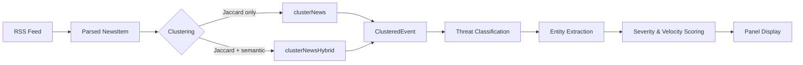
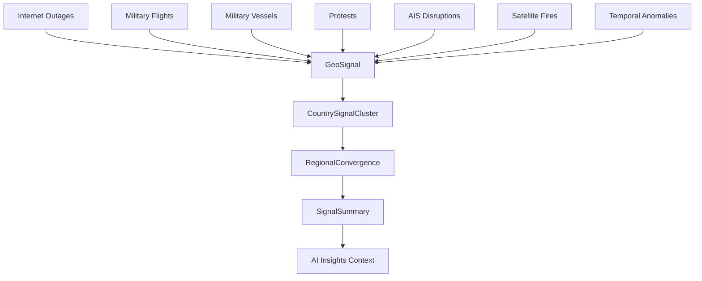
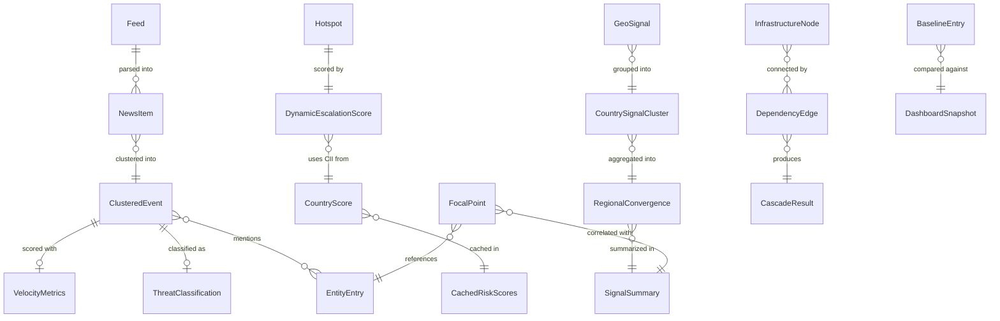

# Data Model Reference

Comprehensive data model documentation for **World Monitor** — an AI-powered real-time global intelligence dashboard. This reference covers all TypeScript interfaces, data structures, and their relationships across the system.

> **Source of truth:** [`src/types/index.ts`](../src/types/index.ts) (1,297 lines, 60+ interfaces)

---

## Table of Contents

1. [Core News & Events](#1-core-news--events)
2. [Geopolitical & Military](#2-geopolitical--military)
3. [Cyber & Security](#3-cyber--security)
4. [Humanitarian & Climate](#4-humanitarian--climate)
5. [Infrastructure](#5-infrastructure)
6. [Natural Events](#6-natural-events)
7. [Markets & Finance](#7-markets--finance)
8. [Tech Variant Types](#8-tech-variant-types)
9. [Panel & Map Configuration](#9-panel--map-configuration)
10. [Application State](#10-application-state)
11. [Focal Points](#11-focal-points)
12. [Social Unrest](#12-social-unrest)
13. [Entity Model](#13-entity-model)
14. [News Item Lifecycle](#14-news-item-lifecycle)
15. [Signal Model](#15-signal-model)
16. [Map Data Models](#16-map-data-models)
17. [Panel State Model](#17-panel-state-model)
18. [Variant Configuration](#18-variant-configuration)
19. [Risk Scoring Models](#19-risk-scoring-models)
20. [Cache & Storage Schemas](#20-cache--storage-schemas)

---

## 1. Core News & Events

The news pipeline ingests RSS feeds, parses individual items, clusters them into events, and scores each event for severity and velocity.

### Feed

RSS feed configuration. Each feed defines a source to poll, with optional metadata for filtering and propaganda risk assessment.

```typescript
interface Feed {
  name: string;
  url: string | Record<string, string>;
  type?: string;
  region?: string;
  propagandaRisk?: PropagandaRisk;       // 'low' | 'medium' | 'high'
  stateAffiliated?: string;              // e.g. "Russia", "China", "Iran"
  lang?: string;                         // ISO 2-letter language code
}
```

### NewsItem

A single parsed news article from an RSS feed. The minimal unit of intelligence in the pipeline.

```typescript
interface NewsItem {
  source: string;
  title: string;
  link: string;
  pubDate: Date;
  isAlert: boolean;
  monitorColor?: string;
  tier?: number;
  threat?: ThreatClassification;
  lat?: number;
  lon?: number;
  locationName?: string;
  lang?: string;
}
```

### ClusteredEvent

Multiple `NewsItem`s merged into a single event via Jaccard or hybrid semantic clustering. This is the primary unit displayed in news panels.

```typescript
interface ClusteredEvent {
  id: string;
  primaryTitle: string;
  primarySource: string;
  primaryLink: string;
  sourceCount: number;
  topSources: Array<{ name: string; tier: number; url: string }>;
  allItems: NewsItem[];
  firstSeen: Date;
  lastUpdated: Date;
  isAlert: boolean;
  monitorColor?: string;
  velocity?: VelocityMetrics;
  threat?: ThreatClassification;
  lat?: number;
  lon?: number;
  lang?: string;
}
```

### VelocityMetrics

Measures how quickly a story is spreading across sources. Used to detect breaking news and surging stories.

```typescript
type VelocityLevel = 'normal' | 'elevated' | 'spike';
type SentimentType = 'negative' | 'neutral' | 'positive';

interface VelocityMetrics {
  sourcesPerHour: number;
  level: VelocityLevel;
  trend: 'rising' | 'stable' | 'falling';
  sentiment: SentimentType;
  sentimentScore: number;
}
```

### RelatedAsset

Links a news event to a nearby physical asset (pipeline, cable, datacenter, military base, nuclear facility).

```typescript
type AssetType = 'pipeline' | 'cable' | 'datacenter' | 'base' | 'nuclear';

interface RelatedAsset {
  id: string;
  name: string;
  type: AssetType;
  distanceKm: number;
}

interface RelatedAssetContext {
  origin: { label: string; lat: number; lon: number };
  types: AssetType[];
  assets: RelatedAsset[];
}
```

---

## 2. Geopolitical & Military

### Hotspot

A monitored geopolitical hotspot from the geo configuration. Includes static metadata and dynamic escalation tracking.

```typescript
type EscalationTrend = 'escalating' | 'stable' | 'de-escalating';

interface Hotspot {
  id: string;
  name: string;
  lat: number;
  lon: number;
  keywords: string[];
  subtext?: string;
  location?: string;             // e.g. "Sahel Region, West Africa"
  agencies?: string[];
  level?: 'low' | 'elevated' | 'high';
  description?: string;
  status?: string;
  escalationScore?: 1 | 2 | 3 | 4 | 5;
  escalationTrend?: EscalationTrend;
  escalationIndicators?: string[];
  history?: HistoricalContext;
  whyItMatters?: string;
}

interface HistoricalContext {
  lastMajorEvent?: string;
  lastMajorEventDate?: string;
  precedentCount?: number;
  precedentDescription?: string;
  cyclicalRisk?: string;
}
```

### DynamicEscalationScore

Real-time escalation assessment combining static baselines with live signal data. Maintained in `src/services/hotspot-escalation.ts`.

```typescript
interface DynamicEscalationScore {
  hotspotId: string;
  staticBaseline: number;
  dynamicScore: number;
  combinedScore: number;
  trend: EscalationTrend;
  components: {
    newsActivity: number;       // weight: 0.35
    ciiContribution: number;    // weight: 0.25
    geoConvergence: number;     // weight: 0.25
    militaryActivity: number;   // weight: 0.15
  };
  history: Array<{ timestamp: number; score: number }>;
  lastUpdated: Date;
}
```

### ConflictZone

Active conflict zone with polygon boundaries and contextual metadata.

```typescript
interface ConflictZone {
  id: string;
  name: string;
  coords: [number, number][];
  center: [number, number];
  intensity?: 'high' | 'medium' | 'low';
  parties?: string[];
  casualties?: string;
  displaced?: string;
  keywords?: string[];
  startDate?: string;
  location?: string;
  description?: string;
  keyDevelopments?: string[];
}
```

### UCDP Geo Events

Georeferenced events from the Uppsala Conflict Data Program.

```typescript
type UcdpEventType = 'state-based' | 'non-state' | 'one-sided';

interface UcdpGeoEvent {
  id: string;
  date_start: string;
  date_end: string;
  latitude: number;
  longitude: number;
  country: string;
  side_a: string;
  side_b: string;
  deaths_best: number;
  deaths_low: number;
  deaths_high: number;
  type_of_violence: UcdpEventType;
  source_original: string;
}
```

### Military Bases

Foreign military installations and bases worldwide.

```typescript
type MilitaryBaseType =
  | 'us-nato' | 'china' | 'russia' | 'uk' | 'france'
  | 'india' | 'italy' | 'uae' | 'turkey' | 'japan' | 'other';

interface MilitaryBase {
  id: string;
  name: string;
  lat: number;
  lon: number;
  type: MilitaryBaseType;
  description?: string;
  country?: string;            // Host country
  arm?: string;                // Armed forces branch
  status?: 'active' | 'planned' | 'controversial' | 'closed';
  source?: string;
}
```

### Military Flights

Tracked military aircraft from ADS-B/OpenSky with classification metadata.

```typescript
type MilitaryAircraftType =
  | 'fighter' | 'bomber' | 'transport' | 'tanker' | 'awacs'
  | 'reconnaissance' | 'helicopter' | 'drone' | 'patrol'
  | 'special_ops' | 'vip' | 'unknown';

type MilitaryOperator =
  | 'usaf' | 'usn' | 'usmc' | 'usa' | 'raf' | 'rn'
  | 'faf' | 'gaf' | 'plaaf' | 'plan' | 'vks' | 'iaf'
  | 'nato' | 'other';

interface MilitaryFlight {
  id: string;
  callsign: string;
  hexCode: string;
  registration?: string;
  aircraftType: MilitaryAircraftType;
  aircraftModel?: string;
  operator: MilitaryOperator;
  operatorCountry: string;
  lat: number;
  lon: number;
  altitude: number;
  heading: number;
  speed: number;
  verticalRate?: number;
  onGround: boolean;
  squawk?: string;
  origin?: string;
  destination?: string;
  lastSeen: Date;
  firstSeen?: Date;
  track?: [number, number][];
  confidence: 'high' | 'medium' | 'low';
  isInteresting?: boolean;
  note?: string;
  enriched?: {
    manufacturer?: string;
    owner?: string;
    operatorName?: string;
    typeCode?: string;
    builtYear?: string;
    confirmedMilitary?: boolean;
    militaryBranch?: string;
  };
}

interface MilitaryFlightCluster {
  id: string;
  name: string;
  lat: number;
  lon: number;
  flightCount: number;
  flights: MilitaryFlight[];
  dominantOperator?: MilitaryOperator;
  activityType?: 'exercise' | 'patrol' | 'transport' | 'unknown';
}
```

### Military Vessels

Naval vessel tracking from AIS data with type classification.

```typescript
type MilitaryVesselType =
  | 'carrier' | 'destroyer' | 'frigate' | 'submarine'
  | 'amphibious' | 'patrol' | 'auxiliary' | 'research'
  | 'icebreaker' | 'special' | 'unknown';

interface MilitaryVessel {
  id: string;
  mmsi: string;
  name: string;
  vesselType: MilitaryVesselType;
  aisShipType?: string;
  hullNumber?: string;
  operator: MilitaryOperator | 'other';
  operatorCountry: string;
  lat: number;
  lon: number;
  heading: number;
  speed: number;
  course?: number;
  destination?: string;
  lastAisUpdate: Date;
  aisGapMinutes?: number;
  isDark?: boolean;
  nearChokepoint?: string;
  nearBase?: string;
  track?: [number, number][];
  confidence: 'high' | 'medium' | 'low';
  isInteresting?: boolean;
  note?: string;
}

interface MilitaryVesselCluster {
  id: string;
  name: string;
  lat: number;
  lon: number;
  vesselCount: number;
  vessels: MilitaryVessel[];
  region?: string;
  activityType?: 'exercise' | 'deployment' | 'transit' | 'unknown';
}
```

### Military Activity Summary

Aggregated view of all tracked military assets.

```typescript
interface MilitaryActivitySummary {
  flights: MilitaryFlight[];
  vessels: MilitaryVessel[];
  flightClusters: MilitaryFlightCluster[];
  vesselClusters: MilitaryVesselCluster[];
  activeOperations: number;
  lastUpdate: Date;
}
```

### Strategic Waterways & AIS

```typescript
interface StrategicWaterway {
  id: string;
  name: string;
  lat: number;
  lon: number;
  description?: string;
}

type AisDisruptionType = 'gap_spike' | 'chokepoint_congestion';

interface AisDisruptionEvent {
  id: string;
  name: string;
  type: AisDisruptionType;
  lat: number;
  lon: number;
  severity: 'low' | 'elevated' | 'high';
  changePct: number;
  windowHours: number;
  darkShips?: number;
  vesselCount?: number;
  region?: string;
  description: string;
}

interface AisDensityZone {
  id: string;
  name: string;
  lat: number;
  lon: number;
  intensity: number;
  deltaPct: number;
  shipsPerDay?: number;
  note?: string;
}
```

### GDELT Tension & PizzINT

```typescript
interface GdeltTensionPair {
  id: string;
  countries: [string, string];
  label: string;
  score: number;
  trend: 'rising' | 'stable' | 'falling';
  changePercent: number;
  region: string;
}

// Pentagon Pizza Index (novelty OSINT indicator)
type PizzIntDefconLevel = 1 | 2 | 3 | 4 | 5;
type PizzIntDataFreshness = 'fresh' | 'stale';

interface PizzIntStatus {
  defconLevel: PizzIntDefconLevel;
  defconLabel: string;
  aggregateActivity: number;
  activeSpikes: number;
  locationsMonitored: number;
  locationsOpen: number;
  lastUpdate: Date;
  dataFreshness: PizzIntDataFreshness;
  locations: PizzIntLocation[];
}
```

---

## 3. Cyber & Security

### CyberThreat

Cyber threat indicators sourced from threat intelligence feeds (Feodo, URLhaus, C2Intel, OTX, AbuseIPDB).

```typescript
type CyberThreatType = 'c2_server' | 'malware_host' | 'phishing' | 'malicious_url';
type CyberThreatSource = 'feodo' | 'urlhaus' | 'c2intel' | 'otx' | 'abuseipdb';
type CyberThreatSeverity = 'low' | 'medium' | 'high' | 'critical';
type CyberThreatIndicatorType = 'ip' | 'domain' | 'url';

interface CyberThreat {
  id: string;
  type: CyberThreatType;
  source: CyberThreatSource;
  indicator: string;
  indicatorType: CyberThreatIndicatorType;
  lat: number;
  lon: number;
  country?: string;
  severity: CyberThreatSeverity;
  malwareFamily?: string;
  tags: string[];
  firstSeen?: string;
  lastSeen?: string;
}
```

### APT Groups

Known Advanced Persistent Threat group profiles, mapped to their attributed state sponsors.

```typescript
interface APTGroup {
  id: string;
  name: string;
  aka: string;
  sponsor: string;
  lat: number;
  lon: number;
}
```

---

## 4. Humanitarian & Climate

### UNHCR Displacement

Three-tier model: global summary → country-level displacement → individual flow corridors.

```typescript
interface DisplacementFlow {
  originCode: string;
  originName: string;
  asylumCode: string;
  asylumName: string;
  refugees: number;
  originLat?: number;
  originLon?: number;
  asylumLat?: number;
  asylumLon?: number;
}

interface CountryDisplacement {
  code: string;
  name: string;
  // Origin-country displacement outflow
  refugees: number;
  asylumSeekers: number;
  idps: number;
  stateless: number;
  totalDisplaced: number;
  // Host-country intake
  hostRefugees: number;
  hostAsylumSeekers: number;
  hostTotal: number;
  lat?: number;
  lon?: number;
}

interface UnhcrSummary {
  year: number;
  globalTotals: {
    refugees: number;
    asylumSeekers: number;
    idps: number;
    stateless: number;
    total: number;
  };
  countries: CountryDisplacement[];
  topFlows: DisplacementFlow[];
}
```

### Climate Anomalies

Derived from Open-Meteo / ERA5 reanalysis data.

```typescript
type AnomalySeverity = 'normal' | 'moderate' | 'extreme';

interface ClimateAnomaly {
  zone: string;
  lat: number;
  lon: number;
  tempDelta: number;
  precipDelta: number;
  severity: AnomalySeverity;
  type: 'warm' | 'cold' | 'wet' | 'dry' | 'mixed';
  period: string;
}
```

### Population Exposure

WorldPop-derived population density for impact assessment.

```typescript
interface CountryPopulation {
  code: string;
  name: string;
  population: number;
  densityPerKm2: number;
}

interface PopulationExposure {
  eventId: string;
  eventName: string;
  eventType: string;
  lat: number;
  lon: number;
  exposedPopulation: number;
  exposureRadiusKm: number;
}
```

---

## 5. Infrastructure

### Undersea Cables

Submarine cable routes with landing points and country-level capacity data.

```typescript
interface CableLandingPoint {
  country: string;       // ISO code
  countryName: string;
  city?: string;
  lat: number;
  lon: number;
}

interface CountryCapacity {
  country: string;       // ISO code
  capacityShare: number; // 0–1
  isRedundant: boolean;
}

interface UnderseaCable {
  id: string;
  name: string;
  points: [number, number][];
  major?: boolean;
  landingPoints?: CableLandingPoint[];
  countriesServed?: CountryCapacity[];
  capacityTbps?: number;
  rfsYear?: number;
  owners?: string[];
}

interface CableAdvisory {
  id: string;
  cableId: string;
  title: string;
  severity: 'fault' | 'degraded';
  description: string;
  reported: Date;
  lat: number;
  lon: number;
  impact: string;
  repairEta?: string;
}

interface RepairShip {
  id: string;
  name: string;
  cableId: string;
  status: 'enroute' | 'on-station';
  lat: number;
  lon: number;
  eta: string;
  operator?: string;
  note?: string;
}
```

### Pipelines

Oil and gas pipelines with terminal endpoints and capacity data.

```typescript
type PipelineType = 'oil' | 'gas' | 'products';
type PipelineStatus = 'operating' | 'construction';

interface PipelineTerminal {
  country: string;
  name?: string;
  portId?: string;
  lat?: number;
  lon?: number;
}

interface Pipeline {
  id: string;
  name: string;
  type: PipelineType;
  status: PipelineStatus;
  points: [number, number][];
  capacity?: string;
  length?: string;
  operator?: string;
  countries?: string[];
  origin?: PipelineTerminal;
  destination?: PipelineTerminal;
  transitCountries?: string[];
  capacityMbpd?: number;
  capacityBcmY?: number;
  alternatives?: string[];
}
```

### Internet Outages

Real-time internet connectivity disruptions.

```typescript
interface InternetOutage {
  id: string;
  title: string;
  link: string;
  description: string;
  pubDate: Date;
  country: string;
  region?: string;
  lat: number;
  lon: number;
  severity: 'partial' | 'major' | 'total';
  categories: string[];
  cause?: string;
  outageType?: string;
  endDate?: Date;
}
```

### Infrastructure Cascade Analysis

Graph-based dependency model for simulating cascading failures across infrastructure networks.

```typescript
type InfrastructureNodeType = 'cable' | 'pipeline' | 'port' | 'chokepoint' | 'country' | 'route';

interface InfrastructureNode {
  id: string;
  type: InfrastructureNodeType;
  name: string;
  coordinates?: [number, number];
  metadata?: Record<string, unknown>;
}

type DependencyType =
  | 'serves' | 'terminates_at' | 'transits_through' | 'lands_at'
  | 'depends_on' | 'shares_risk' | 'alternative_to'
  | 'trade_route' | 'controls_access' | 'trade_dependency';

interface DependencyEdge {
  from: string;
  to: string;
  type: DependencyType;
  strength: number;        // 0–1 criticality
  redundancy?: number;     // 0–1 replaceability
  metadata?: {
    capacityShare?: number;
    alternativeRoutes?: number;
    estimatedImpact?: string;
    portType?: string;
    relationship?: string;
  };
}

type CascadeImpactLevel = 'critical' | 'high' | 'medium' | 'low';

interface CascadeAffectedNode {
  node: InfrastructureNode;
  impactLevel: CascadeImpactLevel;
  pathLength: number;
  dependencyChain: string[];
  redundancyAvailable: boolean;
  estimatedRecovery?: string;
}

interface CascadeResult {
  source: InfrastructureNode;
  affectedNodes: CascadeAffectedNode[];
  countriesAffected: CascadeCountryImpact[];
  economicImpact?: {
    dailyTradeLoss?: number;
    affectedThroughput?: number;
  };
  redundancies?: Array<{
    id: string;
    name: string;
    capacityShare: number;
  }>;
}
```

### Nuclear Facilities

```typescript
type NuclearFacilityType =
  | 'plant' | 'enrichment' | 'reprocessing' | 'weapons'
  | 'ssbn' | 'test-site' | 'icbm' | 'research';

interface NuclearFacility {
  id: string;
  name: string;
  lat: number;
  lon: number;
  type: NuclearFacilityType;
  status: 'active' | 'contested' | 'inactive' | 'decommissioned' | 'construction';
  operator?: string;
}

interface GammaIrradiator {
  id: string;
  city: string;
  country: string;
  lat: number;
  lon: number;
  organization?: string;
}
```

---

## 6. Natural Events

### Earthquakes

USGS earthquake data.

```typescript
interface Earthquake {
  id: string;
  place: string;
  magnitude: number;
  lat: number;
  lon: number;
  depth: number;
  time: Date;
  url: string;
}
```

### NASA EONET Natural Events

```typescript
type NaturalEventCategory =
  | 'severeStorms' | 'wildfires' | 'volcanoes' | 'earthquakes'
  | 'floods' | 'landslides' | 'drought' | 'dustHaze'
  | 'snow' | 'tempExtremes' | 'seaLakeIce' | 'waterColor' | 'manmade';

interface NaturalEvent {
  id: string;
  title: string;
  description?: string;
  category: NaturalEventCategory;
  categoryTitle: string;
  lat: number;
  lon: number;
  date: Date;
  magnitude?: number;
  magnitudeUnit?: string;
  sourceUrl?: string;
  sourceName?: string;
  closed: boolean;
}
```

---

## 7. Markets & Finance

### MarketData

Equities, indices, and commodities pricing.

```typescript
interface MarketData {
  symbol: string;
  name: string;
  display: string;
  price: number | null;
  change: number | null;
  sparkline?: number[];
}

interface CryptoData {
  name: string;
  symbol: string;
  price: number;
  change: number;
  sparkline?: number[];
}

interface Sector {
  symbol: string;
  name: string;
}

interface Commodity {
  symbol: string;
  name: string;
  display: string;
}
```

### Prediction Markets

Polymarket-sourced prediction contract data.

```typescript
interface PredictionMarket {
  title: string;
  yesPrice: number;
  volume?: number;
  url?: string;
}
```

### Gulf FDI Investments

Tracks Saudi and UAE foreign direct investment in global infrastructure.

```typescript
type GulfInvestorCountry = 'SA' | 'UAE';

type GulfInvestmentSector =
  | 'ports' | 'pipelines' | 'energy' | 'datacenters' | 'airports'
  | 'railways' | 'telecoms' | 'water' | 'logistics' | 'mining'
  | 'real-estate' | 'manufacturing';

type GulfInvestmentStatus =
  | 'operational' | 'under-construction' | 'announced'
  | 'rumoured' | 'cancelled' | 'divested';

type GulfInvestingEntity =
  | 'DP World' | 'AD Ports' | 'Mubadala' | 'ADIA' | 'ADNOC'
  | 'Masdar' | 'PIF' | 'Saudi Aramco' | 'ACWA Power' | 'STC'
  | 'Mawani' | 'NEOM' | 'Emirates Global Aluminium' | 'Other';

interface GulfInvestment {
  id: string;
  investingEntity: GulfInvestingEntity;
  investingCountry: GulfInvestorCountry;
  targetCountry: string;
  targetCountryIso: string;
  sector: GulfInvestmentSector;
  assetType: string;
  assetName: string;
  lat: number;
  lon: number;
  investmentUSD?: number;
  stakePercent?: number;
  status: GulfInvestmentStatus;
  yearAnnounced?: number;
  yearOperational?: number;
  description: string;
  sourceUrl?: string;
  tags?: string[];
}
```

### Economic Centers

```typescript
type EconomicCenterType = 'exchange' | 'central-bank' | 'financial-hub';

interface EconomicCenter {
  id: string;
  name: string;
  type: EconomicCenterType;
  lat: number;
  lon: number;
  country: string;
  marketHours?: { open: string; close: string; timezone: string };
  description?: string;
}
```

---

## 8. Tech Variant Types

Specialized types for the Tech variant dashboard.

### AI Data Centers

```typescript
interface AIDataCenter {
  id: string;
  name: string;
  owner: string;
  country: string;
  lat: number;
  lon: number;
  status: 'existing' | 'planned' | 'decommissioned';
  chipType: string;
  chipCount: number;
  powerMW?: number;
  h100Equivalent?: number;
  sector?: string;
  note?: string;
}
```

### AI Regulation

```typescript
type RegulationType = 'comprehensive' | 'sectoral' | 'voluntary' | 'proposed';
type ComplianceStatus = 'active' | 'proposed' | 'draft' | 'superseded';
type RegulationStance = 'strict' | 'moderate' | 'permissive' | 'undefined';

interface AIRegulation {
  id: string;
  name: string;
  shortName: string;
  country: string;
  region?: string;
  type: RegulationType;
  status: ComplianceStatus;
  announcedDate: string;
  effectiveDate?: string;
  complianceDeadline?: string;
  scope: string[];
  keyProvisions: string[];
  penalties?: string;
  link?: string;
  description?: string;
}

interface RegulatoryAction {
  id: string;
  date: string;
  country: string;
  title: string;
  type: 'law-passed' | 'executive-order' | 'guideline' | 'enforcement' | 'consultation';
  regulationId?: string;
  description: string;
  impact: 'high' | 'medium' | 'low';
  source?: string;
}
```

### Tech Companies & AI Research Labs

```typescript
interface TechCompany {
  id: string;
  name: string;
  lat: number;
  lon: number;
  country: string;
  city?: string;
  sector?: string;
  officeType?: 'headquarters' | 'regional' | 'engineering' | 'research' | 'campus' | 'major office';
  employees?: number;
  foundedYear?: number;
  keyProducts?: string[];
  valuation?: number;
  stockSymbol?: string;
  description?: string;
}

interface AIResearchLab {
  id: string;
  name: string;
  lat: number;
  lon: number;
  country: string;
  city?: string;
  type: 'corporate' | 'academic' | 'government' | 'nonprofit' | 'industry' | 'research institute';
  parent?: string;
  focusAreas?: string[];
  description?: string;
  foundedYear?: number;
  notableWork?: string[];
  publications?: number;
  faculty?: number;
}

interface StartupEcosystem {
  id: string;
  name: string;
  lat: number;
  lon: number;
  country: string;
  city: string;
  ecosystemTier?: 'tier1' | 'tier2' | 'tier3' | 'emerging';
  totalFunding2024?: number;
  activeStartups?: number;
  unicorns?: number;
  topSectors?: string[];
  majorVCs?: string[];
  notableStartups?: string[];
  avgSeedRound?: number;
  avgSeriesA?: number;
  description?: string;
}
```

---

## 9. Panel & Map Configuration

### PanelConfig

Per-panel toggle and priority for the variant system.

```typescript
interface PanelConfig {
  name: string;
  enabled: boolean;
  priority?: number;
}
```

### MapLayers

35+ boolean layer toggles that control which data overlays appear on the map.

```typescript
interface MapLayers {
  // Geopolitical
  conflicts: boolean;
  bases: boolean;
  hotspots: boolean;
  military: boolean;
  sanctions: boolean;

  // Infrastructure
  cables: boolean;
  pipelines: boolean;
  nuclear: boolean;
  irradiators: boolean;
  datacenters: boolean;
  waterways: boolean;
  spaceports: boolean;
  minerals: boolean;

  // Security
  cyberThreats: boolean;
  outages: boolean;

  // Environmental
  weather: boolean;
  fires: boolean;
  natural: boolean;
  climate: boolean;

  // Tracking
  ais: boolean;
  flights: boolean;
  protests: boolean;

  // Economic
  economic: boolean;
  gulfInvestments: boolean;
  stockExchanges: boolean;
  financialCenters: boolean;
  centralBanks: boolean;
  commodityHubs: boolean;

  // Data sources
  ucdpEvents: boolean;
  displacement: boolean;

  // Tech variant
  startupHubs: boolean;
  cloudRegions: boolean;
  accelerators: boolean;
  techHQs: boolean;
  techEvents: boolean;
}
```

### Monitor

User-defined keyword monitors that highlight matching news items.

```typescript
interface Monitor {
  id: string;
  keywords: string[];
  color: string;
  name?: string;
  lat?: number;
  lon?: number;
}
```

---

## 10. Application State

Top-level application state holding all active data and UI configuration.

```typescript
interface AppState {
  currentView: 'global' | 'us';
  mapZoom: number;
  mapPan: { x: number; y: number };
  mapLayers: MapLayers;
  panels: Record<string, PanelConfig>;
  monitors: Monitor[];
  allNews: NewsItem[];
  isLoading: boolean;
}
```

---

## 11. Focal Points

Intelligence synthesis layer that detects entities (countries, companies) with converging news and signal activity.

```typescript
type FocalPointUrgency = 'watch' | 'elevated' | 'critical';

interface HeadlineWithUrl {
  title: string;
  url: string;
}

interface EntityMention {
  entityId: string;
  entityType: 'country' | 'company' | 'index' | 'commodity' | 'crypto' | 'sector';
  displayName: string;
  mentionCount: number;
  avgConfidence: number;
  clusterIds: string[];
  topHeadlines: HeadlineWithUrl[];
}

interface FocalPoint {
  id: string;
  entityId: string;
  entityType: 'country' | 'company' | 'index' | 'commodity' | 'crypto' | 'sector';
  displayName: string;

  // News dimension
  newsMentions: number;
  newsVelocity: number;
  topHeadlines: HeadlineWithUrl[];

  // Signal dimension
  signalTypes: string[];
  signalCount: number;
  highSeverityCount: number;
  signalDescriptions: string[];

  // Scoring
  focalScore: number;
  urgency: FocalPointUrgency;

  // AI context
  narrative: string;
  correlationEvidence: string[];
}

interface FocalPointSummary {
  timestamp: Date;
  focalPoints: FocalPoint[];
  aiContext: string;
  topCountries: FocalPoint[];
  topCompanies: FocalPoint[];
}
```

---

## 12. Social Unrest

### SocialUnrestEvent

Individual protest, riot, or civil unrest event sourced from ACLED, GDELT, or RSS feeds.

```typescript
type ProtestSeverity = 'low' | 'medium' | 'high';
type ProtestSource = 'acled' | 'gdelt' | 'rss';
type ProtestEventType = 'protest' | 'riot' | 'strike' | 'demonstration' | 'civil_unrest';

interface SocialUnrestEvent {
  id: string;
  title: string;
  summary?: string;
  eventType: ProtestEventType;
  city?: string;
  country: string;
  region?: string;
  lat: number;
  lon: number;
  time: Date;
  severity: ProtestSeverity;
  fatalities?: number;
  sources: string[];
  sourceType: ProtestSource;
  tags?: string[];
  actors?: string[];
  relatedHotspots?: string[];
  confidence: 'high' | 'medium' | 'low';
  validated: boolean;
  imageUrl?: string;
  sentiment?: 'angry' | 'peaceful' | 'mixed';
}
```

### ProtestCluster

Geographically grouped protest events.

```typescript
interface ProtestCluster {
  id: string;
  country: string;
  region?: string;
  eventCount: number;
  events: SocialUnrestEvent[];
  severity: ProtestSeverity;
  startDate: Date;
  endDate: Date;
  primaryCause?: string;
}
```

### Map Cluster Types

Compact cluster representations used for map rendering (protest, tech HQ, datacenter, tech event).

```typescript
interface MapProtestCluster {
  id: string;
  lat: number;
  lon: number;
  count: number;
  items: SocialUnrestEvent[];
  country: string;
  maxSeverity: 'low' | 'medium' | 'high';
  hasRiot: boolean;
  totalFatalities: number;
  riotCount?: number;
  highSeverityCount?: number;
  verifiedCount?: number;
  sampled?: boolean;
}

interface MapDatacenterCluster {
  id: string;
  lat: number;
  lon: number;
  count: number;
  items: AIDataCenter[];
  region: string;
  country: string;
  totalChips: number;
  totalPowerMW: number;
  majorityExisting: boolean;
  sampled?: boolean;
}
```

---

## 13. Entity Model

**Source:** [`src/config/entities.ts`](../src/config/entities.ts) (636 lines)

The entity system provides a registry of 600+ real-world entities (companies, indices, commodities, countries, crypto assets) used for news-to-asset linking.

### Core Types

```typescript
type EntityType = 'company' | 'index' | 'commodity' | 'crypto' | 'sector' | 'country';

interface EntityEntry {
  id: string;              // Ticker symbol or code (e.g., "AAPL", "^GSPC", "BTC")
  type: EntityType;
  name: string;            // Display name (e.g., "Apple Inc.")
  aliases: string[];       // All recognized names/abbreviations
  keywords: string[];      // Contextual keywords for matching
  sector?: string;         // Sector classification (e.g., "Technology")
  related?: string[];      // Entity IDs of related entities
}
```

### EntityIndex

Multi-index lookup structure built from `ENTITY_REGISTRY`. Defined in [`src/services/entity-index.ts`](../src/services/entity-index.ts).

```typescript
interface EntityIndex {
  byId: Map<string, EntityEntry>;        // Direct lookup by entity ID
  byAlias: Map<string, string>;          // alias → entity ID (lowercased)
  byKeyword: Map<string, Set<string>>;   // keyword → set of entity IDs
  bySector: Map<string, Set<string>>;    // sector → set of entity IDs
  byType: Map<string, Set<string>>;      // entity type → set of entity IDs
}
```

**Lookup functions:**

| Function | Signature | Description |
|----------|-----------|-------------|
| `buildEntityIndex()` | `(entities: EntityEntry[]) → EntityIndex` | Build all index maps |
| `getEntityIndex()` | `() → EntityIndex` | Singleton accessor (lazy build) |
| `lookupEntityByAlias()` | `(alias: string) → EntityEntry \| undefined` | Find entity by any alias |
| `lookupEntitiesByKeyword()` | `(keyword: string) → EntityEntry[]` | Find all entities matching keyword |
| `lookupEntitiesBySector()` | `(sector: string) → EntityEntry[]` | Find all entities in a sector |
| `findRelatedEntities()` | `(entityId: string) → EntityEntry[]` | Get related entities |
| `findEntitiesInText()` | `(text: string) → EntityMatch[]` | NLP-style entity extraction from text |

### EntityMatch

Result of text-based entity extraction.

```typescript
interface EntityMatch {
  entityId: string;
  matchedText: string;
  matchType: 'alias' | 'keyword' | 'name';
  confidence: number;
  position: number;
}
```

---

## 14. News Item Lifecycle



**Stages:**

1. **Ingest** — RSS feeds polled at `REFRESH_INTERVALS.feeds` (5 min). Raw XML parsed into `NewsItem` objects.
2. **Cluster** — Duplicate/related stories merged via two strategies:
   - `clusterNews()` — Jaccard similarity on tokenized titles. Fast, no ML dependency.
   - `clusterNewsHybrid()` — Jaccard + ML-based semantic similarity via Web Worker embedding model (cosine similarity). Produces higher-quality merges.
3. **Classify** — Threat classifier assigns `ThreatClassification` with category and severity level.
4. **Entity extraction** — `findEntitiesInText()` matches aliases/keywords from `ENTITY_REGISTRY` against titles.
5. **Score** — `VelocityMetrics` computed (sources/hour, acceleration). Sentiment scored.
6. **Display** — Final `ClusteredEvent` rendered in news panels with velocity badges, threat indicators, and entity links.

---

## 15. Signal Model

**Source:** [`src/services/signal-aggregator.ts`](../src/services/signal-aggregator.ts) (495 lines)

The signal aggregator collects all map-layer signals and correlates them by country/region to feed the AI Insights engine.

### Signal Types

```typescript
type SignalType =
  | 'internet_outage'
  | 'military_flight'
  | 'military_vessel'
  | 'protest'
  | 'ais_disruption'
  | 'satellite_fire'        // NASA FIRMS thermal anomalies
  | 'temporal_anomaly';     // Baseline deviation alerts
```

### Signal Pipeline



### Core Signal Types

```typescript
interface GeoSignal {
  type: SignalType;
  country: string;
  countryName: string;
  lat: number;
  lon: number;
  severity: 'low' | 'medium' | 'high';
  title: string;
  timestamp: Date;
}

interface CountrySignalCluster {
  country: string;
  countryName: string;
  signals: GeoSignal[];
  signalTypes: Set<SignalType>;
  totalCount: number;
  highSeverityCount: number;
  convergenceScore: number;
}

interface RegionalConvergence {
  region: string;
  countries: string[];
  signalTypes: SignalType[];
  totalSignals: number;
  description: string;
}

interface SignalSummary {
  timestamp: Date;
  totalSignals: number;
  byType: Record<SignalType, number>;
  convergenceZones: RegionalConvergence[];
  topCountries: CountrySignalCluster[];
  aiContext: string;          // Pre-formatted text for LLM prompts
}
```

### Region Definitions

Six monitored regions with their constituent country codes:

| Region | Countries |
|--------|-----------|
| Middle East | IR, IL, SA, AE, IQ, SY, YE, JO, LB, KW, QA, OM, BH |
| East Asia | CN, TW, JP, KR, KP, HK, MN |
| South Asia | IN, PK, BD, AF, NP, LK, MM |
| Eastern Europe | UA, RU, BY, PL, RO, MD, HU, CZ, SK, BG |
| North Africa | EG, LY, DZ, TN, MA, SD, SS |
| Sahel | ML, NE, BF, TD, NG, CM, CF |

---

## 16. Map Data Models

The map renders 35+ toggleable layers. Each layer is controlled by a boolean in `MapLayers`.

### Layer Keys

Defined in [`src/utils/urlState.ts`](../src/utils/urlState.ts), the `LAYER_KEYS` array lists all URL-serializable layer identifiers:

```typescript
const LAYER_KEYS: (keyof MapLayers)[] = [
  'conflicts', 'bases', 'cables', 'pipelines', 'hotspots', 'ais',
  'nuclear', 'irradiators', 'sanctions', 'weather', 'economic',
  'waterways', 'outages', 'cyberThreats', 'datacenters', 'protests',
  'flights', 'military', 'natural', 'spaceports', 'minerals', 'fires',
  'ucdpEvents', 'displacement', 'climate',
  'startupHubs', 'cloudRegions', 'accelerators', 'techHQs', 'techEvents',
];
```

### Layer → Data Type Mapping

| Layer | Data Interface | Source |
|-------|----------------|--------|
| `conflicts` | `ConflictZone` | Static config + UCDP |
| `bases` | `MilitaryBase` | Static config |
| `cables` | `UnderseaCable` | Static config |
| `pipelines` | `Pipeline` | Static config |
| `hotspots` | `Hotspot` | Static config + dynamic escalation |
| `ais` | `AisDisruptionEvent`, `AisDensityZone` | API |
| `nuclear` | `NuclearFacility` | Static config |
| `flights` | `MilitaryFlight` | OpenSky / Wingbits |
| `military` | `MilitaryVessel` | AIS data |
| `protests` | `MapProtestCluster` | ACLED / GDELT |
| `fires` | FIRMS data | NASA FIRMS API |
| `cyberThreats` | `CyberThreat` | Multi-source threat feeds |
| `outages` | `InternetOutage` | Cloudflare / IODA |
| `datacenters` | `MapDatacenterCluster` | Static config |
| `ucdpEvents` | `UcdpGeoEvent` | UCDP API |
| `displacement` | `CountryDisplacement` | UNHCR API |
| `climate` | `ClimateAnomaly` | Open-Meteo / ERA5 |
| `natural` | `NaturalEvent` | NASA EONET |
| `economic` | `EconomicCenter` | Static config |
| `gulfInvestments` | `GulfInvestment` | Static config |

---

## 17. Panel State Model

**Source:** [`src/components/Panel.ts`](../src/components/Panel.ts)

### PanelOptions

Constructor options for creating a panel widget.

```typescript
interface PanelOptions {
  id: string;
  title: string;
  showCount?: boolean;
  className?: string;
  trackActivity?: boolean;
  infoTooltip?: string;
}
```

### Panel Persistence

Panels persist their size and ordering in `localStorage`:

| Key | Constant | Value Schema |
|-----|----------|--------------|
| `worldmonitor-panel-spans` | `PANEL_SPANS_KEY` | `Record<string, number>` — panel ID → grid span (1–4) |
| `panel-order` | `PANEL_ORDER_KEY` | `string[]` — ordered panel IDs |

### Span/Resize Logic

`heightToSpan(height: number) → number` converts a pixel height to a grid span:

| Pixel Height | Grid Span |
|-------------|-----------|
| < 250px | 1 |
| 250–349px | 2 |
| 350–499px | 3 |
| ≥ 500px | 4 |

Functions: `loadPanelSpans()` reads from localStorage, `savePanelSpan(panelId, span)` writes back.

---

## 18. Variant Configuration

**Source:** [`src/config/variants/base.ts`](../src/config/variants/base.ts)

The variant system supports multiple dashboard configurations (full, tech, finance) via an override chain.

### VariantConfig

```typescript
interface VariantConfig {
  name: string;
  description: string;
  panels: Record<string, PanelConfig>;
  mapLayers: MapLayers;
  mobileMapLayers: MapLayers;
}
```

### Shared Constants

```typescript
const API_URLS = {
  finnhub: (symbols: string[]) => `/api/finnhub?symbols=...`,
  yahooFinance: (symbol: string) => `/api/yahoo-finance?symbol=...`,
  coingecko: '/api/coingecko?...',
  polymarket: '/api/polymarket?...',
  earthquakes: '/api/earthquakes',
  arxiv: (category, maxResults) => `/api/arxiv?...`,
  githubTrending: (language, since) => `/api/github-trending?...`,
  hackernews: (type, limit) => `/api/hackernews?...`,
};

const REFRESH_INTERVALS = {
  feeds:           5 * 60 * 1000,   // 5 min
  markets:         2 * 60 * 1000,   // 2 min
  crypto:          2 * 60 * 1000,   // 2 min
  predictions:     5 * 60 * 1000,   // 5 min
  ais:            10 * 60 * 1000,   // 10 min
  arxiv:          60 * 60 * 1000,   // 1 hr
  githubTrending: 30 * 60 * 1000,   // 30 min
  hackernews:      5 * 60 * 1000,   // 5 min
};

const STORAGE_KEYS = {
  panels:        'worldmonitor-panels',
  monitors:      'worldmonitor-monitors',
  mapLayers:     'worldmonitor-layers',
  disabledFeeds: 'worldmonitor-disabled-feeds',
} as const;
```

### Override Chain

```
base.ts (defaults) → full.ts / tech.ts / finance.ts (overrides)
```

Each variant file imports from `base.ts` and selectively overrides `panels`, `mapLayers`, and `mobileMapLayers` to tailor the dashboard for its domain.

---

## 19. Risk Scoring Models

### Country Instability Index (CII)

**Source:** [`src/services/country-instability.ts`](../src/services/country-instability.ts) (703 lines)

Computes a real-time instability score per country from four components.

```typescript
interface CountryScore {
  code: string;
  name: string;
  score: number;
  level: 'low' | 'normal' | 'elevated' | 'high' | 'critical';
  trend: 'rising' | 'stable' | 'falling';
  change24h: number;
  components: ComponentScores;
  lastUpdated: Date;
}

interface ComponentScores {
  unrest: number;       // Protests, riots, civil unrest
  conflict: number;     // Armed conflict, UCDP events
  security: number;     // Military activity, internet outages
  information: number;  // News volume, velocity
}
```

**Learning mode:** 15-minute warmup period during which scores are unreliable. Bypassed when cached scores are available from the backend (`setHasCachedScores(true)`).

**Input data per country:** `SocialUnrestEvent[]`, `ConflictEvent[]`, `UcdpConflictStatus`, `HapiConflictSummary`, `MilitaryFlight[]`, `MilitaryVessel[]`, `ClusteredEvent[]`, `InternetOutage[]`, displacement outflow, climate stress.

### Cached Risk Scores

**Source:** [`src/services/cached-risk-scores.ts`](../src/services/cached-risk-scores.ts)

Pre-computed scores fetched from the backend to eliminate the learning mode delay.

```typescript
interface CachedCIIScore {
  code: string;
  name: string;
  score: number;
  level: 'low' | 'normal' | 'elevated' | 'high' | 'critical';
  trend: 'rising' | 'stable' | 'falling';
  change24h: number;
  components: ComponentScores;
  lastUpdated: string;
}

interface CachedStrategicRisk {
  score: number;
  level: string;
  trend: string;
  lastUpdated: string;
  contributors: Array<{
    country: string;
    code: string;
    score: number;
    level: string;
  }>;
}

interface CachedRiskScores {
  cii: CachedCIIScore[];
  strategicRisk: CachedStrategicRisk;
  protestCount: number;
  computedAt: string;
  cached: boolean;
}
```

### Hotspot Escalation

**Source:** [`src/services/hotspot-escalation.ts`](../src/services/hotspot-escalation.ts) (349 lines)

Combines a static baseline with four dynamic components to produce a real-time escalation score per hotspot.

**Component weights:**

| Component | Weight | Description |
|-----------|--------|-------------|
| `newsActivity` | 0.35 | Keyword matches, breaking news, velocity |
| `ciiContribution` | 0.25 | Country instability score for hotspot's country |
| `geoConvergence` | 0.25 | Nearby geospatial signal density |
| `militaryActivity` | 0.15 | Military flights/vessels within radius |

**Constraints:**

- 24-hour history window, maximum 48 history points
- 2-hour signal cooldown between updates per hotspot
- Static baseline from `Hotspot.escalationScore` (default: 3)

---

## 20. Cache & Storage Schemas

### Upstash Redis (Server-side)

**Source:** [`api/_upstash-cache.js`](../api/_upstash-cache.js)

- TTL-based expiration per endpoint
- In sidecar mode: in-memory `Map` with max 5,000 entries, disk-persisted to `api-cache.json`

### IndexedDB (Client-side)

**Source:** [`src/services/storage.ts`](../src/services/storage.ts) (230 lines)

Database: `worldmonitor_db`, version 1.

#### Store: `baselines`

Rolling window statistics for temporal anomaly detection.

```typescript
// keyPath: 'key'
interface BaselineEntry {
  key: string;
  counts: number[];      // Historical count values
  timestamps: number[];  // Corresponding timestamps (ms)
  avg7d: number;         // 7-day rolling average
  avg30d: number;        // 30-day rolling average
  lastUpdated: number;   // Timestamp (ms)
}
```

**Deviation calculation:**

```typescript
function calculateDeviation(current: number, baseline: BaselineEntry): {
  zScore: number;
  percentChange: number;
  level: 'normal' | 'elevated' | 'spike' | 'quiet';
}
```

| z-score | Level |
|---------|-------|
| > 2.5 | `spike` |
| > 1.5 | `elevated` |
| < −2.0 | `quiet` |
| otherwise | `normal` |

#### Store: `snapshots`

Periodic dashboard state captures for historical comparison.

```typescript
// keyPath: 'timestamp', index: 'by_time'
interface DashboardSnapshot {
  timestamp: number;
  events: unknown[];
  marketPrices: Record<string, number>;
  predictions: Array<{ title: string; yesPrice: number }>;
  hotspotLevels: Record<string, string>;
}
```

Retention: 7 days. Cleaned via `cleanOldSnapshots()`.

### Persistent Cache (Client-side)

**Source:** [`src/services/persistent-cache.ts`](../src/services/persistent-cache.ts)

Cross-runtime cache with Tauri invoke → localStorage fallback.

```typescript
type CacheEnvelope<T> = {
  key: string;
  updatedAt: number;
  data: T;
};
```

- Key prefix: `worldmonitor-persistent-cache:`
- Desktop runtime: Tauri `read_cache_entry` / `write_cache_entry` commands
- Web runtime: `localStorage` fallback
- Helper: `describeFreshness(updatedAt)` → `"just now" | "5m ago" | "2h ago" | "1d ago"`

---

## Relationship Overview


