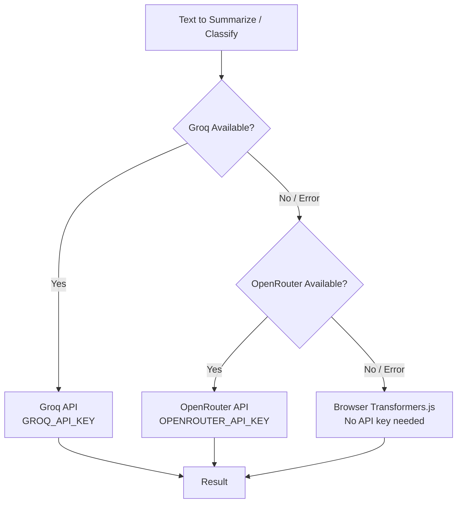

# External APIs Catalog

> Comprehensive reference for every external API consumed by World Monitor.
> Last updated: 2026-02-19

---

## Table of Contents

- [1. Overview](#1-overview)
- [2. API Key Requirements](#2-api-key-requirements)
- [3. External APIs by Domain](#3-external-apis-by-domain)
  - [3.1 Geopolitical Data](#31-geopolitical-data)
  - [3.2 Markets & Finance](#32-markets--finance)
  - [3.3 Military & Security](#33-military--security)
  - [3.4 Natural Events](#34-natural-events)
  - [3.5 AI / ML](#35-ai--ml)
  - [3.6 Infrastructure & Status](#36-infrastructure--status)
  - [3.7 Humanitarian](#37-humanitarian)
  - [3.8 Content & Research](#38-content--research)
- [4. Dependency Chain Diagram](#4-dependency-chain-diagram)
- [5. Degradation Matrix](#5-degradation-matrix)
- [6. Cost & Tier Summary](#6-cost--tier-summary)
- [7. Environment Variable Quick Reference](#7-environment-variable-quick-reference)

---

## 1. Overview

World Monitor integrates **38 distinct external API sources** (plus ~150 RSS feed
domains) to provide a unified real-time intelligence dashboard across geopolitical,
financial, military, environmental, humanitarian, and technology domains.

| Metric | Count |
|---|---|
| Total external APIs | 38 |
| Require API key (mandatory) | 10 |
| Require API key (optional) | 2 |
| Fully public / no auth | 26 |
| Free tier sufficient | 36 |
| Paid / commercial tier needed | 2 |
| WebSocket sources | 1 |
| RSS/Atom feed domains | ~150 |

**Auth breakdown:**

- **API key in header/query** — ACLED, Finnhub, FRED, Wingbits, AbuseIPDB, NASA FIRMS, Groq, OpenRouter, Cloudflare Radar, EIA
- **Optional API key** — GitHub, HDX HAPI
- **No authentication** — UCDP, GDELT, NGA MSI, Yahoo Finance, CoinGecko, Polymarket, alternative.me, blockchain.info, OpenSky, Feodo Tracker, URLhaus, C2IntelFeeds, AlienVault OTX, USGS, NOAA, Status Pages, FAA, UNHCR, WorldPop, World Bank, Hacker News, ArXiv, pizzint.watch, RSS feeds, Tech Events
- **URL-based auth** — Custom AIS Relay

---

## 2. API Key Requirements

| # | API Name | Env Var | Required | Signup URL | Tier Needed |
|---|---|---|---|---|---|
| 1 | ACLED | `ACLED_ACCESS_TOKEN`, `ACLED_EMAIL` | **Yes** | https://developer.acleddata.com/ | Free (researcher) |
| 2 | Finnhub | `FINNHUB_API_KEY` | **Yes** | https://finnhub.io/register | Free |
| 3 | FRED | `FRED_API_KEY` | **Yes** | https://fred.stlouisfed.org/docs/api/api_key.html | Free |
| 4 | NASA FIRMS | `NASA_FIRMS_API_KEY` | **Yes** | https://firms.modaps.eosdis.nasa.gov/api/area/ | Free (EOSDIS) |
| 5 | Groq | `GROQ_API_KEY` | **Yes** | https://console.groq.com/ | Free / Paid |
| 6 | OpenRouter | `OPENROUTER_API_KEY` | **Yes** | https://openrouter.ai/keys | Free (select models) |
| 7 | Cloudflare Radar | `CLOUDFLARE_API_TOKEN` | **Yes** | https://dash.cloudflare.com/profile/api-tokens | Enterprise |
| 8 | AbuseIPDB | `ABUSEIPDB_API_KEY` | **Yes** | https://www.abuseipdb.com/account/plans | Free (1000/day) |
| 9 | Wingbits | `WINGBITS_API_KEY` | **Yes** | https://wingbits.com/ | Commercial |
| 10 | EIA | `EIA_API_KEY` | **Yes** | https://www.eia.gov/opendata/register.php | Free |
| 11 | GitHub | `GITHUB_TOKEN` | Optional | https://github.com/settings/tokens | Free |
| 12 | HDX HAPI | `HDX_APP_IDENTIFIER` | Optional | https://hapi.humdata.org/ | Free |
| 13 | AIS Relay | `WS_RELAY_URL` | **Yes**¹ | Self-hosted | N/A |

> ¹ The AIS relay is a self-hosted WebSocket server; the env var points to its URL
> rather than an API key.

---

## 3. External APIs by Domain

### 3.1 Geopolitical Data

---

#### 1 — ACLED (Armed Conflict Location & Event Data)

| Field | Value |
|---|---|
| **Base URL** | `https://api.acleddata.com/acled/read` |
| **Authentication** | Query params: `key` + `email` |
| **Env Vars** | `ACLED_ACCESS_TOKEN`, `ACLED_EMAIL` |
| **Rate Limits** | Unspecified; researcher tier has generous limits |
| **Data Format** | JSON |
| **WM Endpoints** | `/api/acled`, `/api/acled-conflict` |
| **Frontend Services** | `ConflictService` → ConflictPanel, MapLayer |
| **Degradation** | Returns empty `data` array; conflict panels display "no data available" |
| **Tier Needed** | Free researcher account |
| **Quirks** | Requires both key *and* email as separate params. Data lags 1–2 weeks behind real-time events. Pagination via `page` param. |

---

#### 2 — UCDP (Uppsala Conflict Data Program)

| Field | Value |
|---|---|
| **Base URL** | `https://ucdpapi.pcr.uu.se/api/` |
| **Authentication** | None |
| **Env Vars** | — |
| **Rate Limits** | No documented limit |
| **Data Format** | JSON |
| **WM Endpoints** | `/api/ucdp`, `/api/ucdp-events` |
| **Frontend Services** | `ConflictService` → ConflictPanel |
| **Degradation** | Cached data served with 24h TTL from Upstash/CDN |
| **Tier Needed** | Public |
| **Quirks** | Academic data source; updates less frequently than ACLED. Supports versioned datasets. |

---

#### 3 — GDELT (Global Database of Events, Language, and Tone)

| Field | Value |
|---|---|
| **Base URL** | `https://api.gdeltproject.org/api/v2/` |
| **Authentication** | None |
| **Env Vars** | — |
| **Rate Limits** | Public API; no documented limit but aggressive scraping will 429 |
| **Data Format** | JSON, GeoJSON, CSV (varies by sub-endpoint) |
| **WM Endpoints** | `/api/gdelt-doc`, `/api/gdelt-geo` |
| **Frontend Services** | `NewsService` → GdeltPanel, GeoHeatmap |
| **Degradation** | Upstream 502 passed through; panel shows error state |
| **Tier Needed** | Public |
| **Quirks** | `gdelt-doc` uses the DOC 2.0 API for full-text search; `gdelt-geo` uses the GEO 2.0 API for geographic heat-mapping. Large result sets can be slow. |

---

#### 4 — NGA MSI (Maritime Safety Information)

| Field | Value |
|---|---|
| **Base URL** | `https://msi.gs.mil/api/publications/broadcast-warn` |
| **Authentication** | None |
| **Env Vars** | — |
| **Rate Limits** | Public US government endpoint |
| **Data Format** | JSON |
| **WM Endpoints** | `/api/nga-warnings` |
| **Frontend Services** | `MilitaryService` → MaritimeWarningsPanel, MapLayer |
| **Degradation** | Passthrough 502 error; panel shows "service unavailable" |
| **Tier Needed** | Public |
| **Quirks** | US DoD-hosted; occasionally slow. Returns NAVAREA warnings, HYDROLANT/HYDROPAC notices. |

---

### 3.2 Markets & Finance

---

#### 5 — Finnhub

| Field | Value |
|---|---|
| **Base URL** | `https://finnhub.io/api/v1/` |
| **Authentication** | Query param `token` or header `X-Finnhub-Token` |
| **Env Vars** | `FINNHUB_API_KEY` |
| **Rate Limits** | Free tier: 60 calls/min, 30 API calls/sec |
| **Data Format** | JSON |
| **WM Endpoints** | `/api/finnhub`, `/api/etf-flows` |
| **Frontend Services** | `MarketService` → MarketPanel, ETFFlowsPanel |
| **Degradation** | Returns `unavailable` flag; MarketPanel shows stale cached data with timestamp |
| **Tier Needed** | Free |
| **Quirks** | WebSocket endpoint available but WM uses REST polling. ETF data requires specific symbol lookups. Free tier lacks some institutional data. |

---

#### 6 — Yahoo Finance (Unofficial)

| Field | Value |
|---|---|
| **Base URL** | `https://query1.finance.yahoo.com/v8/finance/chart/` |
| **Authentication** | None |
| **Env Vars** | — |
| **Rate Limits** | Unofficial API; aggressive rate limiting possible; no SLA |
| **Data Format** | JSON |
| **WM Endpoints** | `/api/yahoo-finance`, `/api/stock-index` |
| **Frontend Services** | `MarketService` → StockIndexPanel, MarketOverview |
| **Degradation** | CDN cache serves stale data; empty results on sustained outage |
| **Tier Needed** | Public (unofficial) |
| **Quirks** | **No official API** — this is an undocumented Yahoo endpoint. May break without notice. Crumb/cookie auth sometimes required by Yahoo; current implementation works without. Consider migrating to official alternative. |

---

#### 7 — CoinGecko

| Field | Value |
|---|---|
| **Base URL** | `https://api.coingecko.com/api/v3/` |
| **Authentication** | None (free tier); API key for Pro |
| **Env Vars** | — |
| **Rate Limits** | Free: 10–30 calls/min (varies) |
| **Data Format** | JSON |
| **WM Endpoints** | `/api/coingecko`, `/api/stablecoin-markets`, `/api/macro-signals` |
| **Frontend Services** | `CryptoService` → CryptoPanel, StablecoinPanel; `MacroService` → MacroSignals |
| **Degradation** | Returns `unavailable` flag; panels show last-known values |
| **Tier Needed** | Free |
| **Quirks** | Rate limits fluctuate and are not well-documented. Stablecoin market-cap queries can be slow. Feeds into `macro-signals` as one of several composite inputs. |

---

#### 8 — FRED (Federal Reserve Economic Data)

| Field | Value |
|---|---|
| **Base URL** | `https://api.stlouisfed.org/fred/` |
| **Authentication** | Query param `api_key` |
| **Env Vars** | `FRED_API_KEY` |
| **Rate Limits** | 120 requests/min (free tier) |
| **Data Format** | JSON or XML (WM uses JSON via `file_type=json`) |
| **WM Endpoints** | `/api/fred-data`, `/api/macro-signals` |
| **Frontend Services** | `MacroService` → MacroSignals, EconIndicatorsPanel |
| **Degradation** | Cached data served from Upstash; stale indicator shown |
| **Tier Needed** | Free |
| **Quirks** | Series IDs must be known in advance (e.g. `DGS10`, `T10Y2Y`). Data updates on Fed schedule (not real-time). |

---

#### 9 — Gamma (Polymarket)

| Field | Value |
|---|---|
| **Base URL** | `https://gamma-api.polymarket.com/` |
| **Authentication** | None |
| **Env Vars** | — |
| **Rate Limits** | Public; no documented limit |
| **Data Format** | JSON |
| **WM Endpoints** | `/api/polymarket` |
| **Frontend Services** | `PredictionService` → PolymarketPanel |
| **Degradation** | CDN cache serves stale prediction data |
| **Tier Needed** | Public |
| **Quirks** | Gamma is the off-chain API for Polymarket. Market slugs/IDs can change. Filterable by tag for geopolitical/election markets. |

---

#### 10 — alternative.me (Fear & Greed Index)

| Field | Value |
|---|---|
| **Base URL** | `https://api.alternative.me/fng/` |
| **Authentication** | None |
| **Env Vars** | — |
| **Rate Limits** | Public; lenient |
| **Data Format** | JSON |
| **WM Endpoints** | `/api/macro-signals` (composite input) |
| **Frontend Services** | `MacroService` → MacroSignals (fear/greed gauge) |
| **Degradation** | Signal omitted from aggregate score; composite continues without it |
| **Tier Needed** | Public |
| **Quirks** | Returns crypto-specific Fear & Greed Index (0–100). Single-value endpoint; very lightweight. |

---

#### 11 — blockchain.info (Bitcoin Hash Rate)

| Field | Value |
|---|---|
| **Base URL** | `https://blockchain.info/` |
| **Authentication** | None |
| **Env Vars** | — |
| **Rate Limits** | Public; moderate (avoid rapid bursts) |
| **Data Format** | JSON |
| **WM Endpoints** | `/api/macro-signals` (composite input) |
| **Frontend Services** | `MacroService` → MacroSignals |
| **Degradation** | Hash-rate signal omitted from aggregate; composite score adjusted |
| **Tier Needed** | Public |
| **Quirks** | Used specifically for BTC network hash-rate as a macro signal. Endpoint: `/q/hashrate`. |

---

### 3.3 Military & Security

---

#### 12 — OpenSky Network

| Field | Value |
|---|---|
| **Base URL** | `https://opensky-network.org/api/` |
| **Authentication** | None (anonymous); optional Basic auth for higher limits |
| **Env Vars** | — |
| **Rate Limits** | Anonymous: 100 requests/day; authenticated: 4000/day |
| **Data Format** | JSON |
| **WM Endpoints** | `/api/opensky`, `/api/theater-posture` |
| **Frontend Services** | `AviationService` → FlightTracker; `TheaterService` → TheaterPosture |
| **Degradation** | CDN cache serves stale snapshot; theater posture uses last-known aircraft positions |
| **Tier Needed** | Free (anonymous sufficient for current usage) |
| **Quirks** | State vectors update every ~10 seconds but WM polls less frequently. Returns all aircraft in bounding box. `theater-posture` uses OpenSky as one of multiple inputs. Anonymous rate limit is tight — caching is critical. |

---

#### 13 — Wingbits

| Field | Value |
|---|---|
| **Base URL** | `https://data.wingbits.com/` |
| **Authentication** | API key |
| **Env Vars** | `WINGBITS_API_KEY` |
| **Rate Limits** | Commercial agreement; undisclosed |
| **Data Format** | JSON |
| **WM Endpoints** | `/api/wingbits/*`, `/api/theater-posture` |
| **Frontend Services** | `AviationService` → WingbitsPanel; `TheaterService` → TheaterPosture |
| **Degradation** | Theater posture proceeds without Wingbits augmentation; panel shows "source unavailable" |
| **Tier Needed** | **Commercial** (paid) |
| **Quirks** | Premium ADS-B data provider. Multiple sub-endpoints under `wingbits/`. Augments OpenSky with higher-fidelity data in specific regions. |

---

#### 14 — Custom AIS Relay

| Field | Value |
|---|---|
| **Base URL** | Configurable via `WS_RELAY_URL` |
| **Authentication** | URL-based (credentials in URL) |
| **Env Vars** | `WS_RELAY_URL` |
| **Rate Limits** | Self-hosted; depends on deployment |
| **Data Format** | JSON over WebSocket |
| **WM Endpoints** | `/api/ais-snapshot` |
| **Frontend Services** | `MaritimeService` → VesselTracker, MapLayer |
| **Degradation** | Returns empty vessel array; maritime layer shows no ship positions |
| **Tier Needed** | Self-hosted |
| **Quirks** | WebSocket relay run via `scripts/ais-relay.cjs`. Decodes AIS NMEA sentences into JSON. Snapshot endpoint aggregates latest positions from persistent WS connection. See `deploy/` for systemd service config. |

---

#### 15 — Feodo Tracker (abuse.ch)

| Field | Value |
|---|---|
| **Base URL** | `https://feodotracker.abuse.ch/` |
| **Authentication** | None |
| **Env Vars** | — |
| **Rate Limits** | Public |
| **Data Format** | CSV |
| **WM Endpoints** | `/api/cyber-threats` (aggregated source) |
| **Frontend Services** | `CyberService` → CyberThreatsPanel |
| **Degradation** | Source omitted from aggregation; other cyber sources still displayed |
| **Tier Needed** | Public |
| **Quirks** | Tracks C2 (command & control) botnet infrastructure. CSV parsed server-side. One of 5 cyber-threat sources aggregated by the endpoint. |

---

#### 16 — URLhaus (abuse.ch)

| Field | Value |
|---|---|
| **Base URL** | `https://urlhaus.abuse.ch/` |
| **Authentication** | None |
| **Env Vars** | — |
| **Rate Limits** | Public |
| **Data Format** | CSV |
| **WM Endpoints** | `/api/cyber-threats` (aggregated source) |
| **Frontend Services** | `CyberService` → CyberThreatsPanel |
| **Degradation** | Source omitted from aggregation |
| **Tier Needed** | Public |
| **Quirks** | Malicious URL database. Daily CSV dump downloaded and parsed. |

---

#### 17 — C2IntelFeeds

| Field | Value |
|---|---|
| **Base URL** | Public GitHub repository (CSV files) |
| **Authentication** | None |
| **Env Vars** | — |
| **Rate Limits** | GitHub raw content rate limits apply |
| **Data Format** | CSV |
| **WM Endpoints** | `/api/cyber-threats` (aggregated source) |
| **Frontend Services** | `CyberService` → CyberThreatsPanel |
| **Degradation** | Source omitted from aggregation |
| **Tier Needed** | Public |
| **Quirks** | Community-maintained C2 IP/domain feeds. Fetched from GitHub raw URLs. |

---

#### 18 — AlienVault OTX

| Field | Value |
|---|---|
| **Base URL** | `https://otx.alienvault.com/` |
| **Authentication** | None (public feed) |
| **Env Vars** | — |
| **Rate Limits** | Public |
| **Data Format** | JSON |
| **WM Endpoints** | `/api/cyber-threats` (aggregated source) |
| **Frontend Services** | `CyberService` → CyberThreatsPanel |
| **Degradation** | Source omitted from aggregation |
| **Tier Needed** | Public |
| **Quirks** | Open Threat Exchange pulses. Used for IoC (indicators of compromise) enrichment. |

---

#### 19 — AbuseIPDB

| Field | Value |
|---|---|
| **Base URL** | `https://api.abuseipdb.com/api/v2/` |
| **Authentication** | Header: `Key` |
| **Env Vars** | `ABUSEIPDB_API_KEY` |
| **Rate Limits** | Free: 1000 checks/day; paid tiers higher |
| **Data Format** | JSON |
| **WM Endpoints** | `/api/cyber-threats` (aggregated source) |
| **Frontend Services** | `CyberService` → CyberThreatsPanel |
| **Degradation** | Source omitted from aggregate; other 4 cyber sources still function |
| **Tier Needed** | Free (1000/day sufficient) |
| **Quirks** | IP reputation/abuse confidence scoring. Daily limit can be exhausted if scans are broad; WM uses targeted checks only. |

---

### 3.4 Natural Events

---

#### 20 — USGS Earthquake Hazards

| Field | Value |
|---|---|
| **Base URL** | `https://earthquake.usgs.gov/earthquakes/feed/v1.0/` |
| **Authentication** | None |
| **Env Vars** | — |
| **Rate Limits** | Public; updated every 5 min by USGS |
| **Data Format** | GeoJSON |
| **WM Endpoints** | `/api/earthquakes` |
| **Frontend Services** | `SeismicService` → EarthquakePanel, MapLayer |
| **Degradation** | CDN cache serves stale GeoJSON; map shows last-known quakes |
| **Tier Needed** | Public |
| **Quirks** | Pre-built feeds by magnitude/time range (e.g. `all_day.geojson`, `significant_month.geojson`). No query API — just static feed URLs that USGS regenerates. |

---

#### 21 — NASA FIRMS (Fire Information for Resource Management System)

| Field | Value |
|---|---|
| **Base URL** | `https://firms.modaps.eosdis.nasa.gov/api/` |
| **Authentication** | Query param `MAP_KEY` |
| **Env Vars** | `NASA_FIRMS_API_KEY` |
| **Rate Limits** | Free tier; transaction-based limits |
| **Data Format** | CSV (parsed server-side to JSON) |
| **WM Endpoints** | `/api/firms-fires` |
| **Frontend Services** | `FireService` → WildfiresPanel, MapLayer |
| **Degradation** | Cached data served; empty array on sustained outage |
| **Tier Needed** | Free (EOSDIS Earthdata account) |
| **Quirks** | VIIRS and MODIS satellite data. Area/country queries. CSV rows can be very large for global queries — WM limits to specific regions or short time windows. |

---

#### 22 — NOAA Climate Monitoring

| Field | Value |
|---|---|
| **Base URL** | Various NOAA Climate Monitoring endpoints |
| **Authentication** | None |
| **Env Vars** | — |
| **Rate Limits** | Public US government |
| **Data Format** | JSON |
| **WM Endpoints** | `/api/climate-anomalies` |
| **Frontend Services** | `ClimateService` → ClimateAnomaliesPanel |
| **Degradation** | Cached data served with 6h TTL |
| **Tier Needed** | Public |
| **Quirks** | Global temperature anomaly data. Monthly/annual resolution — not real-time. Multiple NOAA sub-endpoints aggregated. |

---

### 3.5 AI / ML

---

#### 23 — Groq

| Field | Value |
|---|---|
| **Base URL** | `https://api.groq.com/openai/v1/` |
| **Authentication** | Bearer token in `Authorization` header |
| **Env Vars** | `GROQ_API_KEY` |
| **Rate Limits** | Free: varies by model (e.g. 30 req/min for Llama); paid: higher |
| **Data Format** | JSON (OpenAI-compatible chat completions) |
| **WM Endpoints** | `/api/groq-summarize`, `/api/classify-batch`, `/api/classify-event`, `/api/country-intel` |
| **Frontend Services** | `SummaryService`, `ClassificationService`, `CountryIntelService` |
| **Degradation** | Falls back to OpenRouter → browser-based Transformers.js pipeline |
| **Tier Needed** | Free / Paid (free sufficient for moderate usage) |
| **Quirks** | Primary LLM provider. OpenAI-compatible API. Ultra-fast inference via custom LPU hardware. Model selection configurable. Fallback chain: Groq → OpenRouter → Transformers.js (in-browser). |

---

#### 24 — OpenRouter

| Field | Value |
|---|---|
| **Base URL** | `https://openrouter.ai/api/v1/` |
| **Authentication** | Bearer token in `Authorization` header |
| **Env Vars** | `OPENROUTER_API_KEY` |
| **Rate Limits** | Varies by underlying model; free models have lower limits |
| **Data Format** | JSON (OpenAI-compatible chat completions) |
| **WM Endpoints** | `/api/openrouter-summarize` |
| **Frontend Services** | `SummaryService` (fallback from Groq) |
| **Degradation** | Falls back to browser-based Transformers.js |
| **Tier Needed** | Free (select models only) |
| **Quirks** | Aggregator routing to multiple LLM providers. Used as secondary/fallback LLM. Supports `HTTP-Referer` and `X-Title` headers for attribution. Specific free models (e.g. `mistralai/mistral-7b-instruct:free`) used to avoid cost. |

---

### 3.6 Infrastructure & Status

---

#### 25 — Cloudflare Radar

| Field | Value |
|---|---|
| **Base URL** | `https://api.cloudflare.com/client/v4/radar/` |
| **Authentication** | Bearer token in `Authorization` header |
| **Env Vars** | `CLOUDFLARE_API_TOKEN` |
| **Rate Limits** | Enterprise API; generous limits |
| **Data Format** | JSON |
| **WM Endpoints** | `/api/cloudflare-outages` |
| **Frontend Services** | `InfraService` → CloudflareOutagesPanel |
| **Degradation** | Returns empty outage list; panel shows "no active outages" (may be false negative) |
| **Tier Needed** | **Enterprise** (Radar API token required) |
| **Quirks** | Provides internet outage/anomaly detection globally. Requires Cloudflare account with Radar API access. Token needs `radar:read` permission. |

---

#### 26 — Status Pages (33 Services)

| Field | Value |
|---|---|
| **Base URL** | Various: `*.statuspage.io`, `status.*` domains |
| **Authentication** | None |
| **Env Vars** | — |
| **Rate Limits** | Public status pages |
| **Data Format** | JSON (Atlassian Statuspage API format) |
| **WM Endpoints** | `/api/service-status` |
| **Frontend Services** | `InfraService` → ServiceStatusPanel |
| **Degradation** | Individual services shown as "unknown" status; others continue |
| **Tier Needed** | Public |
| **Quirks** | Monitors 33 major services (AWS, Azure, GCP, GitHub, Cloudflare, Stripe, Twilio, etc.). Each status page polled independently. Circuit breaker per source. Atlassian Statuspage JSON format is standard across most targets. |

**Monitored services include** (non-exhaustive):
AWS, Microsoft Azure, Google Cloud, GitHub, Cloudflare, Vercel, Netlify,
Fastly, Stripe, Twilio, Datadog, PagerDuty, Slack, Discord, Zoom, Atlassian,
HashiCorp, DigitalOcean, Heroku, MongoDB Atlas, Redis Cloud, Supabase,
OpenAI, Anthropic, and others.

---

#### 27 — FAA ASWS (Airport Status Web Service)

| Field | Value |
|---|---|
| **Base URL** | `https://soa.smext.faa.gov/asws/api/` |
| **Authentication** | None |
| **Env Vars** | — |
| **Rate Limits** | Public US government |
| **Data Format** | XML (parsed server-side) |
| **WM Endpoints** | `/api/faa-status` |
| **Frontend Services** | `AviationService` → FAAStatusPanel |
| **Degradation** | CDN cache serves stale data; panel shows last-known status |
| **Tier Needed** | Public |
| **Quirks** | Returns ground delays, ground stops, closures, and delay info per airport. XML response parsed to JSON. US airports only. |

---

### 3.7 Humanitarian

---

#### 28 — UNHCR Population API

| Field | Value |
|---|---|
| **Base URL** | `https://api.unhcr.org/population/v1/` |
| **Authentication** | None |
| **Env Vars** | — |
| **Rate Limits** | Public |
| **Data Format** | JSON |
| **WM Endpoints** | `/api/unhcr-population` |
| **Frontend Services** | `HumanitarianService` → RefugeePanel |
| **Degradation** | Cached data served with 24h TTL |
| **Tier Needed** | Public |
| **Quirks** | Refugee and displaced population statistics. Annual data granularity. Large datasets; WM queries specific country/year combos. |

---

#### 29 — HDX HAPI (Humanitarian API)

| Field | Value |
|---|---|
| **Base URL** | `https://hapi.humdata.org/api/v2/` |
| **Authentication** | Optional `app_identifier` query param |
| **Env Vars** | `HDX_APP_IDENTIFIER` (optional) |
| **Rate Limits** | Public; higher limits with app identifier |
| **Data Format** | JSON |
| **WM Endpoints** | `/api/hapi` |
| **Frontend Services** | `HumanitarianService` → HAPIPanel |
| **Degradation** | Cached data served with 6h TTL |
| **Tier Needed** | Free (identifier optional but recommended) |
| **Quirks** | OCHA's Humanitarian Data Exchange programmatic API. Covers food security, population, operational presence, etc. Without `app_identifier`, lower rate limits apply. |

---

#### 30 — WorldPop

| Field | Value |
|---|---|
| **Base URL** | WorldPop raster/API endpoints |
| **Authentication** | None |
| **Env Vars** | — |
| **Rate Limits** | Public |
| **Data Format** | JSON |
| **WM Endpoints** | `/api/worldpop-exposure` |
| **Frontend Services** | `HumanitarianService` → ExposureAnalysis |
| **Degradation** | Cached data served with 7-day TTL |
| **Tier Needed** | Public |
| **Quirks** | Population density data for exposure analysis (e.g. "how many people near this earthquake?"). Long cache TTL because population data changes slowly. |

---

#### 31 — World Bank

| Field | Value |
|---|---|
| **Base URL** | `https://api.worldbank.org/v2/` |
| **Authentication** | None |
| **Env Vars** | — |
| **Rate Limits** | Public |
| **Data Format** | JSON (via `format=json` param) |
| **WM Endpoints** | `/api/worldbank` |
| **Frontend Services** | `EconService` → WorldBankPanel, CountryProfile |
| **Degradation** | Cached data served with 24h TTL |
| **Tier Needed** | Public |
| **Quirks** | Development indicators (GDP, population, etc.). Pagination via `page`/`per_page`. Default format is XML — must specify `format=json`. Annual data; not real-time. |

---

### 3.8 Content & Research

---

#### 32 — Hacker News (Firebase API)

| Field | Value |
|---|---|
| **Base URL** | `https://hacker-news.firebaseio.com/v0/` |
| **Authentication** | None |
| **Env Vars** | — |
| **Rate Limits** | Public Firebase endpoint; generous |
| **Data Format** | JSON |
| **WM Endpoints** | `/api/hackernews` |
| **Frontend Services** | `TechService` → HackerNewsPanel |
| **Degradation** | CDN cache serves stale stories |
| **Tier Needed** | Public |
| **Quirks** | Official HN API via Firebase. Each story requires a separate fetch (by ID). WM fetches top N story IDs then batch-fetches details. |

---

#### 33 — GitHub API

| Field | Value |
|---|---|
| **Base URL** | `https://api.github.com/` |
| **Authentication** | Optional Bearer token |
| **Env Vars** | `GITHUB_TOKEN` (optional) |
| **Rate Limits** | Unauthenticated: 60/hour; Authenticated: 5000/hour |
| **Data Format** | JSON |
| **WM Endpoints** | `/api/github-trending`, `/api/version`, `/api/download` |
| **Frontend Services** | `TechService` → GitHubTrendingPanel; `AppService` → VersionCheck |
| **Degradation** | HTML scrape fallback for trending; version check fails gracefully |
| **Tier Needed** | Free (token optional but recommended) |
| **Quirks** | Trending repos: no official API — WM uses search API with date filters as proxy, falls back to HTML scraping `github.com/trending`. Version endpoint checks latest release tag. Without `GITHUB_TOKEN`, 60 req/h can be exhausted quickly in development. |

---

#### 34 — ArXiv

| Field | Value |
|---|---|
| **Base URL** | `https://export.arxiv.org/api/` |
| **Authentication** | None |
| **Env Vars** | — |
| **Rate Limits** | Public; requests should be spaced ≥3 seconds apart |
| **Data Format** | XML (Atom feed) |
| **WM Endpoints** | `/api/arxiv` |
| **Frontend Services** | `ResearchService` → ArXivPanel |
| **Degradation** | CDN cache serves stale results |
| **Tier Needed** | Public |
| **Quirks** | Academic paper search. Atom XML parsed server-side. ArXiv requests that they be polite with rate (3s between requests). Search syntax uses specific field prefixes (`ti:`, `au:`, `cat:`). |

---

#### 35 — EIA (Energy Information Administration)

| Field | Value |
|---|---|
| **Base URL** | `https://api.eia.gov/v2/` |
| **Authentication** | Query param `api_key` |
| **Env Vars** | `EIA_API_KEY` |
| **Rate Limits** | Free tier; undisclosed limits |
| **Data Format** | JSON |
| **WM Endpoints** | `/api/eia/*` (multiple sub-endpoints) |
| **Frontend Services** | `EnergyService` → EnergyPanel |
| **Degradation** | CDN cache serves stale data |
| **Tier Needed** | Free |
| **Quirks** | US energy data: petroleum, natural gas, electricity, coal. V2 API replaces legacy V1. Series IDs follow hierarchical facet structure. |

---

#### 36 — pizzint.watch

| Field | Value |
|---|---|
| **Base URL** | `https://pizzint.watch/` |
| **Authentication** | None |
| **Env Vars** | — |
| **Rate Limits** | Public |
| **Data Format** | JSON |
| **WM Endpoints** | `/api/pizzint/*` (multiple sub-endpoints) |
| **Frontend Services** | `IntelService` → PizzintPanel |
| **Degradation** | CDN cache serves stale data |
| **Tier Needed** | Public |
| **Quirks** | OSINT aggregation platform. Multiple sub-endpoints proxied through WM edge functions. |

---

#### 37 — RSS Feeds (~150 Domains)

| Field | Value |
|---|---|
| **Base URL** | Various publisher domains |
| **Authentication** | None |
| **Env Vars** | — |
| **Rate Limits** | Varies per publisher; typically lenient for RSS |
| **Data Format** | RSS 2.0 / Atom XML |
| **WM Endpoints** | `/api/rss-proxy` |
| **Frontend Services** | `NewsService` → RSSPanel, NewsFeed |
| **Degradation** | Circuit breaker per feed; 5-minute cooldown on failure; other feeds unaffected |
| **Tier Needed** | Public |
| **Quirks** | RSS proxy fetches and normalizes feeds from ~150 news sources worldwide. Per-feed circuit breaker prevents one broken feed from affecting others. 5-minute cooldown before retrying a failed feed. Feeds are categorized by region/topic. XML parsed and normalized to common JSON schema. |

**Feed categories include**: Major wire services (AP, Reuters, AFP), regional news
(Al Jazeera, BBC, NHK, TASS), defense/security publications, financial news,
technology outlets, and specialized OSINT sources.

---

#### 38 — Tech Event Sources

| Field | Value |
|---|---|
| **Base URL** | Various scraped sources |
| **Authentication** | None |
| **Env Vars** | — |
| **Rate Limits** | Standard web scraping considerations |
| **Data Format** | HTML (scraped and parsed) |
| **WM Endpoints** | `/api/tech-events` |
| **Frontend Services** | `TechService` → TechEventsPanel |
| **Degradation** | Cached data served with 6h TTL |
| **Tier Needed** | Public |
| **Quirks** | Scrapes conference/event listings from multiple sources. HTML parsing; fragile if source layouts change. Long cache TTL to reduce scrape frequency. |

---

## 4. Dependency Chain Diagram

### 4.1 Overall Architecture

```mermaid
graph LR
    subgraph External APIs
        A1[ACLED]
        A2[UCDP]
        A3[GDELT]
        A4[Finnhub]
        A5[CoinGecko]
        A6[USGS]
        A7[Groq]
        A8[OpenRouter]
        A9[Status Pages]
        A10[RSS Feeds]
        A11[Others...]
    end

    subgraph Vercel Edge Functions
        E1[/api/acled]
        E2[/api/ucdp]
        E3[/api/gdelt-doc]
        E4[/api/finnhub]
        E5[/api/coingecko]
        E6[/api/earthquakes]
        E7[/api/groq-summarize]
        E8[/api/openrouter-summarize]
        E9[/api/service-status]
        E10[/api/rss-proxy]
    end

    subgraph Caching Layer
        C1[Upstash Redis]
        C2[Vercel CDN / Edge Cache]
    end

    subgraph Frontend Services
        S1[ConflictService]
        S2[MarketService]
        S3[SeismicService]
        S4[SummaryService]
        S5[InfraService]
        S6[NewsService]
    end

    subgraph UI Components
        U1[ConflictPanel]
        U2[MarketPanel]
        U3[EarthquakePanel]
        U4[SummaryCards]
        U5[ServiceStatusPanel]
        U6[NewsFeed]
    end

    A1 --> E1
    A2 --> E2
    A3 --> E3
    A4 --> E4
    A5 --> E5
    A6 --> E6
    A7 --> E7
    A8 --> E8
    A9 --> E9
    A10 --> E10

    E1 --> C1 --> S1
    E2 --> C1 --> S1
    E3 --> C2 --> S6
    E4 --> C2 --> S2
    E5 --> C2 --> S2
    E6 --> C2 --> S3
    E7 --> C2 --> S4
    E8 --> C2 --> S4
    E9 --> C2 --> S5
    E10 --> C2 --> S6

    S1 --> U1
    S2 --> U2
    S3 --> U3
    S4 --> U4
    S5 --> U5
    S6 --> U6
```

### 4.2 AI/LLM Fallback Chain



### 4.3 Cyber Threats Aggregation

```mermaid
graph TD
    F1[Feodo Tracker<br/>CSV] --> AGG[/api/cyber-threats<br/>Aggregator]
    F2[URLhaus<br/>CSV] --> AGG
    F3[C2IntelFeeds<br/>CSV] --> AGG
    F4[AlienVault OTX<br/>JSON] --> AGG
    F5[AbuseIPDB<br/>JSON + API Key] --> AGG
    AGG --> CS[CyberService]
    CS --> CP[CyberThreatsPanel]

    style F5 fill:#ff9,stroke:#333
```

### 4.4 Macro Signals Composite

```mermaid
graph TD
    M1[FRED<br/>Treasury yields, rates] --> MS[/api/macro-signals<br/>Composite Builder]
    M2[CoinGecko<br/>Crypto market cap] --> MS
    M3[alternative.me<br/>Fear & Greed] --> MS
    M4[blockchain.info<br/>BTC hash rate] --> MS
    MS --> MSvc[MacroService]
    MSvc --> MP[MacroSignalsPanel]
```

### 4.5 Theater Posture Composite

```mermaid
graph TD
    T1[OpenSky<br/>Aircraft positions] --> TP[/api/theater-posture<br/>Analysis]
    T2[Wingbits<br/>ADS-B premium] --> TP
    T3[AIS Relay<br/>Vessel positions] --> TP
    T4[ACLED<br/>Conflict events] --> TP
    TP --> TS[TheaterService]
    TS --> TPnl[TheaterPosturePanel]

    style T2 fill:#ff9,stroke:#333
```

---

## 5. Degradation Matrix

How World Monitor behaves when each external API is unavailable:

| # | API | Cache TTL | Behavior When Down | User Impact | Severity |
|---|---|---|---|---|---|
| 1 | ACLED | — | Empty data array | Conflict panels blank | **High** |
| 2 | UCDP | 24h | Stale cached data | Data may be outdated | Low |
| 3 | GDELT | — | 502 passthrough | Panel shows error | Medium |
| 4 | NGA MSI | — | 502 passthrough | Maritime warnings blank | Medium |
| 5 | Finnhub | CDN | `unavailable` flag, stale data | Market data delayed | Medium |
| 6 | Yahoo Finance | CDN | Stale CDN / empty results | Stock data delayed or missing | Medium |
| 7 | CoinGecko | CDN | `unavailable` flag | Crypto data delayed | Low |
| 8 | FRED | Upstash | Stale cached data | Macro indicators delayed | Low |
| 9 | Polymarket | CDN | Stale predictions | Predictions outdated | Low |
| 10 | alternative.me | — | Signal omitted | Macro score slightly less accurate | Minimal |
| 11 | blockchain.info | — | Signal omitted | Macro score slightly less accurate | Minimal |
| 12 | OpenSky | CDN | Stale aircraft data | Flight positions outdated | Medium |
| 13 | Wingbits | — | Proceeds without augmentation | Lower-fidelity ADS-B in some regions | Low |
| 14 | AIS Relay | — | Empty vessel array | No ship tracking | **High** |
| 15 | Feodo Tracker | — | Source omitted | Cyber panel partial | Minimal |
| 16 | URLhaus | — | Source omitted | Cyber panel partial | Minimal |
| 17 | C2IntelFeeds | — | Source omitted | Cyber panel partial | Minimal |
| 18 | AlienVault OTX | — | Source omitted | Cyber panel partial | Minimal |
| 19 | AbuseIPDB | — | Source omitted | Cyber panel partial | Minimal |
| 20 | USGS | CDN | Stale GeoJSON | Earthquake data delayed | Low |
| 21 | NASA FIRMS | CDN | Cached / empty | Fire data delayed or missing | Medium |
| 22 | NOAA | 6h | Stale cached data | Climate data delayed | Low |
| 23 | Groq | — | Fallback → OpenRouter → Transformers.js | Summarization slower | Medium |
| 24 | OpenRouter | — | Fallback → Transformers.js | Summarization slower, lower quality | Medium |
| 25 | Cloudflare Radar | — | Empty outage list | May miss internet outages | Medium |
| 26 | Status Pages | — | Individual → "unknown" | Partial service status | Low |
| 27 | FAA ASWS | CDN | Stale airport status | Airport delays outdated | Low |
| 28 | UNHCR | 24h | Stale cached data | Refugee data delayed | Low |
| 29 | HDX HAPI | 6h | Stale cached data | Humanitarian data delayed | Low |
| 30 | WorldPop | 7d | Stale cached data | Population estimates unchanged | Minimal |
| 31 | World Bank | 24h | Stale cached data | Development indicators delayed | Low |
| 32 | Hacker News | CDN | Stale stories | HN feed outdated | Minimal |
| 33 | GitHub | — | HTML scrape fallback / graceful fail | Trending may fail; version check skipped | Low |
| 34 | ArXiv | CDN | Stale search results | Research papers outdated | Minimal |
| 35 | EIA | CDN | Stale energy data | Energy metrics delayed | Low |
| 36 | pizzint.watch | CDN | Stale intel data | OSINT data delayed | Low |
| 37 | RSS Feeds | 5m CB | Circuit breaker per feed | Individual feeds drop; others continue | Low |
| 38 | Tech Events | 6h | Stale cached data | Event listings outdated | Minimal |

**Severity legend:**

- **High** — Core functionality lost, no fallback
- **Medium** — Noticeable degradation, partial data or delayed experience
- **Low** — Minor impact, cached data fills the gap
- **Minimal** — Barely noticeable; one signal among many omitted

---

## 6. Cost & Tier Summary

### Free APIs (No Payment Required) — 36 APIs

| Category | APIs |
|---|---|
| Fully public (no key) | UCDP, GDELT, NGA MSI, Yahoo Finance, CoinGecko, Polymarket, alternative.me, blockchain.info, OpenSky, Feodo Tracker, URLhaus, C2IntelFeeds, AlienVault OTX, USGS, NOAA, Status Pages, FAA, UNHCR, WorldPop, World Bank, Hacker News, ArXiv, pizzint.watch, RSS Feeds, Tech Events |
| Free key required | ACLED (researcher), Finnhub, FRED, NASA FIRMS, AbuseIPDB, Groq (free tier), EIA |
| Free key optional | GitHub, HDX HAPI |
| Free with model limits | OpenRouter (select free models) |

### Paid / Commercial APIs — 2 APIs

| API | Cost Model | Why Paid |
|---|---|---|
| **Wingbits** | Commercial subscription | Premium ADS-B data with higher fidelity |
| **Cloudflare Radar** | Enterprise (included with CF plan) | Radar API requires enterprise-level API token |

### Monthly Cost Estimate

| Item | Estimated Cost |
|---|---|
| Wingbits commercial tier | Varies (contact vendor) |
| Cloudflare Radar | Included with Enterprise plan |
| All other APIs | **$0** (free tiers) |
| Upstash Redis (caching) | Free tier / ~$10/mo for production |
| Vercel (hosting + edge functions) | Free tier / Pro ~$20/mo |

> **Total API cost for free-tier operation: $0/month** (excluding Wingbits and
> Cloudflare Enterprise, which are optional enhancements).

---

## 7. Environment Variable Quick Reference

All environment variables needed for full API coverage:

```env
# ── Geopolitical ──────────────────────────────────────
ACLED_ACCESS_TOKEN=           # ACLED API key (researcher account)
ACLED_EMAIL=                  # ACLED registered email

# ── Markets & Finance ────────────────────────────────
FINNHUB_API_KEY=              # Finnhub stock/ETF data
FRED_API_KEY=                 # Federal Reserve Economic Data

# ── Military & Security ──────────────────────────────
WINGBITS_API_KEY=             # Wingbits ADS-B (commercial)
WS_RELAY_URL=                 # AIS WebSocket relay URL
ABUSEIPDB_API_KEY=            # AbuseIPDB threat intel

# ── Natural Events ───────────────────────────────────
NASA_FIRMS_API_KEY=           # NASA FIRMS fire data

# ── AI / ML ──────────────────────────────────────────
GROQ_API_KEY=                 # Groq LLM inference (primary)
OPENROUTER_API_KEY=           # OpenRouter LLM (fallback)

# ── Infrastructure ───────────────────────────────────
CLOUDFLARE_API_TOKEN=         # Cloudflare Radar (enterprise)

# ── Content ──────────────────────────────────────────
GITHUB_TOKEN=                 # GitHub API (optional, higher rate limit)
HDX_APP_IDENTIFIER=           # HDX HAPI (optional, higher rate limit)
EIA_API_KEY=                  # Energy Information Administration

# ── Caching (infrastructure, not external API) ──────
UPSTASH_REDIS_REST_URL=       # Upstash Redis cache URL
UPSTASH_REDIS_REST_TOKEN=     # Upstash Redis cache token
```

**Minimum viable setup** (core features work): `ACLED_ACCESS_TOKEN`, `ACLED_EMAIL`,
`FINNHUB_API_KEY`, `GROQ_API_KEY`

**Recommended setup** (all free features): All env vars above except `WINGBITS_API_KEY`
and `CLOUDFLARE_API_TOKEN`

**Full setup** (all features): All env vars populated

---

*This document is auto-referenced from [todo_docs.md](todo_docs.md) §3.2.
See also: [ARCHITECTURE.md](ARCHITECTURE.md), [DATA_MODEL.md](DATA_MODEL.md)*
