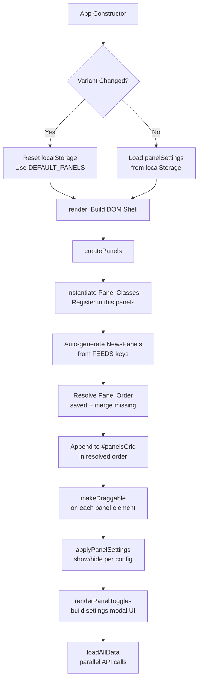
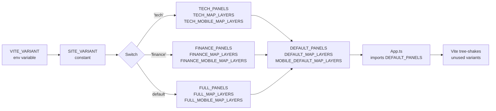
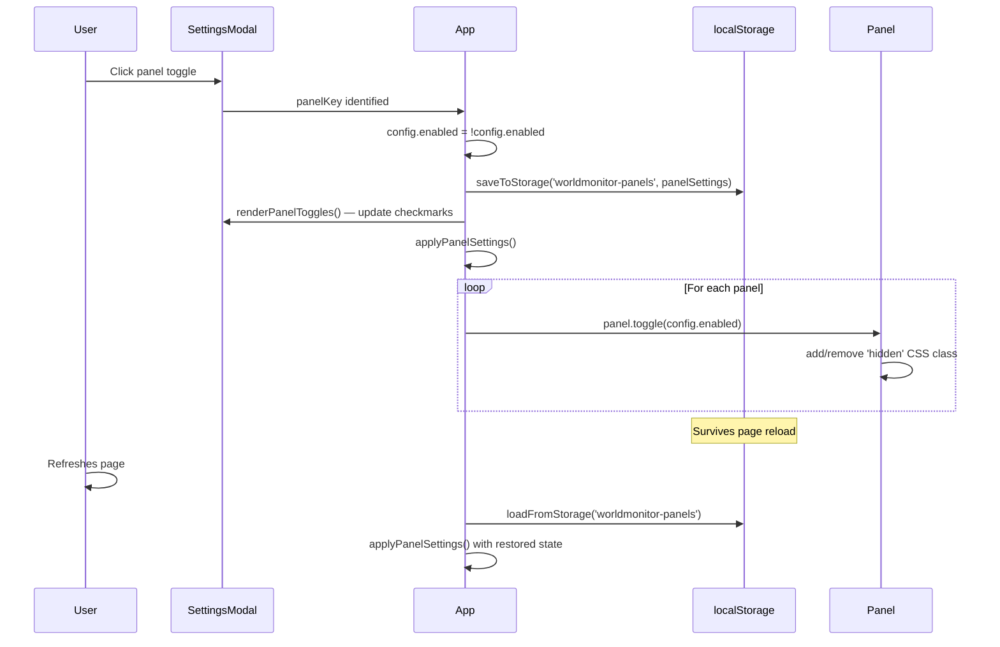

# Panel System Documentation

> **World Monitor** — Config-driven panel architecture powering three site variants.
>
> Source of truth: [`src/config/panels.ts`](../src/config/panels.ts) · Panel base class: [`src/components/Panel.ts`](../src/components/Panel.ts) · App wiring: [`src/App.ts`](../src/App.ts)

---

## Table of Contents

1. [Overview](#1-overview)
2. [Panel Configuration](#2-panel-configuration)
3. [Panel Base Class](#3-panel-base-class)
4. [Full Variant Panels](#4-full-variant-panels-worldmonitorio)
5. [Tech Variant Panels](#5-tech-variant-panels-techworldmonitorio)
6. [Finance Variant Panels](#6-finance-variant-panels-financeworldmonitorio)
7. [Variant Comparison Matrix](#7-variant-comparison-matrix)
8. [Map Layers](#8-map-layers)
9. [Panel Persistence](#9-panel-persistence)
10. [Panel Lifecycle](#10-panel-lifecycle)
11. [Adding a New Panel](#11-adding-a-new-panel)
12. [Diagrams](#12-diagrams)

---

## 1. Overview

World Monitor uses a **config-driven panel system** where every dashboard tile — from live news feeds to AI insights to market data — is declared as a `PanelConfig` entry inside a variant-specific configuration object. The system is designed around three principles:

1. **Variant isolation** — Each site variant (`full`, `tech`, `finance`) declares its own panel set with variant-appropriate display names and priorities. The build-time environment variable `VITE_VARIANT` selects which set is exported.
2. **User customization** — Users can toggle panel visibility, reorder panels via drag-and-drop, and resize panels via a drag handle. All preferences persist to `localStorage`.
3. **No framework** — Panels are vanilla TypeScript classes extending a shared `Panel` base class. There is no React/Vue/Angular; DOM construction and updates are imperative.

### Variant Domains

| Variant | Domain | Focus | Panel Count |
|---------|--------|-------|-------------|
| `full` | worldmonitor.io | Geopolitical intelligence, OSINT, defense | 37 |
| `tech` | tech.worldmonitor.io | Technology, AI/ML, startups, VC | 34 |
| `finance` | finance.worldmonitor.io | Markets, trading, macro, commodities | 29 |

### Key Files

| File | Purpose |
|------|---------|
| [`src/config/panels.ts`](../src/config/panels.ts) | Central panel & map-layer definitions for all three variants |
| [`src/config/variants/base.ts`](../src/config/variants/base.ts) | Shared `VariantConfig` interface, `STORAGE_KEYS`, `MONITOR_COLORS`, API URLs |
| [`src/config/variants/full.ts`](../src/config/variants/full.ts) | Full variant config with panels, layers, and feeds |
| [`src/config/variants/tech.ts`](../src/config/variants/tech.ts) | Tech variant config |
| [`src/config/variants/finance.ts`](../src/config/variants/finance.ts) | Finance variant config |
| [`src/components/Panel.ts`](../src/components/Panel.ts) | Base `Panel` class (440 lines) — DOM, resize, badges, lifecycle |
| [`src/components/NewsPanel.ts`](../src/components/NewsPanel.ts) | `NewsPanel` extending `Panel` — RSS-driven news tiles |
| [`src/App.ts`](../src/App.ts) | Application shell — panel instantiation, data loading, settings modal |
| [`src/types/index.ts`](../src/types/index.ts) | `PanelConfig`, `MapLayers`, `AppState` type definitions |

---

## 2. Panel Configuration

### 2.1 PanelConfig Type

Every panel is described by a `PanelConfig` object defined in [`src/types/index.ts`](../src/types/index.ts):

```typescript
export interface PanelConfig {
  name: string;       // Display name shown in panel header and settings modal
  enabled: boolean;   // Whether the panel is visible (toggled by user)
  priority?: number;  // 1 = core (shown early), 2 = supplementary (shown later)
}
```

- **`name`** — Variant-specific. The same panel ID (e.g. `map`) can have different display names across variants: *"Global Map"* (full), *"Global Tech Map"* (tech), *"Global Markets Map"* (finance).
- **`enabled`** — Defaults to `true` for all shipped panels. Users can disable panels via the Settings modal; the toggled state is persisted.
- **`priority`** — Informational grouping. Priority 1 panels are considered core to the variant's mission; priority 2 panels are supplementary. This does not affect rendering order—order is determined by declaration order in the config object and user drag-and-drop overrides.

### 2.2 Variant Selection

Panel sets are selected at build time via the `SITE_VARIANT` constant (derived from `VITE_VARIANT` env var):

```typescript
// src/config/panels.ts — variant-aware exports
export const DEFAULT_PANELS =
  SITE_VARIANT === 'tech'    ? TECH_PANELS :
  SITE_VARIANT === 'finance' ? FINANCE_PANELS :
                                FULL_PANELS;

export const DEFAULT_MAP_LAYERS =
  SITE_VARIANT === 'tech'    ? TECH_MAP_LAYERS :
  SITE_VARIANT === 'finance' ? FINANCE_MAP_LAYERS :
                                FULL_MAP_LAYERS;

export const MOBILE_DEFAULT_MAP_LAYERS =
  SITE_VARIANT === 'tech'    ? TECH_MOBILE_MAP_LAYERS :
  SITE_VARIANT === 'finance' ? FINANCE_MOBILE_MAP_LAYERS :
                                FULL_MOBILE_MAP_LAYERS;
```

Vite tree-shakes the unused variant objects from the production bundle.

### 2.3 VariantConfig Interface

Each variant file exports a full `VariantConfig` object:

```typescript
// src/config/variants/base.ts
export interface VariantConfig {
  name: string;                              // 'full' | 'tech' | 'finance'
  description: string;                       // Human-readable variant description
  panels: Record<string, PanelConfig>;       // Panel ID → config
  mapLayers: MapLayers;                      // Desktop default layer toggles
  mobileMapLayers: MapLayers;                // Mobile default layer toggles
}
```

The variant config also defines its own `FEEDS` object (`Record<string, Feed[]>`) mapping panel IDs to their RSS feed sources. Feeds that don't have a registered panel ID result in auto-generated `NewsPanel` instances (see [Panel Lifecycle](#10-panel-lifecycle)).

### 2.4 Storage Keys

All persistence keys are centralized in `STORAGE_KEYS`:

```typescript
// src/config/variants/base.ts (also re-exported from src/config/panels.ts)
export const STORAGE_KEYS = {
  panels:        'worldmonitor-panels',          // Panel visibility toggles
  monitors:      'worldmonitor-monitors',         // Monitor keyword configs
  mapLayers:     'worldmonitor-layers',           // Map layer toggles
  disabledFeeds: 'worldmonitor-disabled-feeds',   // Per-source feed disabling
} as const;
```

Additional keys used outside `STORAGE_KEYS`:

| Key | Purpose | Managed By |
|-----|---------|------------|
| `worldmonitor-panel-spans` | Panel height/span sizes (1–4) | `Panel.ts` |
| `panel-order` | Drag-and-drop panel ordering | `App.ts` |
| `worldmonitor-variant` | Last-active variant (triggers reset on change) | `App.ts` |
| `worldmonitor-panel-order-v1.9` | Migration flag for v1.9 panel layout | `App.ts` |

### 2.5 Monitor Colors

The monitor palette provides 10 fixed category colors used for user-defined keyword monitors:

```typescript
export const MONITOR_COLORS = [
  '#44ff88', '#ff8844', '#4488ff', '#ff44ff', '#ffff44',
  '#ff4444', '#44ffff', '#88ff44', '#ff88ff', '#88ffff',
];
```

These colors are theme-independent and persist alongside monitor definitions in `localStorage`.

---

## 3. Panel Base Class

All panels extend the `Panel` class defined in [`src/components/Panel.ts`](../src/components/Panel.ts) (440 lines). This base class provides the shared DOM structure, interaction patterns, and lifecycle methods.

### 3.1 Constructor Options

```typescript
export interface PanelOptions {
  id: string;             // Unique panel identifier (matches config key)
  title: string;          // Display name rendered in header
  showCount?: boolean;    // Show item count badge in header
  className?: string;     // Additional CSS class on root element
  trackActivity?: boolean; // Enable "new items" badge (default: true)
  infoTooltip?: string;   // HTML content for methodology tooltip (ℹ️ button)
}
```

### 3.2 DOM Structure

Every panel renders the following DOM tree:

```
div.panel[data-panel="{id}"]
├── div.panel-header
│   ├── div.panel-header-left
│   │   ├── span.panel-title          ← Display name
│   │   ├── div.panel-info-wrapper    ← (optional) ℹ️ tooltip
│   │   └── span.panel-new-badge      ← (optional) "N new" badge
│   ├── span.panel-data-badge         ← live/cached/unavailable indicator
│   └── span.panel-count              ← (optional) item count
├── div.panel-content#${id}Content    ← Main content area
└── div.panel-resize-handle           ← Drag-to-resize handle
```

### 3.3 Features

| Feature | Description |
|---------|-------------|
| **Drag-to-resize** | Bottom handle supports mouse + touch. Height maps to span classes (`span-1` through `span-4`). Double-click resets to default. |
| **Collapsible** | Click header to toggle `hidden` class on content (handled by CSS). |
| **Loading state** | `showLoading(message?)` renders a radar sweep animation with text. Shown by default on construction. |
| **Error state** | `showError(message?)` renders error text. `showConfigError(message)` adds a "Open Settings" button (Tauri desktop). |
| **Data badge** | `setDataBadge(state, detail?)` shows `live`, `cached`, or `unavailable` with optional detail text. |
| **New badge** | `setNewBadge(count, pulse?)` shows a blue dot with count in the header. Pulses for important updates. |
| **Count badge** | `setCount(n)` updates the numeric count in the header (when `showCount` is enabled). |
| **Info tooltip** | Hover/click on ℹ️ icon shows methodology explanation. Dismissed on outside click. |
| **Throttled content** | `setContentThrottled(html)` buffers DOM writes to one per animation frame (PERF-009). |
| **Header error state** | `setErrorState(hasError, tooltip?)` toggles a red header accent for degraded panels. |

### 3.4 Span System (Sizing)

Panel height is quantized into 4 span levels:

| Span | Min Height | CSS Class | Description |
|------|-----------|-----------|-------------|
| 1 | default | `span-1` | Standard single-row height |
| 2 | 250px | `span-2` | Medium — 50px drag triggers |
| 3 | 350px | `span-3` | Large — 150px drag triggers |
| 4 | 500px | `span-4` | Extra-large — 300px drag triggers |

Span values are persisted per-panel in the `worldmonitor-panel-spans` localStorage key as a JSON object `{ [panelId]: spanNumber }`.

### 3.5 Public Methods

| Method | Signature | Description |
|--------|-----------|-------------|
| `getElement()` | `(): HTMLElement` | Returns the root DOM element |
| `show()` | `(): void` | Remove `hidden` class |
| `hide()` | `(): void` | Add `hidden` class |
| `toggle(visible)` | `(boolean): void` | Show or hide |
| `showLoading(msg?)` | `(string?): void` | Render loading spinner |
| `showError(msg?)` | `(string?): void` | Render error message |
| `showConfigError(msg)` | `(string): void` | Render config error with settings button |
| `setContent(html)` | `(string): void` | Set content innerHTML directly |
| `setContentThrottled(html)` | `(string): void` | Buffered content update (rAF) |
| `setCount(n)` | `(number): void` | Update count badge |
| `setNewBadge(count, pulse?)` | `(number, boolean?): void` | Update new-items badge |
| `clearNewBadge()` | `(): void` | Hide new badge |
| `setDataBadge(state, detail?)` | `(string, string?): void` | Update data freshness badge |
| `clearDataBadge()` | `(): void` | Hide data badge |
| `setErrorState(err, tip?)` | `(boolean, string?): void` | Toggle header error styling |
| `getId()` | `(): string` | Return panel ID |
| `resetHeight()` | `(): void` | Clear saved span, remove span classes |
| `destroy()` | `(): void` | Remove all event listeners |

---

## 4. Full Variant Panels (worldmonitor.io)

The full (geopolitical) variant ships **37 panels** focused on OSINT, defense intelligence, geopolitical risk, and global situational awareness.

| # | Panel ID | Display Name | Priority | Component Class | Data Source |
|---|----------|-------------|----------|-----------------|-------------|
| 1 | `map` | Global Map | 1 | `MapContainer` | MapLibre + deck.gl |
| 2 | `live-news` | Live News | 1 | `LiveNewsPanel` | Multi-source RSS aggregation |
| 3 | `live-webcams` | Live Webcams | 1 | `LiveWebcamsPanel` | Curated webcam streams |
| 4 | `insights` | AI Insights | 1 | `InsightsPanel` | Groq/OpenRouter LLM summarization |
| 5 | `strategic-posture` | AI Strategic Posture | 1 | `StrategicPosturePanel` | Theater posture API |
| 6 | `cii` | Country Instability | 1 | `CIIPanel` | Composite instability index |
| 7 | `strategic-risk` | Strategic Risk Overview | 1 | `StrategicRiskPanel` | Risk scores API |
| 8 | `intel` | Intel Feed | 1 | `NewsPanel` | Intelligence RSS feeds |
| 9 | `gdelt-intel` | Live Intelligence | 1 | `GdeltIntelPanel` | GDELT event database |
| 10 | `cascade` | Infrastructure Cascade | 1 | `CascadePanel` | Multi-domain cascade analysis |
| 11 | `politics` | World News | 1 | `NewsPanel` | Political RSS feeds |
| 12 | `middleeast` | Middle East | 1 | `NewsPanel` | Regional RSS feeds |
| 13 | `africa` | Africa | 1 | `NewsPanel` | Regional RSS feeds |
| 14 | `latam` | Latin America | 1 | `NewsPanel` | Regional RSS feeds |
| 15 | `asia` | Asia-Pacific | 1 | `NewsPanel` | Regional RSS feeds |
| 16 | `energy` | Energy & Resources | 1 | `NewsPanel` | Energy RSS feeds |
| 17 | `gov` | Government | 1 | `NewsPanel` | Government RSS feeds |
| 18 | `thinktanks` | Think Tanks | 1 | `NewsPanel` | Think tank RSS feeds |
| 19 | `polymarket` | Predictions | 1 | `PredictionPanel` | Polymarket API |
| 20 | `commodities` | Commodities | 1 | `CommoditiesPanel` | Yahoo Finance / commodity APIs |
| 21 | `markets` | Markets | 1 | `MarketPanel` | Finnhub / Yahoo Finance |
| 22 | `economic` | Economic Indicators | 1 | `EconomicPanel` | FRED API |
| 23 | `finance` | Financial | 1 | `NewsPanel` | Financial RSS feeds |
| 24 | `tech` | Technology | 2 | `NewsPanel` | Technology RSS feeds |
| 25 | `crypto` | Crypto | 2 | `CryptoPanel` | CoinGecko API |
| 26 | `heatmap` | Sector Heatmap | 2 | `HeatmapPanel` | Market sector data |
| 27 | `ai` | AI/ML | 2 | `NewsPanel` | AI/ML RSS feeds |
| 28 | `layoffs` | Layoffs Tracker | 2 | `NewsPanel` | Layoffs RSS feeds |
| 29 | `monitors` | My Monitors | 2 | `MonitorPanel` | User-defined keyword monitors |
| 30 | `satellite-fires` | Fires | 2 | `SatelliteFiresPanel` | NASA FIRMS API |
| 31 | `macro-signals` | Market Radar | 2 | `MacroSignalsPanel` | Macro signals API |
| 32 | `etf-flows` | BTC ETF Tracker | 2 | `ETFFlowsPanel` | ETF flows API |
| 33 | `stablecoins` | Stablecoins | 2 | `StablecoinPanel` | Stablecoin markets API |
| 34 | `ucdp-events` | UCDP Conflict Events | 2 | `UcdpEventsPanel` | UCDP API |
| 35 | `displacement` | UNHCR Displacement | 2 | `DisplacementPanel` | UNHCR population API |
| 36 | `climate` | Climate Anomalies | 2 | `ClimateAnomalyPanel` | Climate anomalies API |
| 37 | `population-exposure` | Population Exposure | 2 | `PopulationExposurePanel` | WorldPop exposure API |

**Full variant exclusive panels**: `strategic-posture`, `cii`, `strategic-risk`, `gdelt-intel`, `cascade`, `satellite-fires`, `ucdp-events`, `displacement`, `climate`, `population-exposure`, and the regional panels (`middleeast`, `africa`, `latam`, `asia`).

---

## 5. Tech Variant Panels (tech.worldmonitor.io)

The tech variant ships **34 panels** focused on technology news, AI/ML, startup ecosystems, and developer tooling.

| # | Panel ID | Display Name | Priority | Component Class | Data Source |
|---|----------|-------------|----------|-----------------|-------------|
| 1 | `map` | Global Tech Map | 1 | `MapContainer` | MapLibre + deck.gl |
| 2 | `live-news` | Tech Headlines | 1 | `LiveNewsPanel` | Tech RSS aggregation |
| 3 | `live-webcams` | Live Webcams | 2 | `LiveWebcamsPanel` | Curated webcam streams |
| 4 | `insights` | AI Insights | 1 | `InsightsPanel` | Groq/OpenRouter LLM summarization |
| 5 | `ai` | AI/ML News | 1 | `NewsPanel` | AI/ML RSS feeds |
| 6 | `tech` | Technology | 1 | `NewsPanel` | Technology RSS feeds |
| 7 | `startups` | Startups & VC | 1 | `NewsPanel` | Startup RSS feeds |
| 8 | `vcblogs` | VC Insights & Essays | 1 | `NewsPanel` | VC blog RSS feeds |
| 9 | `regionalStartups` | Global Startup News | 1 | `NewsPanel` | Regional startup RSS feeds |
| 10 | `unicorns` | Unicorn Tracker | 1 | `NewsPanel` | Unicorn RSS feeds |
| 11 | `accelerators` | Accelerators & Demo Days | 1 | `NewsPanel` | Accelerator RSS feeds |
| 12 | `security` | Cybersecurity | 1 | `NewsPanel` | Cybersecurity RSS feeds |
| 13 | `policy` | AI Policy & Regulation | 1 | `NewsPanel` | AI policy RSS feeds |
| 14 | `regulation` | AI Regulation Dashboard | 1 | `RegulationPanel` | Regulation data |
| 15 | `layoffs` | Layoffs Tracker | 1 | `NewsPanel` | Layoffs RSS feeds |
| 16 | `markets` | Tech Stocks | 2 | `MarketPanel` | Finnhub / Yahoo Finance |
| 17 | `finance` | Financial News | 2 | `NewsPanel` | Financial RSS feeds |
| 18 | `crypto` | Crypto | 2 | `CryptoPanel` | CoinGecko API |
| 19 | `hardware` | Semiconductors & Hardware | 2 | `NewsPanel` | Hardware RSS feeds |
| 20 | `cloud` | Cloud & Infrastructure | 2 | `NewsPanel` | Cloud RSS feeds |
| 21 | `dev` | Developer Community | 2 | `NewsPanel` | Developer RSS feeds |
| 22 | `github` | GitHub Trending | 1 | `NewsPanel` | GitHub trending API |
| 23 | `ipo` | IPO & SPAC | 2 | `NewsPanel` | IPO RSS feeds |
| 24 | `polymarket` | Tech Predictions | 2 | `PredictionPanel` | Polymarket API |
| 25 | `funding` | Funding & VC | 1 | `NewsPanel` | Funding RSS feeds |
| 26 | `producthunt` | Product Hunt | 1 | `NewsPanel` | Product Hunt RSS |
| 27 | `events` | Tech Events | 1 | `TechEventsPanel` | Tech events API |
| 28 | `service-status` | Service Status | 2 | `ServiceStatusPanel` | Service status API |
| 29 | `economic` | Economic Indicators | 2 | `EconomicPanel` | FRED API |
| 30 | `tech-readiness` | Tech Readiness Index | 1 | `TechReadinessPanel` | World Bank API |
| 31 | `macro-signals` | Market Radar | 2 | `MacroSignalsPanel` | Macro signals API |
| 32 | `etf-flows` | BTC ETF Tracker | 2 | `ETFFlowsPanel` | ETF flows API |
| 33 | `stablecoins` | Stablecoins | 2 | `StablecoinPanel` | Stablecoin markets API |
| 34 | `monitors` | My Monitors | 2 | `MonitorPanel` | User-defined keyword monitors |

**Tech variant exclusive panels**: `startups`, `vcblogs`, `regionalStartups`, `unicorns`, `accelerators`, `security`, `policy`, `regulation`, `hardware`, `cloud`, `dev`, `github`, `funding`, `producthunt`, `events`, `service-status`, `tech-readiness`.

---

## 6. Finance Variant Panels (finance.worldmonitor.io)

The finance variant ships **29 panels** focused on markets, trading, macro indicators, and financial data.

| # | Panel ID | Display Name | Priority | Component Class | Data Source |
|---|----------|-------------|----------|-----------------|-------------|
| 1 | `map` | Global Markets Map | 1 | `MapContainer` | MapLibre + deck.gl |
| 2 | `live-news` | Market Headlines | 1 | `LiveNewsPanel` | Financial RSS aggregation |
| 3 | `live-webcams` | Live Webcams | 2 | `LiveWebcamsPanel` | Curated webcam streams |
| 4 | `insights` | AI Market Insights | 1 | `InsightsPanel` | Groq/OpenRouter LLM summarization |
| 5 | `markets` | Live Markets | 1 | `MarketPanel` | Finnhub / Yahoo Finance |
| 6 | `markets-news` | Markets News | 2 | `NewsPanel` | Markets RSS feeds |
| 7 | `forex` | Forex & Currencies | 1 | `NewsPanel` | Forex RSS feeds |
| 8 | `bonds` | Fixed Income | 1 | `NewsPanel` | Fixed income RSS feeds |
| 9 | `commodities` | Commodities & Futures | 1 | `CommoditiesPanel` | Yahoo Finance / commodity APIs |
| 10 | `commodities-news` | Commodities News | 2 | `NewsPanel` | Commodities RSS feeds |
| 11 | `crypto` | Crypto & Digital Assets | 1 | `CryptoPanel` | CoinGecko API |
| 12 | `crypto-news` | Crypto News | 2 | `NewsPanel` | Crypto RSS feeds |
| 13 | `centralbanks` | Central Bank Watch | 1 | `NewsPanel` | Central bank RSS feeds |
| 14 | `economic` | Economic Data | 1 | `EconomicPanel` | FRED API |
| 15 | `economic-news` | Economic News | 2 | `NewsPanel` | Economic RSS feeds |
| 16 | `ipo` | IPOs, Earnings & M&A | 1 | `NewsPanel` | IPO/M&A RSS feeds |
| 17 | `heatmap` | Sector Heatmap | 1 | `HeatmapPanel` | Market sector data |
| 18 | `macro-signals` | Market Radar | 1 | `MacroSignalsPanel` | Macro signals API |
| 19 | `derivatives` | Derivatives & Options | 2 | `NewsPanel` | Derivatives RSS feeds |
| 20 | `fintech` | Fintech & Trading Tech | 2 | `NewsPanel` | Fintech RSS feeds |
| 21 | `regulation` | Financial Regulation | 2 | `NewsPanel` | Regulation RSS feeds |
| 22 | `institutional` | Hedge Funds & PE | 2 | `NewsPanel` | Institutional RSS feeds |
| 23 | `analysis` | Market Analysis | 2 | `NewsPanel` | Analysis RSS feeds |
| 24 | `etf-flows` | BTC ETF Tracker | 2 | `ETFFlowsPanel` | ETF flows API |
| 25 | `stablecoins` | Stablecoins | 2 | `StablecoinPanel` | Stablecoin markets API |
| 26 | `gcc-investments` | GCC Investments | 2 | `InvestmentsPanel` | GCC investment data |
| 27 | `gccNews` | GCC Business News | 2 | `NewsPanel` | GCC news RSS feeds |
| 28 | `polymarket` | Predictions | 2 | `PredictionPanel` | Polymarket API |
| 29 | `monitors` | My Monitors | 2 | `MonitorPanel` | User-defined keyword monitors |

**Finance variant exclusive panels**: `markets-news`, `forex`, `bonds`, `commodities-news`, `crypto-news`, `centralbanks`, `economic-news`, `derivatives`, `fintech`, `institutional`, `analysis`, `gcc-investments`, `gccNews`.

---

## 7. Variant Comparison Matrix

This matrix shows which panel IDs are available in each variant. Panels that appear in multiple variants may have different display names (see individual variant sections above).

| Panel ID | Full | Tech | Finance | Notes |
|----------|:----:|:----:|:-------:|-------|
| `map` | ✅ | ✅ | ✅ | Different names per variant |
| `live-news` | ✅ | ✅ | ✅ | Different names per variant |
| `live-webcams` | ✅ | ✅ | ✅ | Priority 1 in full, priority 2 in tech/finance |
| `insights` | ✅ | ✅ | ✅ | Different names per variant |
| `markets` | ✅ | ✅ | ✅ | "Markets" / "Tech Stocks" / "Live Markets" |
| `economic` | ✅ | ✅ | ✅ | "Economic Indicators" / "Economic Indicators" / "Economic Data" |
| `crypto` | ✅ | ✅ | ✅ | "Crypto" / "Crypto" / "Crypto & Digital Assets" |
| `polymarket` | ✅ | ✅ | ✅ | "Predictions" / "Tech Predictions" / "Predictions" |
| `monitors` | ✅ | ✅ | ✅ | Identical across all variants |
| `macro-signals` | ✅ | ✅ | ✅ | P2 in full/tech, P1 in finance |
| `etf-flows` | ✅ | ✅ | ✅ | P2 in all variants |
| `stablecoins` | ✅ | ✅ | ✅ | P2 in all variants |
| `layoffs` | ✅ | ✅ | — | P2 in full, P1 in tech |
| `finance` | ✅ | ✅ | — | "Financial" / "Financial News" |
| `tech` | ✅ | ✅ | — | P2 in full, P1 in tech |
| `ai` | ✅ | ✅ | — | "AI/ML" / "AI/ML News" |
| `heatmap` | ✅ | — | ✅ | P2 in full, P1 in finance |
| `commodities` | ✅ | — | ✅ | "Commodities" / "Commodities & Futures" |
| `ipo` | — | ✅ | ✅ | "IPO & SPAC" / "IPOs, Earnings & M&A" |
| `regulation` | — | ✅ | ✅ | "AI Regulation Dashboard" / "Financial Regulation" |
| `politics` | ✅ | — | — | Full only — World News |
| `middleeast` | ✅ | — | — | Full only |
| `africa` | ✅ | — | — | Full only |
| `latam` | ✅ | — | — | Full only |
| `asia` | ✅ | — | — | Full only |
| `energy` | ✅ | — | — | Full only |
| `gov` | ✅ | — | — | Full only |
| `thinktanks` | ✅ | — | — | Full only |
| `intel` | ✅ | — | — | Full only |
| `gdelt-intel` | ✅ | — | — | Full only |
| `cascade` | ✅ | — | — | Full only |
| `strategic-posture` | ✅ | — | — | Full only |
| `cii` | ✅ | — | — | Full only |
| `strategic-risk` | ✅ | — | — | Full only |
| `satellite-fires` | ✅ | — | — | Full only |
| `ucdp-events` | ✅ | — | — | Full only |
| `displacement` | ✅ | — | — | Full only |
| `climate` | ✅ | — | — | Full only |
| `population-exposure` | ✅ | — | — | Full only |
| `startups` | — | ✅ | — | Tech only |
| `vcblogs` | — | ✅ | — | Tech only |
| `regionalStartups` | — | ✅ | — | Tech only |
| `unicorns` | — | ✅ | — | Tech only |
| `accelerators` | — | ✅ | — | Tech only |
| `security` | — | ✅ | — | Tech only |
| `policy` | — | ✅ | — | Tech only |
| `hardware` | — | ✅ | — | Tech only |
| `cloud` | — | ✅ | — | Tech only |
| `dev` | — | ✅ | — | Tech only |
| `github` | — | ✅ | — | Tech only |
| `funding` | — | ✅ | — | Tech only |
| `producthunt` | — | ✅ | — | Tech only |
| `events` | — | ✅ | — | Tech only |
| `service-status` | — | ✅ | — | Tech only |
| `tech-readiness` | — | ✅ | — | Tech only |
| `markets-news` | — | — | ✅ | Finance only |
| `forex` | — | — | ✅ | Finance only |
| `bonds` | — | — | ✅ | Finance only |
| `commodities-news` | — | — | ✅ | Finance only |
| `crypto-news` | — | — | ✅ | Finance only |
| `centralbanks` | — | — | ✅ | Finance only |
| `economic-news` | — | — | ✅ | Finance only |
| `derivatives` | — | — | ✅ | Finance only |
| `fintech` | — | — | ✅ | Finance only |
| `institutional` | — | — | ✅ | Finance only |
| `analysis` | — | — | ✅ | Finance only |
| `gcc-investments` | — | — | ✅ | Finance only |
| `gccNews` | — | — | ✅ | Finance only |

---

## 8. Map Layers

The map is a specialized panel (`map` ID) rendered in its own `#mapSection` container rather than the `#panelsGrid`. Each variant defines both desktop and mobile default layer sets.

### 8.1 MapLayers Interface

```typescript
// src/types/index.ts
export interface MapLayers {
  // Geopolitical layers
  conflicts: boolean;     bases: boolean;         hotspots: boolean;
  nuclear: boolean;       sanctions: boolean;     military: boolean;

  // Infrastructure layers
  cables: boolean;        pipelines: boolean;     waterways: boolean;
  outages: boolean;       datacenters: boolean;   spaceports: boolean;

  // Threat layers
  cyberThreats: boolean;  protests: boolean;      fires: boolean;

  // Environmental layers
  weather: boolean;       economic: boolean;      natural: boolean;
  minerals: boolean;      irradiators: boolean;

  // Transport layers
  ais: boolean;           flights: boolean;

  // Data source layers
  ucdpEvents: boolean;    displacement: boolean;  climate: boolean;

  // Tech variant layers
  startupHubs: boolean;   cloudRegions: boolean;  accelerators: boolean;
  techHQs: boolean;       techEvents: boolean;

  // Finance variant layers
  stockExchanges: boolean; financialCenters: boolean; centralBanks: boolean;
  commodityHubs: boolean;  gulfInvestments: boolean;
}
```

### 8.2 Full Variant Layers

| Layer | Desktop Default | Mobile Default | Description |
|-------|:--------------:|:--------------:|-------------|
| `conflicts` | ✅ ON | ✅ ON | Armed conflict zones |
| `bases` | ✅ ON | OFF | Military bases |
| `hotspots` | ✅ ON | ✅ ON | Geopolitical hotspots |
| `nuclear` | ✅ ON | OFF | Nuclear facilities |
| `sanctions` | ✅ ON | ✅ ON | Sanctioned entities/regions |
| `weather` | ✅ ON | ✅ ON | Weather alerts |
| `economic` | ✅ ON | OFF | Economic indicators overlay |
| `waterways` | ✅ ON | OFF | Strategic waterways |
| `outages` | ✅ ON | ✅ ON | Internet/infrastructure outages |
| `military` | ✅ ON | OFF | Military deployments |
| `natural` | ✅ ON | ✅ ON | Natural disasters |
| `cables` | OFF | OFF | Undersea fiber cables |
| `pipelines` | OFF | OFF | Oil/gas pipelines |
| `ais` | OFF | OFF | AIS vessel tracking |
| `irradiators` | OFF | OFF | Gamma irradiators |
| `cyberThreats` | OFF | OFF | Cyber threat indicators |
| `datacenters` | OFF | OFF | AI data centers |
| `protests` | OFF | OFF | Social unrest events |
| `flights` | OFF | OFF | Military flights |
| `spaceports` | OFF | OFF | Space launch facilities |
| `minerals` | OFF | OFF | Critical mineral deposits |
| `fires` | OFF | OFF | Active fires (FIRMS) |
| `ucdpEvents` | OFF | OFF | UCDP conflict data |
| `displacement` | OFF | OFF | UNHCR displacement data |
| `climate` | OFF | OFF | Climate anomalies |
| All tech layers | OFF | OFF | — |
| All finance layers | OFF | OFF | — |

**Desktop default ON: 11 layers** · **Mobile default ON: 5 layers**

### 8.3 Tech Variant Layers

| Layer | Desktop Default | Mobile Default | Description |
|-------|:--------------:|:--------------:|-------------|
| `cables` | ✅ ON | OFF | Undersea fiber cables |
| `weather` | ✅ ON | OFF | Weather alerts |
| `economic` | ✅ ON | OFF | Economic indicators overlay |
| `outages` | ✅ ON | ✅ ON | Internet outages |
| `datacenters` | ✅ ON | ✅ ON | AI data centers |
| `natural` | ✅ ON | ✅ ON | Natural disasters |
| `startupHubs` | ✅ ON | ✅ ON | Startup ecosystem hubs |
| `cloudRegions` | ✅ ON | OFF | Cloud provider regions |
| `techHQs` | ✅ ON | OFF | Major tech company HQs |
| `techEvents` | ✅ ON | ✅ ON | Tech conferences and events |
| All geopolitical | OFF | OFF | — |
| All military | OFF | OFF | — |
| All finance layers | OFF | OFF | — |

**Desktop default ON: 10 layers** · **Mobile default ON: 5 layers**

### 8.4 Finance Variant Layers

| Layer | Desktop Default | Mobile Default | Description |
|-------|:--------------:|:--------------:|-------------|
| `cables` | ✅ ON | OFF | Undersea fiber cables |
| `pipelines` | ✅ ON | OFF | Oil/gas pipelines |
| `sanctions` | ✅ ON | OFF | Sanctioned entities |
| `weather` | ✅ ON | OFF | Weather alerts |
| `economic` | ✅ ON | ✅ ON | Economic indicators overlay |
| `waterways` | ✅ ON | OFF | Strategic waterways |
| `outages` | ✅ ON | ✅ ON | Internet outages |
| `natural` | ✅ ON | ✅ ON | Natural disasters |
| `stockExchanges` | ✅ ON | ✅ ON | Global stock exchanges |
| `financialCenters` | ✅ ON | OFF | Financial centers |
| `centralBanks` | ✅ ON | ✅ ON | Central bank locations |
| All geopolitical | OFF | OFF | — |
| All military | OFF | OFF | — |
| All tech layers | OFF | OFF | — |

**Desktop default ON: 11 layers** · **Mobile default ON: 5 layers**

### 8.5 Mobile Layer Strategy

Mobile defaults enable fewer layers to preserve performance on constrained devices. The pattern:

- Each variant enables ~5 layers on mobile (vs 10–11 on desktop)
- Environmental critical layers (`natural`, `outages`) are always on
- Variant-signature layers stay on (e.g. `startupHubs` for tech, `stockExchanges` for finance)
- Heavy overlay layers (`cables`, `pipelines`, `weather`) are off by default on mobile

---

## 9. Panel Persistence

All user preferences survive page reload via `localStorage`. The following table enumerates every persisted setting:

### 9.1 Persistence Map

| Setting | localStorage Key | Format | Default Source | Survives Reload |
|---------|-----------------|--------|----------------|:--------------:|
| Panel visibility | `worldmonitor-panels` | `Record<string, PanelConfig>` JSON | `DEFAULT_PANELS` | ✅ |
| Panel ordering | `panel-order` | `string[]` JSON | Config declaration order | ✅ |
| Panel sizes/spans | `worldmonitor-panel-spans` | `Record<string, number>` JSON | All span-1 | ✅ |
| Map layer toggles | `worldmonitor-layers` | `MapLayers` JSON | `DEFAULT_MAP_LAYERS` | ✅ |
| Monitor keywords | `worldmonitor-monitors` | `Monitor[]` JSON | `[]` | ✅ |
| Disabled sources | `worldmonitor-disabled-feeds` | `string[]` JSON | `[]` | ✅ |
| Active variant | `worldmonitor-variant` | Plain string | `SITE_VARIANT` | ✅ |
| Banner dismissal | `banner-dismissed` (sessionStorage) | Timestamp string | — | Session only |

### 9.2 Variant Change Reset

When the stored variant (`worldmonitor-variant`) differs from the current `SITE_VARIANT`, the App constructor performs a full reset:

```typescript
if (storedVariant !== currentVariant) {
  localStorage.setItem('worldmonitor-variant', currentVariant);
  localStorage.removeItem(STORAGE_KEYS.mapLayers);
  localStorage.removeItem(STORAGE_KEYS.panels);
  localStorage.removeItem(this.PANEL_ORDER_KEY);
  localStorage.removeItem(this.PANEL_SPANS_KEY);
  this.mapLayers = { ...defaultLayers };
  this.panelSettings = { ...DEFAULT_PANELS };
}
```

This ensures users switching between variant domains (e.g. from worldmonitor.io to tech.worldmonitor.io) get a clean default experience for the new variant.

### 9.3 Full Reset

Users can clear all panel preferences by clearing `localStorage` for the domain. There is no in-app "reset to defaults" button — the variant change mechanism serves as an implicit reset.

### 9.4 Merge Strategy for New Panels

When the application adds new panels (in a code update), the saved panel order is merged with the current defaults:

1. Start with the saved order (from `panel-order` key)
2. Remove any panels that no longer exist in `DEFAULT_PANELS`
3. Find panels present in `DEFAULT_PANELS` but missing from saved order
4. Insert missing panels after the `politics` panel position (or at position 0)
5. Always place `monitors` panel last
6. Always place `live-news` panel first (CSS grid constraint — it spans 2 columns)
7. Always place `live-webcams` immediately after `live-news`

---

## 10. Panel Lifecycle

### 10.1 Initialization Flow

The panel lifecycle begins in `App.ts` constructor and flows through these phases:

1. **Config Loading** — `panelSettings` loaded from localStorage (or `DEFAULT_PANELS` on first visit / variant change)
2. **DOM Scaffolding** — `render()` builds the page shell including `#panelsGrid` container and settings modal
3. **Panel Instantiation** — `createPanels()` constructs all panel class instances and registers them in `this.panels` and `this.newsPanels`
4. **Grid Insertion** — Panels are appended to `#panelsGrid` in the resolved order (saved + merge)
5. **Drag-and-drop Binding** — Each panel element gets `makeDraggable()` handlers for reordering
6. **Visibility Application** — `applyPanelSettings()` calls `panel.toggle(config.enabled)` for every panel
7. **Data Loading** — `loadAllData()` fires parallel API calls; each handler updates its panel via `setContent()` / `setContentThrottled()`
8. **Refresh Scheduling** — Periodic refresh timers are set up per data source (2–60 min intervals)

### 10.2 Panel Type Hierarchy

```
Panel (base)
├── NewsPanel          ← RSS-driven news feeds (most panels)
├── MarketPanel        ← Live market tickers
├── HeatmapPanel       ← Sector heatmap grid
├── CryptoPanel        ← Cryptocurrency prices
├── CommoditiesPanel   ← Commodity prices
├── PredictionPanel    ← Polymarket predictions
├── EconomicPanel      ← FRED economic indicators
├── MonitorPanel       ← User keyword monitors
├── CIIPanel           ← Country Instability Index
├── CascadePanel       ← Infrastructure cascade analysis
├── GdeltIntelPanel    ← GDELT intelligence feed
├── SatelliteFiresPanel← NASA FIRMS fire data
├── StrategicRiskPanel ← Risk score overview
├── StrategicPosturePanel ← Theater posture
├── UcdpEventsPanel    ← UCDP conflict events
├── DisplacementPanel  ← UNHCR displacement
├── ClimateAnomalyPanel← Climate anomaly data
├── PopulationExposurePanel ← Population exposure
├── InvestmentsPanel   ← GCC investment tracker
├── LiveNewsPanel      ← Breaking news aggregation
├── LiveWebcamsPanel   ← Multi-stream webcam view
├── TechEventsPanel    ← Technology events
├── ServiceStatusPanel ← Service uptime monitor
├── TechReadinessPanel ← World Bank tech index
├── MacroSignalsPanel  ← Macro market signals
├── ETFFlowsPanel      ← BTC ETF flow tracker
├── StablecoinPanel    ← Stablecoin market data
├── InsightsPanel      ← AI-generated insights
├── RegulationPanel    ← Regulation dashboard
├── RuntimeConfigPanel ← Desktop runtime config (Tauri only)
├── OrefSirensPanel    ← Israel alert sirens (full only)
└── StatusPanel        ← System status (not in panel grid)
```

### 10.3 Auto-generated News Panels

`App.ts` iterates over all keys in the variant's `FEEDS` object. For any feed category that does not already have a manually instantiated `NewsPanel`, a new `NewsPanel` is created automatically:

```typescript
for (const key of Object.keys(FEEDS)) {
  if (this.newsPanels[key]) continue;                    // Skip if already created
  if (!Array.isArray((FEEDS as Record<string, unknown>)[key])) continue;
  // If a data panel exists with this key, create a separate news panel with "-news" suffix
  const panelKey = this.panels[key] && !this.newsPanels[key] ? `${key}-news` : key;
  if (this.panels[panelKey]) continue;
  const panelConfig = DEFAULT_PANELS[panelKey] ?? DEFAULT_PANELS[key];
  const label = panelConfig?.name ?? key.charAt(0).toUpperCase() + key.slice(1);
  const panel = new NewsPanel(panelKey, label);
  this.attachRelatedAssetHandlers(panel);
  this.newsPanels[key] = panel;
  this.panels[panelKey] = panel;
}
```

This allows the finance variant to have paired panels like `markets` (data panel) + `markets-news` (RSS panel) without manual duplication.

### 10.4 Panel Toggle Flow

When a user clicks a panel toggle in the Settings modal:

1. `config.enabled` is flipped on the in-memory `panelSettings`
2. `saveToStorage(STORAGE_KEYS.panels, this.panelSettings)` persists to localStorage
3. `renderPanelToggles()` re-renders the toggle UI with updated checkmarks
4. `applyPanelSettings()` iterates all panels, calling `panel.toggle(config.enabled)`
5. The `Panel.toggle()` method adds/removes the `hidden` CSS class

### 10.5 Panel Destruction

Panels are destroyed when the App instance is torn down. The `Panel.destroy()` method removes global event listeners (tooltip close handlers, touch/mouse handlers for resize). Panel DOM elements are removed when their parent grid is cleared.

---

## 11. Adding a New Panel

Step-by-step guide to adding a new panel to World Monitor.

### Step 1: Define the Panel Config

Add the panel entry to the appropriate variant config in [`src/config/panels.ts`](../src/config/panels.ts):

```typescript
// In the FULL_PANELS (or TECH_PANELS, FINANCE_PANELS) object:
'my-panel': { name: 'My Panel', enabled: true, priority: 2 },
```

**Panel order matters** — panels are rendered in declaration order by default.

### Step 2: Create the Component Class

Create a new file in `src/components/`:

```typescript
// src/components/MyPanel.ts
import { Panel } from './Panel';

export class MyPanel extends Panel {
  constructor() {
    super({
      id: 'my-panel',
      title: 'My Panel',
      showCount: true,
      infoTooltip: 'Methodology: ...',
    });
  }

  public async refresh(): Promise<void> {
    this.showLoading();
    try {
      const data = await fetch('/api/my-data').then(r => r.json());
      this.setContent(this.renderData(data));
      this.setCount(data.length);
      this.setDataBadge('live');
    } catch (e) {
      this.showError('Failed to load data');
      this.setDataBadge('unavailable');
    }
  }

  private renderData(data: unknown[]): string {
    return `<div class="my-panel-content">...</div>`;
  }
}
```

For RSS-based panels, use `NewsPanel` directly instead of creating a new class — just add feeds to the variant's `FEEDS` object and the panel will be auto-generated.

### Step 3: Register in App.ts

Import and instantiate the panel in the `createPanels()` method of [`src/App.ts`](../src/App.ts):

```typescript
import { MyPanel } from '@/components/MyPanel';

// Inside createPanels():
const myPanel = new MyPanel();
this.panels['my-panel'] = myPanel;
```

### Step 4: Wire Data Loading

Add a data loading task in `loadAllData()`:

```typescript
tasks.push({
  name: 'myPanel',
  task: runGuarded('myPanel', () => (this.panels['my-panel'] as MyPanel).refresh()),
});
```

### Step 5: Add Refresh Interval (Optional)

If the panel needs periodic refresh, add a timer in `setupRefreshTimers()` referencing `REFRESH_INTERVALS`.

### Step 6: Add Map Layer (Optional)

If the panel has an associated map layer:

1. Add the boolean field to `MapLayers` in `src/types/index.ts`
2. Set default values in all variant layer objects in `src/config/panels.ts`
3. Handle the layer in `MapContainer`

### Step 7: Add i18n Key

Add a translation key in `src/locales/en.json` (and other locale files):

```json
{
  "panels": {
    "myPanel": "My Panel"
  }
}
```

### Step 8: Register in Variant Configs

If using the variant config system (`src/config/variants/`), add the panel to the appropriate variant file(s) alongside feeds if applicable.

---

## 12. Diagrams

### 12.1 Panel Registration Flow



### 12.2 Variant Selection Flow



### 12.3 Panel Toggle Persistence Flow



---

## Appendix: Panel Component Files

Quick reference for locating panel component source files:

| Component | File |
|-----------|------|
| `Panel` (base) | `src/components/Panel.ts` |
| `NewsPanel` | `src/components/NewsPanel.ts` |
| `MarketPanel` / `HeatmapPanel` | `src/components/MarketPanel.ts` |
| `CryptoPanel` | `src/components/CryptoPanel.ts` |
| `CommoditiesPanel` | `src/components/CommoditiesPanel.ts` |
| `PredictionPanel` | `src/components/PredictionPanel.ts` |
| `EconomicPanel` | `src/components/EconomicPanel.ts` |
| `MonitorPanel` | `src/components/MonitorPanel.ts` |
| `CIIPanel` | `src/components/CIIPanel.ts` |
| `CascadePanel` | `src/components/CascadePanel.ts` |
| `GdeltIntelPanel` | `src/components/GdeltIntelPanel.ts` |
| `SatelliteFiresPanel` | `src/components/SatelliteFiresPanel.ts` |
| `StrategicRiskPanel` | `src/components/StrategicRiskPanel.ts` |
| `StrategicPosturePanel` | `src/components/StrategicPosturePanel.ts` |
| `UcdpEventsPanel` | `src/components/UcdpEventsPanel.ts` |
| `DisplacementPanel` | `src/components/DisplacementPanel.ts` |
| `ClimateAnomalyPanel` | `src/components/ClimateAnomalyPanel.ts` |
| `PopulationExposurePanel` | `src/components/PopulationExposurePanel.ts` |
| `InvestmentsPanel` | `src/components/InvestmentsPanel.ts` |
| `LiveNewsPanel` | `src/components/LiveNewsPanel.ts` |
| `LiveWebcamsPanel` | `src/components/LiveWebcamsPanel.ts` |
| `TechEventsPanel` | `src/components/TechEventsPanel.ts` |
| `ServiceStatusPanel` | `src/components/ServiceStatusPanel.ts` |
| `TechReadinessPanel` | `src/components/TechReadinessPanel.ts` |
| `MacroSignalsPanel` | `src/components/MacroSignalsPanel.ts` |
| `ETFFlowsPanel` | `src/components/ETFFlowsPanel.ts` |
| `StablecoinPanel` | `src/components/StablecoinPanel.ts` |
| `InsightsPanel` | `src/components/InsightsPanel.ts` |
| `RegulationPanel` | `src/components/RegulationPanel.ts` |
| `RuntimeConfigPanel` | `src/components/RuntimeConfigPanel.ts` |
| `OrefSirensPanel` | `src/components/OrefSirensPanel.ts` |
| `StatusPanel` | `src/components/StatusPanel.ts` |
