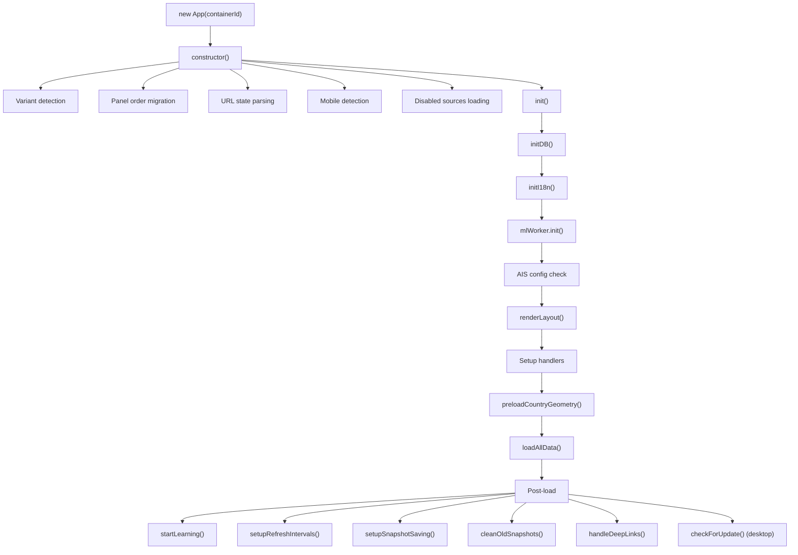
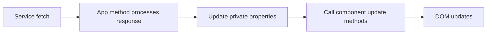
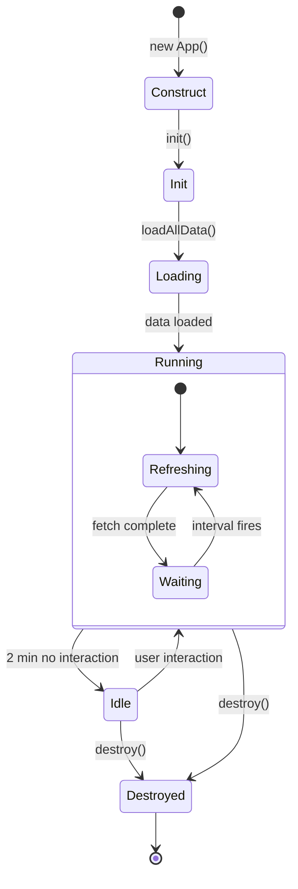
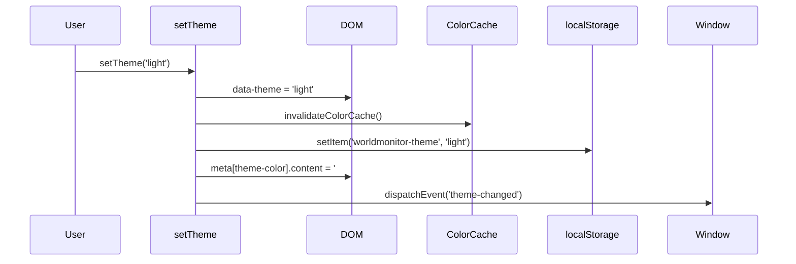
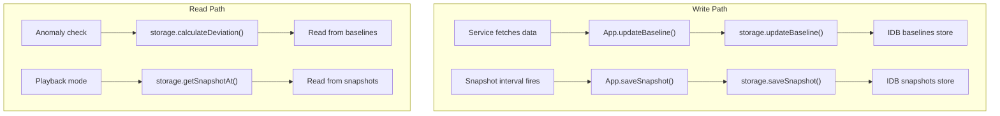
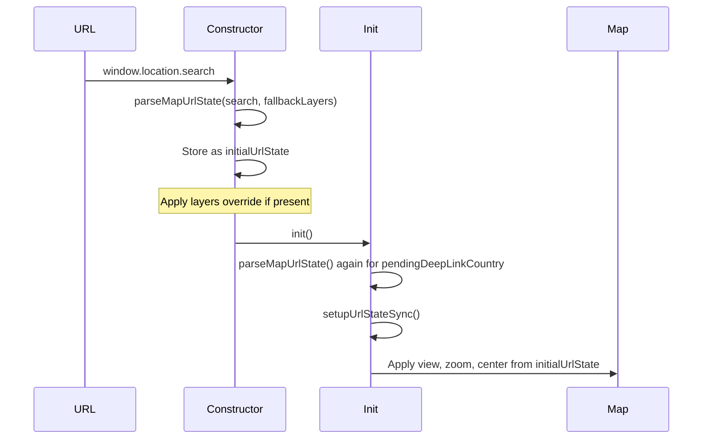
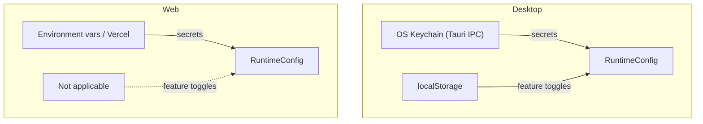
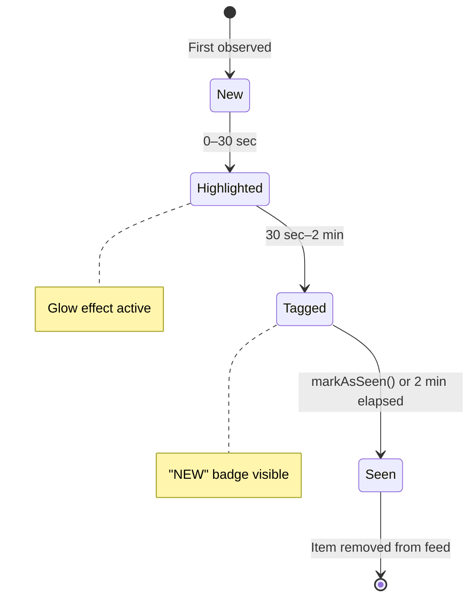
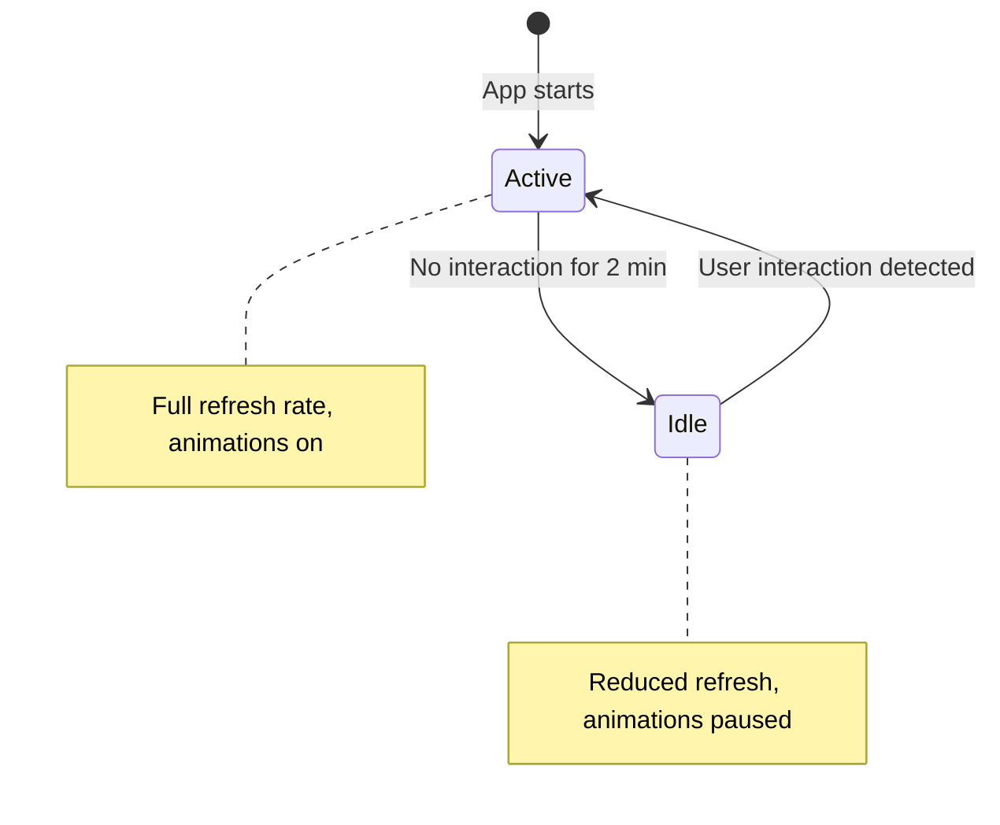
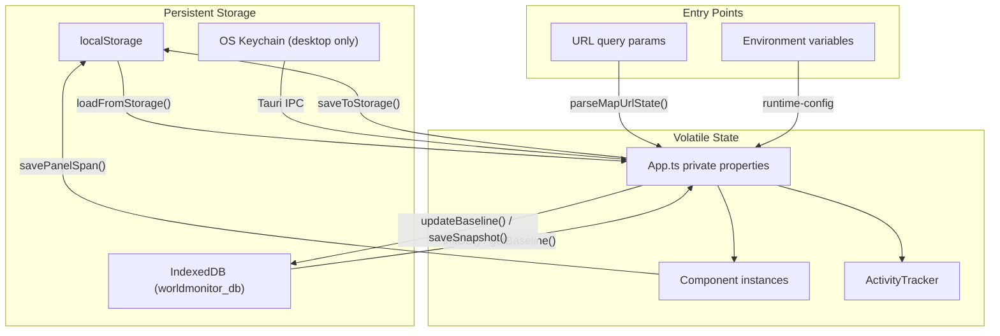

# State Management

World Monitor is an AI-powered real-time global intelligence dashboard built with **vanilla TypeScript** — no framework, no reactive stores. All state is managed manually through class properties, `localStorage`, `IndexedDB`, and URL query parameters.

This document is the canonical reference for how state is stored, updated, and persisted across the application.

---

## Table of Contents

1. [Application State Flow](#1-application-state-flow)
2. [App.ts State Properties & Lifecycle](#2-appts-state-properties--lifecycle)
3. [Panel State Persistence](#3-panel-state-persistence)
4. [Theme State Management](#4-theme-state-management)
5. [IndexedDB Storage Schema](#5-indexeddb-storage-schema)
6. [URL State Encoding/Decoding](#6-url-state-encodingdecoding)
7. [Runtime Config State (Desktop)](#7-runtime-config-state-desktop)
8. [Activity Tracking & Idle Detection](#8-activity-tracking--idle-detection)
9. [All localStorage Keys](#9-all-localstorage-keys)

---

## 1. Application State Flow

There is no framework — the entire app is a single `App` class in `src/App.ts` (~4,300 lines) that orchestrates every service, component, and piece of state. State changes flow through direct method calls and property writes. Components extend a `Panel` base class defined in `src/components/Panel.ts`.

### Initialization Sequence



### Data Flow Pattern

Every state update follows the same pattern:



1. A service function fetches data from an API endpoint.
2. An `App` method receives the response and stores it in a private property (e.g. `this.allNews`).
3. The method calls update methods on the relevant components (e.g. `newsPanel.updateItems(items)`).
4. The component manipulates the DOM directly.

There are no observables, signals, or virtual DOM — every update is an explicit imperative call.

---

## 2. App.ts State Properties & Lifecycle

All state lives as private properties on the `App` class. Grouped by purpose:

### Data State

```typescript
private allNews: NewsItem[] = [];
private newsByCategory: Record<string, NewsItem[]> = {};
private latestPredictions: PredictionMarket[] = [];
private latestMarkets: MarketData[] = [];
private latestClusters: ClusteredEvent[] = [];
private currentTimeRange: TimeRange = '7d';
private monitors: Monitor[];
private panelSettings: Record<string, PanelConfig>;
private mapLayers: MapLayers;
private cyberThreatsCache: CyberThreat[] | null = null;
```

### Component References

```typescript
private map: MapContainer | null = null;
private panels: Record<string, Panel> = {};
private newsPanels: Record<string, NewsPanel> = {};
private signalModal: SignalModal | null = null;
private playbackControl: PlaybackControl | null = null;
private statusPanel: StatusPanel | null = null;
private exportPanel: ExportPanel | null = null;
private languageSelector: LanguageSelector | null = null;
private searchModal: SearchModal | null = null;
private mobileWarningModal: MobileWarningModal | null = null;
private pizzintIndicator: PizzIntIndicator | null = null;
private countryBriefPage: CountryBriefPage | null = null;
private countryTimeline: CountryTimeline | null = null;
private findingsBadge: IntelligenceGapBadge | null = null;
private criticalBannerEl: HTMLElement | null = null;
```

### UI State

```typescript
private isPlaybackMode = false;          // playback / historical mode toggle
private isMobile: boolean;               // detected at construction
private initialLoadComplete = false;     // first data load complete flag
private isIdle = false;                  // idle detection state
private isDestroyed = false;             // cleanup flag
private readonly isDesktopApp: boolean;  // Tauri runtime detection
```

### Infrastructure State

```typescript
private initialUrlState: ParsedMapUrlState | null = null;
private inFlight: Set<string> = new Set();             // currently-running fetch keys
private seenGeoAlerts: Set<string> = new Set();         // deduplicate geo alerts
private disabledSources: Set<string> = new Set();       // user-disabled news sources
private mapFlashCache: Map<string, number> = new Map(); // cooldown for map flash animations
private pendingDeepLinkCountry: string | null = null;   // URL deep-link target
private briefRequestToken = 0;                          // cancellation token for async ops
```

### Timer / Interval IDs

```typescript
private snapshotIntervalId: ReturnType<typeof setInterval> | null = null;
private refreshTimeoutIds: Map<string, ReturnType<typeof setTimeout>> = new Map();
private idleTimeoutId: ReturnType<typeof setTimeout> | null = null;
```

### Event Handler Refs (for cleanup)

```typescript
private boundKeydownHandler: ((e: KeyboardEvent) => void) | null = null;
private boundFullscreenHandler: (() => void) | null = null;
private boundResizeHandler: (() => void) | null = null;
private boundVisibilityHandler: (() => void) | null = null;
private boundIdleResetHandler: (() => void) | null = null;
```

### Constants

```typescript
private readonly PANEL_ORDER_KEY = 'panel-order';
private readonly IDLE_PAUSE_MS = 2 * 60 * 1000;          // 2 minutes
private readonly MAP_FLASH_COOLDOWN_MS = 10 * 60 * 1000;  // 10 minutes
```

### Static Properties

```typescript
private static COUNTRY_BOUNDS: Record<string, { n: number; s: number; e: number; w: number }>;
private static COUNTRY_ALIASES: Record<string, string[]>;
private static otherCountryTermsCache: Map<string, string[]> = new Map();
```

### Lifecycle Diagram



**Destroy** tears down everything: clears all intervals/timeouts, removes event listeners, calls `destroy()` on all components, nullifies references.

---

## 3. Panel State Persistence

Panels use `localStorage` for persistence. Defined in `src/components/Panel.ts`:

### Panel Spans

```typescript
const PANEL_SPANS_KEY = 'worldmonitor-panel-spans';

// Stored as Record<string, number> — panel ID → grid span (1–4)
function loadPanelSpans(): Record<string, number> {
  const stored = localStorage.getItem(PANEL_SPANS_KEY);
  return stored ? JSON.parse(stored) : {};
}

function savePanelSpan(panelId: string, span: number): void {
  const spans = loadPanelSpans();
  spans[panelId] = span;
  localStorage.setItem(PANEL_SPANS_KEY, JSON.stringify(spans));
}
```

### Height-to-Span Conversion

```typescript
function heightToSpan(height: number): number {
  if (height >= 500) return 4;
  if (height >= 350) return 3;
  if (height >= 250) return 2;
  return 1;
}
```

Users drag-resize panels; the pixel height is converted to a span (1–4), which is persisted and applied as a CSS class (`span-1` through `span-4`).

### Panel Order

Stored in `localStorage` under `panel-order` as a JSON `string[]` of panel IDs. The `App` constructor reads the saved order and applies it to the grid layout. Migrations reorder panels for new versions (e.g. the v1.9 migration promotes `insights`, `strategic-posture`, `cii`, `strategic-risk` to the top).

### Panel Settings

Stored in `localStorage` under `worldmonitor-panels` as `Record<string, PanelConfig>`. Includes per-panel `enabled` state, `name`, and `priority`. Controlled by the variant config and user overrides.

### STORAGE_KEYS

Defined in `src/config/variants/base.ts` (and mirrored in `src/config/panels.ts`):

```typescript
export const STORAGE_KEYS = {
  panels:        'worldmonitor-panels',
  monitors:      'worldmonitor-monitors',
  mapLayers:     'worldmonitor-layers',
  disabledFeeds: 'worldmonitor-disabled-feeds',
} as const;
```

| Key | Type | Purpose |
|-----|------|---------|
| `worldmonitor-panels` | `Record<string, PanelConfig>` | Per-panel enabled/name/priority |
| `worldmonitor-monitors` | `Monitor[]` | Color/label configs for monitors |
| `worldmonitor-layers` | `MapLayers` | Enabled/disabled map layer toggles |
| `worldmonitor-disabled-feeds` | `string[]` | User-disabled news feed sources |

---

## 4. Theme State Management

Defined in `src/utils/theme-manager.ts`. Supported themes: `'dark' | 'light'`.

### Storage

- **Key:** `worldmonitor-theme`
- **Default:** `'dark'`

### API

```typescript
// Read stored preference (falls back to 'dark')
getStoredTheme(): Theme

// Read current DOM theme (from data-theme attribute)
getCurrentTheme(): Theme

// Full theme switch: DOM + cache invalidation + persist + meta + event
setTheme(theme: Theme): void

// Early bootstrap: sets data-theme + meta only (no events)
applyStoredTheme(): void
```

### Theme Application Flow



### Color Cache

`src/utils/theme-colors.ts` provides `getCSSColor(varName)` which reads computed CSS custom properties and caches them. The cache auto-invalidates when the `data-theme` attribute changes:

```typescript
const colorCache = new Map<string, string>();
let cacheTheme = '';

export function getCSSColor(varName: string): string {
  const currentTheme = document.documentElement.dataset.theme || 'dark';
  if (currentTheme !== cacheTheme) {
    colorCache.clear();
    cacheTheme = currentTheme;
  }
  // ...read from cache or compute
}

export function invalidateColorCache(): void {
  colorCache.clear();
  cacheTheme = '';
}
```

### CSS Integration

All colors are driven by CSS custom properties under `[data-theme]` selectors. Components never hardcode colors — they read from the CSS variable system. Meta `theme-color` values:

| Theme | `#meta[theme-color]` |
|-------|---------------------|
| `dark` | `#0a0f0a` |
| `light` | `#f8f9fa` |

---

## 5. IndexedDB Storage Schema

Defined in `src/services/storage.ts`.

- **Database name:** `worldmonitor_db`
- **Version:** `1`
- **Stores:** `baselines`, `snapshots`

### Store: `baselines`

Tracks statistical baselines for anomaly detection.

| Field | Type | Description |
|-------|------|-------------|
| `key` | `string` (keyPath) | Metric identifier |
| `counts` | `number[]` | Rolling 30-day count observations |
| `timestamps` | `number[]` | Corresponding observation timestamps |
| `avg7d` | `number` | Rolling 7-day average |
| `avg30d` | `number` | Rolling 30-day average |
| `lastUpdated` | `number` | Last update timestamp |

**Key operations:**

```typescript
// Push new observation, trim to 30-day window, recalculate averages
updateBaseline(key: string, currentCount: number): Promise<BaselineEntry>

// Calculate z-score deviation level
calculateDeviation(current: number, baseline: BaselineEntry): {
  zScore: number;
  percentChange: number;
  level: 'normal' | 'elevated' | 'spike' | 'quiet';
}
```

Deviation thresholds:

- `zScore > 2.5` → `'spike'`
- `zScore > 1.5` → `'elevated'`
- `zScore < -2` → `'quiet'`
- Otherwise → `'normal'`

### Store: `snapshots`

Periodic dashboard state captures for historical playback.

| Field | Type | Description |
|-------|------|-------------|
| `timestamp` | `number` (keyPath) | Snapshot creation time |
| `events` | `unknown[]` | Event state at time of capture |
| `marketPrices` | `Record<string, number>` | Market prices at capture |
| `predictions` | `Array<{title, yesPrice}>` | Prediction market state |
| `hotspotLevels` | `Record<string, string>` | Hotspot intensity levels |

**Index:** `by_time` on `timestamp`.

**Key operations:**

```typescript
saveSnapshot(snapshot: DashboardSnapshot): Promise<void>
getSnapshots(fromTime?, toTime?): Promise<DashboardSnapshot[]>
getSnapshotAt(timestamp: number): Promise<DashboardSnapshot | null>  // nearest ±15 min
cleanOldSnapshots(): Promise<void>  // removes entries older than 7 days
getSnapshotTimestamps(): Promise<number[]>
```

**Retention:** `SNAPSHOT_RETENTION_DAYS = 7`.

### Initialization

```typescript
export async function initDB(): Promise<IDBDatabase> {
  // Opens or creates worldmonitor_db v1
  // Creates 'baselines' store (keyPath: 'key')
  // Creates 'snapshots' store (keyPath: 'timestamp', index: 'by_time')
}
```

All store operations use a retry-aware `withTransaction()` helper that re-opens the database on `InvalidStateError` (connection closing).

### Data Flow Through IndexedDB



---

## 6. URL State Encoding/Decoding

Defined in `src/utils/urlState.ts`. Used for sharing dashboard state via links and for deep-linking.

### ParsedMapUrlState Interface

```typescript
export interface ParsedMapUrlState {
  view?: MapView;
  zoom?: number;
  lat?: number;
  lon?: number;
  timeRange?: TimeRange;
  layers?: MapLayers;
  country?: string;
}
```

### Supported Query Parameters

| Param | Type | Range/Values | Example |
|-------|------|-------------|---------|
| `view` | `MapView` | `global`, `america`, `mena`, `eu`, `asia`, `latam`, `africa`, `oceania` | `?view=mena` |
| `zoom` | `number` | `1–10` (clamped) | `?zoom=5` |
| `lat` | `number` | `-90–90` (clamped) | `?lat=33.2` |
| `lon` | `number` | `-180–180` (clamped) | `?lon=44.1` |
| `timeRange` | `TimeRange` | `1h`, `6h`, `24h`, `48h`, `7d`, `all` | `?t=24h` |
| `layers` | `string` | Comma-separated layer keys or `none` | `?layers=earthquakes,flights` |
| `country` | `string` | ISO 3166-1 alpha-2 code | `?country=UA` |

### Layer Keys (29 supported)

```typescript
const LAYER_KEYS: (keyof MapLayers)[] = [
  'conflicts', 'bases', 'cables', 'pipelines', 'hotspots', 'ais',
  'nuclear', 'irradiators', 'sanctions', 'weather', 'economic',
  'waterways', 'outages', 'cyberThreats', 'datacenters', 'protests',
  'flights', 'military', 'natural', 'spaceports', 'minerals', 'fires',
  'ucdpEvents', 'displacement', 'climate', 'startupHubs', 'cloudRegions',
  'accelerators', 'techHQs', 'techEvents',
];
```

### URL Application Flow



### Building Shareable URLs

```typescript
buildMapUrl(baseUrl: string, state: {
  view: MapView;
  zoom: number;
  center?: { lat: number; lon: number } | null;
  timeRange: TimeRange;
  layers: MapLayers;
  country?: string;
}): string
```

Produces a full URL with all active state encoded in query parameters.

---

## 7. Runtime Config State (Desktop)

Defined in `src/services/runtime-config.ts`. Manages API keys and feature toggles for the desktop (Tauri) app.

### Secret Keys

```typescript
export type RuntimeSecretKey =
  | 'GROQ_API_KEY'
  | 'OPENROUTER_API_KEY'
  | 'FRED_API_KEY'
  | 'EIA_API_KEY'
  | 'CLOUDFLARE_API_TOKEN'
  | 'ACLED_ACCESS_TOKEN'
  | 'URLHAUS_AUTH_KEY'
  | 'OTX_API_KEY'
  | 'ABUSEIPDB_API_KEY'
  | 'WINGBITS_API_KEY'
  | 'WS_RELAY_URL'
  | 'VITE_OPENSKY_RELAY_URL'
  | 'OPENSKY_CLIENT_ID'
  | 'OPENSKY_CLIENT_SECRET'
  | 'AISSTREAM_API_KEY'
  | 'FINNHUB_API_KEY'
  | 'NASA_FIRMS_API_KEY'
  | 'UC_DP_KEY';
```

### Feature Toggles

```typescript
export type RuntimeFeatureId =
  | 'aiGroq'          | 'aiOpenRouter'
  | 'economicFred'    | 'energyEia'
  | 'internetOutages' | 'acledConflicts'
  | 'abuseChThreatIntel' | 'alienvaultOtxThreatIntel'
  | 'abuseIpdbThreatIntel' | 'wingbitsEnrichment'
  | 'aisRelay'        | 'openskyRelay'
  | 'finnhubMarkets'  | 'nasaFirms';
```

All toggles default to `true`.

### Storage Model



- **Toggles key:** `worldmonitor-runtime-feature-toggles` in `localStorage`
- **Toggles format:** `Record<RuntimeFeatureId, boolean>` (JSON)
- **Secrets (desktop):** stored in the OS keychain via Tauri IPC commands (`read_secret`, `write_secret`)
- **Secrets (web):** sourced from environment variables at build time

### RuntimeFeatureDefinition

```typescript
export interface RuntimeFeatureDefinition {
  id: RuntimeFeatureId;
  name: string;
  description: string;
  requiredSecrets: RuntimeSecretKey[];
  desktopRequiredSecrets?: RuntimeSecretKey[];
  fallback: string;
}
```

Each feature definition specifies which secrets it requires. The settings UI validates that all required secrets are present before allowing a feature to be enabled.

---

## 8. Activity Tracking & Idle Detection

### Activity Tracker

Defined in `src/services/activity-tracker.ts`. Tracks item freshness across panels.

```typescript
export interface ActivityState {
  seenIds: Set<string>;                    // Items user has "seen"
  firstSeenTime: Map<string, number>;      // When items first appeared
  newCount: number;                        // Unseen items count
  lastInteraction: number;                 // Last user interaction timestamp
}
```

**Timing constants:**

| Constant | Value | Purpose |
|----------|-------|---------|
| `NEW_TAG_DURATION_MS` | `2 * 60 * 1000` (2 min) | Duration to show "NEW" badge |
| `HIGHLIGHT_DURATION_MS` | `30 * 1000` (30 sec) | Duration for highlight glow effect |

**Key operations:**

```typescript
// Initialize tracking for a panel
register(panelId: string): void

// Update items and compute new count — returns array of new item IDs
updateItems(panelId: string, itemIds: string[]): string[]

// Mark all items as seen (user interacted with panel)
markAsSeen(panelId: string): void
```

Items are "new" (show badge) for 2 minutes after first appearance, and "highlighted" (glow effect) for 30 seconds.

### Activity Item Lifecycle



### Idle Detection

Implemented directly in `App.ts`:

```typescript
private readonly IDLE_PAUSE_MS = 2 * 60 * 1000; // 2 minutes
private isIdle = false;
private idleTimeoutId: ReturnType<typeof setTimeout> | null = null;
private boundIdleResetHandler: (() => void) | null = null;
```

**Behavior when idle:**

- Animations are paused
- Refresh frequency is reduced
- The `isIdle` flag is checked by refresh methods

**Reset triggers:** any user interaction event (mouse move, click, keydown, scroll, touch).



---

## 9. All localStorage Keys

Complete reference of every `localStorage` key used by World Monitor:

| Key | Purpose | Format | Source |
|-----|---------|--------|--------|
| `worldmonitor-variant` | Active variant override | `'full' \| 'tech' \| 'finance'` | `src/config/variant.ts`, `App.ts` |
| `worldmonitor-theme` | Theme preference | `'dark' \| 'light'` | `src/utils/theme-manager.ts` |
| `panel-order` | Panel arrangement order | `string[]` (JSON) | `App.ts` |
| `worldmonitor-panel-spans` | Panel grid sizes | `Record<string, number>` (JSON) | `src/components/Panel.ts` |
| `worldmonitor-panels` | Panel enabled/config state | `Record<string, PanelConfig>` (JSON) | `STORAGE_KEYS.panels` |
| `worldmonitor-monitors` | Monitor color/label configs | `Monitor[]` (JSON) | `STORAGE_KEYS.monitors` |
| `worldmonitor-layers` | Map layer toggles | `MapLayers` (JSON) | `STORAGE_KEYS.mapLayers` |
| `worldmonitor-disabled-feeds` | User-disabled news sources | `string[]` (JSON) | `STORAGE_KEYS.disabledFeeds` |
| `worldmonitor-runtime-feature-toggles` | Desktop feature toggles | `Record<RuntimeFeatureId, boolean>` (JSON) | `src/services/runtime-config.ts` |
| `worldmonitor-persistent-cache:{key}` | Persistent data cache entries | `CacheEnvelope<T>` (JSON) | `src/services/persistent-cache.ts` |
| `wm-update-dismissed-{version}` | Dismissed update notifications | `'1'` | `App.ts` |
| `worldmonitor-panel-order-v1.9` | Panel order migration flag | `'done'` | `App.ts` (one-time migration) |
| `worldmonitor-tech-insights-top-v1` | Tech variant migration flag | `'done'` | `App.ts` (one-time migration) |

### CacheEnvelope Format

Used by the persistent cache system (`src/services/persistent-cache.ts`):

```typescript
type CacheEnvelope<T> = {
  key: string;
  updatedAt: number;
  data: T;
};
```

On desktop (Tauri), the persistent cache prefers the Tauri IPC bridge (`read_cache_entry` / `write_cache_entry`) and falls back to `localStorage` on failure. On web, `localStorage` is always used.

---

## Summary



All state management is explicit and imperative. There is no reactivity system — when data changes, the code that changed it is responsible for propagating the update to every consumer.
